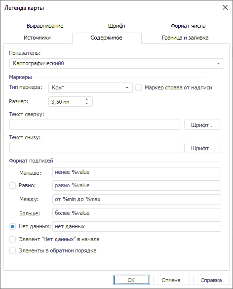

# Настройка содержимого легенды: Легенда карты

Настройка содержимого легенды: Легенда карты
-

# Настройка содержимого легенды

Для настройки содержимого легенды карты перейдите на вкладку «Содержимое» окна «[Легенда
 карты](UiMaps_Report_Legend.htm)»:

Определите на вкладке следующие параметры:

	- Показатель. Из раскрывающегося
	 списка выберите показатель карты, расшифровка которого будет отображена
	 в легенде;

	- Маркеры.
	 Задайте в группе параметры маркеров в легенды:

		- Тип маркера. Из
		 раскрывающегося списка выберите тип маркера, который будет отображен
		 в легенде;

		- Маркер справа от надписи.
		 При установленном флажке маркеры в легенде будут расположены справа
		 от надписи;

		- Размер. Определите
		 размер отображаемого в легенде маркера.

Примечание.
 Доступен ввод значения [в
 разных системах измерения](UiNav.chm::/GUI/Format/Different_units.htm). В поле ввода редактора отображаются значения
 в единицах измерения, соответствующих текущим региональным настройкам
 операционной системы.

		- Текст сверху. В
		 поле ввода введите текст, который будет располагаться в верхней
		 части легенды;

		- Текст снизу. В поле
		 ввода введите текст, который будет располагаться в нижней части
		 легенды.

Примечание.
 Для задания параметров шрифта текста, расположенного в верхней или нижней
 части легенды, нажмите кнопку «Шрифт».
 Откроется стандартное окно «[Шрифт](UiDiagrams.chm::/Tuning_format/Format_Title/UiDiagrams_FormatTitle_type.htm)».

	- Формат надписей. Задайте
	 в группе параметры формата надписей:

		- Меньше. Определите
		 условие, в соответствие с которым будет сформирована легенда карты
		 в формате «менее %value»;

		- Равно. Для отображения
		 в легенде надписи элементов, удовлетворяющих данному условию,
		 установите флажок напротив текущего параметра и определите условие,
		 в соответствие с которым будет сформирована легенда карты в формате
		 «равно %value»;

		- Между. Определите
		 условие, в соответствие с которым будет сформирована легенда карты
		 в формате «от %min до %max»;

		- Больше. Определите
		 условие, в соответствие с которым будет сформирована легенда карты
		 в формате «более %value»;

		- Нет данных. Для
		 отображения в легенде надписи элементов, удовлетворяющих данному
		 условию, установите флажок напротив текущего параметра и введите
		 текст, который будет отображаться в легенде для элементов, по
		 которым нет данных. По умолчанию флажок установлен;

		- Элемент «Нет данных» в
		 начале. При установленном флажке элемент «Нет
		 данных» будет размещен в начале легенды;

		- Элементы в обратном порядке.
		 При установленном флажке элементы легенды будут расположены в
		 обратном порядке.

См. также:

[Начало
 работы с инструментом «Отчёты» в веб-приложении](../../Web/organizational_management/Starting.htm) | [Расширенная
 настройка легенды](UiMaps_Report_Legend.htm)

		Справочная
		 система на версию 10.9
		 от 18/08/2025,
		 © ООО «ФОРСАЙТ»,
