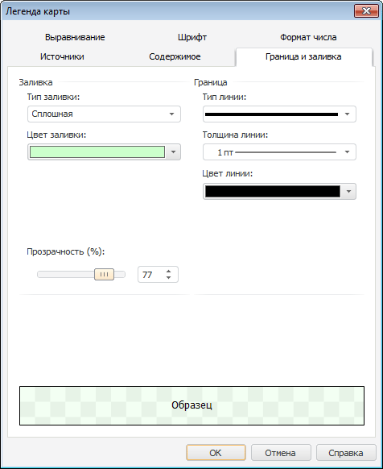

# Настройка оформления легенды: Легенда карты, регламентный отчёт, настольное приложение

Настройка оформления легенды: Легенда карты, регламентный отчёт, настольное приложение
-

# Настройка оформления легенды

Для настройки общего оформления легенды карты перейдите на вкладку «Граница и заливка» окна «[Легенда карты](UiMaps_Report_Legend.htm)»:

Определите на вкладке следующие параметры:

	- Заливка. Определите
	 параметры заливки области легенды карты:

		- Тип заливки. В раскрывающемся
		 списке выберите тип заливки: сплошная или без заливки;

		- Цвет. В раскрывающейся
		 палитре выберите цвет фона, либо выберите новый цвет в расширенной
		 палитре цветов, вызываемой при нажатии на кнопку «Другой»;

		- Прозрачность. Определите
		 прозрачность фона подписи. 100% соответствует полной прозрачности
		 (фон подписи станет невидимым), 0% соответствует полной непрозрачности.
		 Значение задается с помощью ползунка или редактора чисел;

Примечание.
 Параметры «Цвет» и «Прозрачность»
 доступны только при выборе типа заливки «Сплошная».

	- Граница.
	 Определите параметры оформления границы легенды карты:

	-

		- Тип линии. Из раскрывающегося
		 списка выберите тип линии;

		- Толщина линии. В
		 раскрывающемся списке выберите толщину линии. При выборе пункта
		 «Пользовательский» будет
		 открыто окно «Толщина линии»,
		 в котором можно с помощью редактора чисел или вручную задать требуемую
		 толщину линий.

Примечание.
 Толщина линий может задаваться [в
 разных единицах измерения](UiNav.chm::/GUI/Format/Different_units.htm), однако значение в поле ввода
 будет всегда отображаться в единицах point (1/72 дюйма).

	-

		- Цвет линии. В раскрывающейся
		 палитре выберите цвет линии, либо выберите новый цвет в расширенной
		 палитре цветов, вызываемой при нажатии на кнопку «Другой»;

Примечание.
 Параметры «Толщина линии»
 и «Цвет линии» доступны
 только при выборе типа линии, отличного от значения «нет».

	- Образец. В области отображается
	 внешний вид элемента легенды, который он примет после применения установленных
	 параметров. Проверьте, соответствует ли внешний вид элемента легенды
	 ожидаемому результату.

См. также:

[Начало
 работы с инструментом «Отчёты» в веб-приложении](../../Web/organizational_management/Starting.htm) | [Расширенная
 настройка легенды](UiMaps_Report_Legend.htm)

		Справочная
		 система на версию 10.9
		 от 18/08/2025,
		 © ООО «ФОРСАЙТ»,
