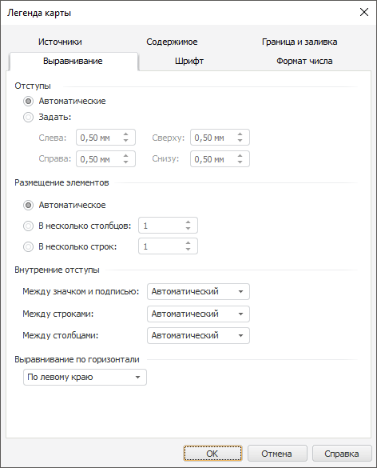

# Настройка выравнивания содержимого легенды: Легенда карты, регламентный отчёт, настольное приложение

Настройка выравнивания содержимого легенды: Легенда карты, регламентный отчёт, настольное приложение
-

# Настройка выравнивания содержимого легенды

Для настройки выравнивания содержимого легенды перейдите на вкладку
 «Выравнивание» окна «[Легенда карты](UiMaps_Report_Legend.htm)»:

Определите на вкладке следующие параметры:

	- Отступы. Определите
	 настройки отступов в легенде. Для этого установите один из переключателей:

		- Автоматические.
		 Отступы между элементами в области легенды задаются автоматически;

		- Задать. Задайте
		 значение отступов между элементами в области легенды.

Примечание.
 Значение отступа может задаваться [в
 разных единицах измерения](UiNav.chm::/GUI/Format/Different_units.htm). В поле ввода редактора будут
 отображаться значения в единицах измерения, соответствующих текущим региональным
 настройкам операционной системы.

	- Размещение элементов.
	 Определите настройки размещения элементов в области легенды. Для этого
	 установите один из переключателей:

		- Автоматическое.
		 Содержимое будет автоматически размещено в области легенды;

		- В несколько столбцов.
		 Задайте количество столбцов, в которое необходимо разместить содержимое
		 легенды;

		- В несколько строк.
		 Задайте количество строк, в которое необходимо разместить содержимое
		 легенды;

	- Внутренние отступы.
	 Определите настройки внутренних отступов в легенде:

		- Между значком и подписью.
		 Из раскрывающегося списка выберите вариант задания значения отступа
		 между [маркером](UiMaps_Report_Legend1.htm#marker)
		 и подписью: автоматический или заданный;

		- Между строками.
		 Из раскрывающегося списка выберите вариант задания значения отступа
		 между строками: автоматический или заданный;

		- Между столбцами.
		 Из раскрывающегося списка выберите вариант задания значения отступа
		 между столбцами: автоматический или заданный.

Примечание.
 При выборе варианта «Заданный»
 появится воле ввода значения внутренних отступов. Значение внутреннего
 отступа может задаваться [в разных единицах измерения](UiNav.chm::/GUI/Format/Different_units.htm). В поле ввода редактора будут
 отображаться значения в единицах измерения, соответствующих текущим региональным
 настройкам операционной системы.

	- Выравнивание по горизонтали.
	 Из раскрывающегося списка выберите необходимый вариант выравнивания
	 содержимого легенды по горизонтали: «По
	 левому краю», «По
	 центру» или «По
	 правому краю».

См. также:

[Начало
 работы с инструментом «Отчёты» в веб-приложении](../../Web/organizational_management/Starting.htm) | [Расширенная
 настройка легенды](UiMaps_Report_Legend.htm)

		Справочная
		 система на версию 10.9
		 от 18/08/2025,
		 © ООО «ФОРСАЙТ»,
