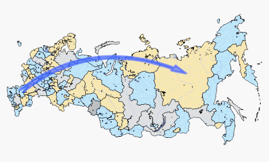

# Упрощенное создание стрелок

Упрощенное создание стрелок
-

# Упрощенное создание стрелок

Стрелка предназначена для визуализации направления движения каких-либо
 потоков между регионами, например:

В регламентном отчете доступно упрощенное создание стрелок: для этого
 требуется карта и источник данных с одним территориальным измерением,
 для которого выполняются [основные
 требования](UiMaps.chm::/Common/Requirements.htm).

Для создания, настройки и удаления стрелок используйте вкладку «Атрибуты» в диалоге «Свойства
 карты».

[Для отображения
 диалога «Свойства карты»](javascript:TextPopup(this))

		- [Добавьте
		 карту на лист отчета](svgmap.htm#add_and_locate_map) или выберите существующую карту.

		- Выполните команду «Свойства
		 карты» в контекстном меню карты.

[Для
 добавления стрелки](javascript:TextPopup(this))

	Для добавления стрелки:

		- В области «Слои и показатели»
		 выделите требуемый слой.

		- Нажмите кнопку «Добавить»
		 и в отобразившемся меню выберите пункт «Стрелка».

	Будет открыт диалог «[Формат
	 стрелки](UiReports_map_CapFormat.htm)», предназначенный для настройки параметров стрелки.

[Для
 редактирования стрелки](javascript:TextPopup(this))

	Для редактирования параметров стрелки:

		- выделите требуемую стрелку в области «Слои
		 и показатели» и нажмите кнопку «Редактировать»;

		- дважды щелкните кнопкой мыши по выбранной стрелке;

	Будет открыт диалог «Формат стрелки»,
	 предназначенный для настройки следующих параметров стрелки:

		- [основные настройки](UiReports_map_CapFormat.htm);

		- [настройки формата
		 линии](UiReports_map_CapLineFormat.htm);

		- [настройки формата
		 надписи](UiReports_map_CupFormatTitle.htm).

[Для
 подсветки стрелок](javascript:TextPopup(this))

	Для подсветки стрелок перейдите на вкладку «Параметры»
	 в диалоге «Свойства карты»
	 и установите флажок «Подсветка стрелок
	 с территориями». При установленном флажке стрелка будет подсвечиваться,
	 если указатель мыши наведен на её территорию-источник.

	Примечание.
	 Для корректной работы подсветки необходимо, чтобы для карты был выбран
	 режим подсветки.

[Для
 удаления стрелки](javascript:TextPopup(this))

	Для удаления стрелки:

		- Выделите стрелку в области «Слои
		 и показалели».

		- Нажмите кнопку «Удалить».

	Будет отображен запрос подтверждения выполняемого действия.

Пример стрелки между регионами:

См. также:

[Начало
 работы с инструментом «Отчёты» в веб-приложении](../../Web/organizational_management/Starting.htm) | [Возможности
 карты в регламентном отчете](UiMaps_Report_property.htm)

		Справочная
		 система на версию 10.9
		 от 18/08/2025,
		 © ООО «ФОРСАЙТ»,
