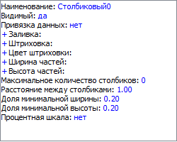

# Настройка атрибутов столбиковых показателей

Настройка атрибутов столбиковых показателей
-

# Настройка атрибутов столбиковых показателей

Настройка столбиковых показателей карты выполняется на вкладке «Атрибуты» в диалоге «Свойства
 карты».

[Для отображения
 диалога «Свойства карты»](javascript:TextPopup(this))

		- [Добавьте
		 карту на лист отчета](svgmap.htm#add_and_locate_map) или выберите существующую карту.

		- Выполните команду «Свойства
		 карты» в контекстном меню карты.

В списке «Слои и показатели»
 выберите требуемый столбиковый показатель. Область «Атрибуты»
 примет следующий вид:

Задайте параметры столбикового показателя:

	- Наименование. Для задания
	 наименования показателя щёлкните по гиперссылке с наименованием, заданным
	 по умолчанию. Введите наименование показателя в поле ввода, расположенном
	 в нижней части окна «Свойства карты»;

	- Видимый. Для отображения
	 показателя на карте установите значение «да». При
	 установленном значении «нет»
	 показатель не будет отображаться на карте;

	- Привязка данных. Для
	 определения среза или диапазона ячеек листа, на основании которых
	 будет построен показатель, щёлкните по гиперссылке «нет».
	 Будет открыто окно «[Адаптер данных](UiReports_map_Data_adapt.htm)»;

	- Заливка. Для определения
	 цвета заливки показателя задайте следующие атрибуты:

	-

		- Привязка данных.
		 Для определения среза или диапазона ячеек листа, на основании
		 которых будет выбрана территория для заливки, щёлкните по гиперссылке
		 «нет». Будет открыто
		 окне «[Адаптер
		 данных](UiReports_map_Data_adapt.htm)»;

		- Использовать шкалу.
		 Для использования в качестве заливки имеющегося набора цветов
		 установите значение «нет».
		 Для использования в качестве заливки [шкалы
		 отчета](../Reports/OperationReport/Scale/UiReport_Reports_Operation_Scale.htm) установите значение «да»,
		 при этом поле «Набор цветов»
		 будет заменено полем «Шкала»;

		- Шкала. В поле «Шкалы отчета», расположенном
		 в нижней части окна «[Свойства
		 карты](UiMaps_Report_property.htm)», выберите имеющуюся в отчете цветовую [шкалу](../Reports/OperationReport/Scale/UiReport_Reports_Operation_Scale.htm),
		 которая будет использоваться для заливки;

		- Набор цветов. Для
		 задания набора цветов, который будет использоваться в качестве
		 заливки щёлкните по гиперссылке «Редактировать»
		 или по цвету, определенному по умолчанию. Будет открыто окно «[Редактирование
		 цветов показателя](UiMaps_Report_property_Edit_Color.htm)»;

	- Штриховка. Для определения
	 штриховки показателя задайте следующие атрибуты:

	-

		- Значение. Для использования
		 штриховки показателя щёлкните по пустому полю напротив атрибута
		 «Значение». После этого
		 выберите тип штриховки в раскрывающемся списке «Штриховка»,
		 появившемся в нижней части окна «Свойства
		 карты». Для использования данного типа в поле «Зависимый» установите
		 значение «нет»;

		- Зависимый. Для задания
		 шкалы и среза, в соответствие с которыми будет производиться штриховка,
		 установите значение «да»;

		- Шкала. В поле «Шкалы отчета», расположенном
		 в нижней части окна «[Свойства
		 карты](UiMaps_Report_property.htm)», выберите имеющуюся в отчете штриховую [шкалу](../Reports/OperationReport/Scale/UiReport_Reports_Operation_Scale.htm),
		 которая будет использоваться для штриховки;

		- Привязка данных.
		 Для определения среза или диапазона ячеек листа, на основании
		 которых будет выбрана территория для штриховки, щёлкните по гиперссылке
		 «нет». Будет открыто окно «[Адаптер
		 данных](UiReports_map_Data_adapt.htm)»;

	- Цвет штриховки. Для
	 определения цвета штриховки показателя задайте следующие атрибуты:

	-

		- Привязка данных.
		 Для определения среза или диапазона ячеек листа, на основании
		 которых будет выбрана территория для штриховки, щёлкните по гиперссылке
		 «нет». Будет открыто
		 окно «[Адаптер
		 данных](UiReports_map_Data_adapt.htm)»;

		- Использовать шкалу.
		 Для использования в качестве цвета штриховки имеющегося набора
		 цветов установите значение «нет».
		 Для использования в качестве цвета штриховки набора цветов из
		 [шкалы
		 отчета](../Reports/OperationReport/Scale/UiReport_Reports_Operation_Scale.htm) установите значение «да»,
		 при этом поле «Набор цветов»
		 будет заменено полем «Шкала»;

		- Шкала. В поле «Шкалы отчета», расположенном
		 в нижней части окна «[Свойства
		 карты](UiMaps_Report_property.htm)», выберите имеющуюся в отчете цветовую [шкалу](../Reports/OperationReport/Scale/UiReport_Reports_Operation_Scale.htm),
		 которая будет использоваться для заливки;

		- Набор цветов. Для
		 задания набора цветов, который будет использоваться в качестве
		 заливки щёлкните по гиперссылке «Редактировать»
		 или по цвету, определенному по умолчанию. Будет открыто окно «[Редактирование
		 цветов показателя](UiMaps_Report_property_Edit_Color.htm)».

	- Ширина частей. Для определения
	 ширины частей показателя задайте следующие атрибуты:

		- Значение. Задайте
		 значение, в соответствии с которым будет определена ширина частей.
		 Для использования данного типа в поле «Зависимый»
		 установите значение «нет»;

		- Зависимый. Для задания
		 шкалы и среза, в соответствии с которыми будет задаваться ширина
		 частей, установите значение «да»;

		- Шкала. В поле «Шкалы отчета», расположенном
		 в нижней части окна «[Свойства
		 карты](UiMaps_Report_property.htm)», выберите имеющуюся в отчете числовую [шкалу](../Reports/OperationReport/Scale/UiReport_Reports_Operation_Scale.htm);

		- Привязка данных.
		 Для определения среза или диапазона ячеек листа, на основании
		 которых будет выбрана территория, щёлкните по гиперссылке «нет». Будет открыто окно «[Адаптер
		 данных](UiReports_map_Data_adapt.htm)»;

	- Высота частей. Для определения
	 высоты частей показателя задайте следующие атрибуты:

		- Значение. Задайте
		 значение, в соответствии с которым будет определена высота частей.
		 Для использования данного типа в поле «Зависимый»
		 установите значение «нет»,

		- Зависимый. Для задания
		 шкалы и среза, в соответствии с которыми будет задаваться высота
		 частей, установите значение «да»;

		- Шкала. В поле «Шкалы отчета», расположенном
		 в нижней части окна «[Свойства
		 карты](UiMaps_Report_property.htm)», выберите имеющуюся в отчете числовую [шкалу](../Reports/OperationReport/Scale/UiReport_Reports_Operation_Scale.htm);

		- Привязка данных.
		 Для определения среза или диапазона ячеек листа, на основании
		 которых будет выбрана территория, щёлкните по гиперссылке «нет». Будет открыто окно «[Адаптер
		 данных](UiReports_map_Data_adapt.htm)»;

	- Максимальное количество столбиков.
	 Определите максимальное количество отображаемых столбиков показателя.
	 По умолчанию значение равно нулю (все столбики показателя будут отображены);

	- Расстояние между столбиками.
	 Определите расстояние между столбиками на карте;

	- Доля минимальной ширины.
	 Определите долю минимальной ширины столбика;

	- Доля минимальной высоты.
	 Определите долю минимальной высоты столбика;

	- Начальный угол поворота.
	 Определяет начальный угол поворота;

	- Процентная шкала. Для
	 использования процентной шкалы для столбикового показателя установите
	 значение «да». По умолчанию
	 установлено значение «нет»
	 и используется абсолютная шкала.

Примечание.
 Для задания значений атрибутов «Ширина
 частей», «Высота частей»,
 «Расстояние между столбиками»,
 «Доля минимальной высоты» и «Доля минимальной высоты» используйте
 тип данных «Вещественный». Для
 задания значений атрибутов «Максимальное
 количество столбиков» и «Начальный
 угол поворота» - «Целый».

См. также:

[Начало
 работы с инструментом «Отчёты» в веб-приложении](../../Web/organizational_management/Starting.htm) | [Настройка
 показателей](UiMaps_Report_property_1.htm) | [Шкалы
 отчета](../Reports/OperationReport/Scale/UiReport_Reports_Operation_Scale.htm)

		Справочная
		 система на версию 10.9
		 от 18/08/2025,
		 © ООО «ФОРСАЙТ»,
