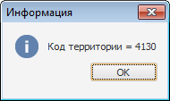

# Настройка обработчика событий карты

Настройка обработчика событий карты
-

# Настройка обработчика событий

Для настройки обработчика событий для карты используйте вкладку «Параметры» в диалоге «[Свойства карты](UiMaps_Report_property.htm)».

[Для отображения
 диалога «Свойства карты»](javascript:TextPopup(this))

		- [Добавьте
		 карту на лист отчета](svgmap.htm#add_and_locate_map) или выберите существующую карту.

		- Выполните команду «Свойства
		 карты» в контекстном меню карты.

В
 поле «Обработчик события»
 укажите наименование макроса, который будет использоваться для
 обработки события при нажатии на территорию карты. Способ указания пути
 к макросу завит от того, где находится реализация макроса:

	- если макрос реализован в модуле/форме репозитория: <идентификатор
	 модуля/формы>.<наименование макроса>;

	- если макрос реализован в одном из объектов сборки репозитория:
	 <идентификатор сборки>.<наименование макроса>.

В модулях/формах репозитория реализация пользовательских
 макросов должна производиться в глобальном пространстве имен (Global Scope).

Примечание.
 Объект среды разработки, в котором содержится реализация макроса, должен
 быть [подключен
 к регламентному отчету](../Reports/Event/UiReport_Reports_Event_Module.htm).

## Пример обработчика события

Для подключения к карте макроса в окне «Навигатор
 объектов» создайте модуль:

			Sub ModMapClick(TerrId: Variant; Map: IPrxMap);

Begin

    WinApplication.InformationBox("Код территории = " + (TerrId As Integer).ToString);

End Sub ModMapClick;

Где TerrId - код территории;
 Map - сама карта.

Для выполнения примера добавьте ссылки на системные сборки: Report и
 Ui.

Созданный модуль [подключите
 к отчету](../Reports/Event/UiReport_Reports_Event_Module.htm). После подключения модуля укажите наименование макроса в
 поле «Обработчик события» на вкладке
 «Параметры» окна «[Свойства
 карты](UiMaps_Report_property.htm)».

После подключения макроса в случае обращения к территориальной единице
 на карте будет выдаваться сообщение, например:

См. также:

[Начало
 работы с инструментом «Отчёты» в веб-приложении](../../Web/organizational_management/Starting.htm) | [Обработка событий
 отчета](../Reports/Event/UiReport_Reports_Event.htm) | [Модули:
 Модули отчета и обработка событий](../Reports/Event/UiReport_Reports_Event_Module.htm) | [Возможности
 карты в регламентном отчете](UiMaps_Report_property.htm)

		Справочная
		 система на версию 10.9
		 от 18/08/2025,
		 © ООО «ФОРСАЙТ»,
