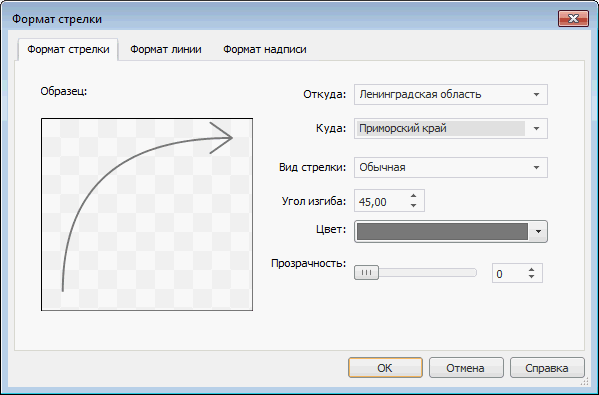

# Основные настройки: Формат стрелки

Основные настройки: Формат стрелки
-

# Основные настройки

Для задания основных настроек стрелки используйте вкладку «Формат
 стрелки» в диалоге «Формат стрелки».

[Для отображения диалога «Формат стрелки»](javascript:TextPopup(this))

		- [Добавьте карту
		 на лист отчета](svgmap.htm#add_and_locate_map) или выберите существующую карту.

		- Выполните команду «Свойства
		 карты» в контекстном меню карты.

		- Перейдите на вкладку «Атрибуты».

		- [Создайте
		 стрелку](UiMaps_Report_property_1_arrow.htm#add) или выберите существующую и нажмите кнопку «Редактировать».

Вкладка состоит из двух частей:

	- в левой части вкладки расположен образец стрелки, построенный
	 по заданным параметрам. Изменение любого параметра (кроме параметров
	 «Откуда», «Куда»)
	 ведет к обновлению образца;

	- в правой части вкладки задаются параметры.

Задайте на вкладке следующие параметры стрелки:

	- Откуда. В раскрывающемся
	 списке выберите регион, который будет являться исходной точкой
	 для стрелки;

	- Куда. В раскрывающемся
	 списке выберите регион, который будет являться конечной точкой
	 для стрелки;

	- Вид
	 стрелки. В раскрывающемся списке выберите внешний вид стрелки:

	-

		- Обычная. Линия стрелки
		 одинаковая по ширине в начале и в конце:

	-

		- С заливкой. Линия
		 стрелки одинаковая по ширине в начале и в конце, обладает внутренним
		 пространством, которое можно залить указанным цветом:

	-

		- Фигурная. Линия
		 стрелки сужается от конца к началу, обладает внутренним пространством,
		 которое можно залить указанным цветом:

Дополнительные параметры стрелки можно задать
 на вкладке «[Формат
 линии](UiReports_map_CapLineFormat.htm)».

	- Угол изгиба. Определите
	 изогнутость стрелки: чем больше угол изгиба (по модулю), тем более
	 выгнутой будет стрелка. Допустимые значения: [-89; 89];

	- Цвет. В раскрывающейся
	 палитре выберите цвет стрелки, либо выберите новый цвет в расширенной
	 палитре цветов, вызываемой при нажатии на кнопку «Другой»;

	- Прозрачность. Определите
	 прозрачность стрелки. 100% соответствует полной прозрачности (стрелка
	 станет невидимой), 0% соответствует полной непрозрачности. Значение
	 задается с помощью ползунка или с помощью редактора чисел.

См. также:

[Начало
 работы с инструментом «Отчёты» в веб-приложении](../../Web/organizational_management/Starting.htm) | [Упрощенное
 создание стрелок](UiMaps_Report_property_1_arrow.htm)

		Справочная
		 система на версию 10.9
		 от 18/08/2025,
		 © ООО «ФОРСАЙТ»,
