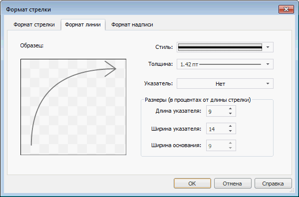

# Настройка формата линии: Формат стрелки

Настройка формата линии: Формат стрелки
-

# Настройка формата линии

Для настройки формата линии стрелки используйте вкладку «Формат
 линии» в диалоге «Формат стрелки».

[Для отображения диалога «Формат стрелки»](javascript:TextPopup(this))

		- [Добавьте карту
		 на лист отчета](svgmap.htm#add_and_locate_map) или выберите существующую карту.

		- Выполните команду «Свойства
		 карты» в контекстном меню карты.

		- Перейдите на вкладку «Атрибуты».

		- [Создайте
		 стрелку](UiMaps_Report_property_1_arrow.htm#add) или выберите существующую и нажмите кнопку «Редактировать».

Вкладка состоит из двух частей:

	- в левой части вкладки расположен образец стрелки, построенный
	 по заданным параметрам. Изменение любого параметра ведет к обновлению
	 образца;

	- в правой части вкладки задаются параметры.

Задайте на вкладке следующие параметры линии и указателя стрелки:

	- Стиль. В раскрывающемся
	 списке выберите стиль линии;

	- Толщина. В раскрывающемся
	 списке выберите толщину линии. При выборе пункта «Пользовательский»
	 будет открыто окно «Толщина линии»,
	 в котором можно с помощью редактора чисел или вручную задать требуемую
	 толщину линий.

Примечание.
 Толщина линий может задаваться [в
 разных единицах измерения](UiNav.chm::/GUI/Format/Different_units.htm), однако значение в поле ввода
 будет всегда отображаться в единицах point (1/72 дюйма).

	- Указатель. В раскрывающемся
	 списке выберите вид наконечника для стрелки. Вид наконечника можно
	 задать, если вид стрелки «[Обычная](UiReports_map_CapFormat.htm#arrow_type)»;

	- Размеры. Определите
	 параметры указателя стрелки. Все размеры задаются в процентах от длины
	 стрелки:

		- Длина указателя.
		 Установите длину указателя стрелки. Допустимые значения: [0, 100];

		- Ширина указателя.
		 Установите ширину указателя стрелки. Допустимые значения: [0, 100];

		- Ширина основания.
		 Установите ширину основания стрелки. Допустимые значения: [0, 100].
		 Ширину основания нельзя задать, если вид стрелки «[Обычная](UiReports_map_CapFormat.htm#arrow_type)».

Примечание.
 Настройка параметров в данной группе недоступна, если для стрелки вида
 «[Обычная](UiReports_map_CapFormat.htm#arrow_type)»
 определен вид наконечника.

См. также:

[Начало
 работы с инструментом «Отчёты» в веб-приложении](../../Web/organizational_management/Starting.htm) | [Упрощенное
 создание стрелок](UiMaps_Report_property_1_arrow.htm)

		Справочная
		 система на версию 10.9
		 от 18/08/2025,
		 © ООО «ФОРСАЙТ»,
