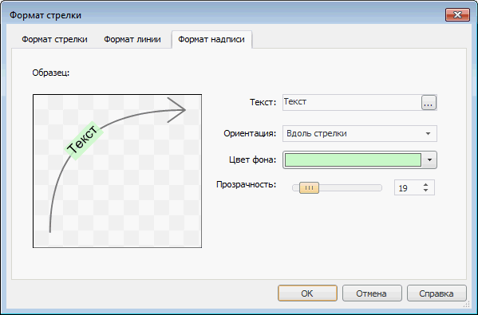

# Настройка формата надписи: Формат стрелки

Настройка формата надписи: Формат стрелки
-

# Настройка формата надписи

Для настройки формата надписи стрелки используйте вкладку «Формат
 надписи» в диалоге «Формат стрелки».

[Для отображения диалога «Формат стрелки»](javascript:TextPopup(this))

		- [Добавьте карту
		 на лист отчета](svgmap.htm#add_and_locate_map) или выберите существующую карту.

		- Выполните команду «Свойства
		 карты» в контекстном меню карты.

		- Перейдите на вкладку «Атрибуты».

		- [Создайте
		 стрелку](UiMaps_Report_property_1_arrow.htm#add) или выберите существующую и нажмите кнопку «Редактировать».

Вкладка состоит из двух частей:

	- в левой части вкладки расположен образец стрелки, построенный
	 по заданным параметрам. Изменение любого параметра ведет к обновлению
	 образца;

	- в правой части вкладки задаются параметры.

Задайте на вкладке следующие параметры подписи стрелки:

	- Текст. Задайте в поле
	 текст подписи стрелке. Для настройки параметров шрифта нажмите кнопку
	 . Будет открыто окно «[Шрифт](UiDiagrams.chm::/Tuning_format/Format_Title/UiDiagrams_FormatTitle_type.htm)»;

	- Ориентация. Из раскрывающегося
	 списка выберите вариант ориентации подписи стрелки:

	-

		- Горизонтально;

		- Вдоль стрелки;

	- Цвет фона. В раскрывающейся
	 палитре выберите цвет фона подписи стрелки, либо выберите новый
	 цвет в расширенной палитре цветов, вызываемой при нажатии на кнопку
	 «Другой»;

	- Прозрачность. Определите
	 прозрачность фона подписи стрелки. 100% соответствует полной прозрачности
	 (фон подписи станет невидимым), 0% соответствует полной непрозрачности.
	 Значение задается с помощью ползунка или с помощью редактора чисел.

См. также:

[Начало
 работы с инструментом «Отчёты» в веб-приложении](../../Web/organizational_management/Starting.htm) | [Упрощенное
 создание стрелок](UiMaps_Report_property_1_arrow.htm)

		Справочная
		 система на версию 10.9
		 от 18/08/2025,
		 © ООО «ФОРСАЙТ»,
