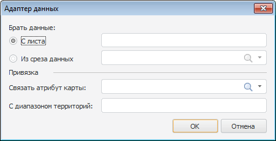

# Выбор адаптера данных

Выбор адаптера данных
-

# Выбор адаптера данных

При настройке атрибутов [слоев](UiReport_layer_atr.htm) и
 показателей ([картографического](UiMaps_Report_property_1_atr_1.htm),
 [столбикового](UiMaps_Report_property_1_atr_3.htm), [кругового](UiMaps_Report_property_1_atr_2.htm))
 для одновременного отображения на одной карте данных разных срезов
 и данных с любых листов отчета используется атрибут «Привязка
 данных», присутствующий во многих групповых атрибутах.

Для сопоставления атрибута показателя карты (или самого показателя)
 и данных задайте связь источника данных и карты в окне «Адаптер данных»:

Задайте в окне следующие параметры:

	- Брать данные.
	 Определите источник данных:

		- С листа. Выберите
		 диапазон ячеек листа, содержащий данные;

Примечание.
 Для использования доступны ячейки области данных, области формул и ячейки
 с данными, введенными вручную.

		- Из среза данных.
		 Из раскрывающегося списка выберите [срез](../Source/UiReport_Source.htm)
		 текущего отчета;

	- Привязка. Определите
	 связь выбранного источника данных с картой:

		- Связать атрибут карты.
		 Выберите атрибут топоосновы, по которому необходимо создать связь
		 с источником данных;

		- С диапазоном территорий.
		 Выберите диапазон ячеек с данными. Параметр доступен при выборе
		 источника данных с листа;

		- С измерением территорий.
		 Из раскрывающегося списка выберите атрибут или индекс измерения
		 территории. Доступны индексы и атрибуты, которые соответствуют
		 выбранному атрибуту топоосновы. Параметр доступен при выборе источника
		 из среза данных.

Примечание.
 Для корректной работы карты выбирайте для связи соответствующие данные.
 Например, указывая в параметре «Связать
 атрибут карты» атрибут топоосновы, содержащий наименование территории,
 выбирайте диапазон ячеек на листе, содержащий наименование территорий.

Пример настройки адаптера данных смотрите в разделе «[Настройка
 карты](UiMaps_Report_CreateMaps.htm)».

См. также:

[Начало
 работы с инструментом «Отчёты» в веб-приложении](../../Web/organizational_management/Starting.htm) | [Пример
 настройки карты](UiMaps_Report_CreateMaps.htm) | [Настройка
 показателей карты](UiMaps_Report_property_1.htm) | [Настройка
 атрибутов слоя](UiReport_layer_atr.htm) | [Настройка атрибутов картографического
 показателя](UiMaps_Report_property_1_atr_1.htm) | [Настройка атрибутов круговых
 показателей](UiMaps_Report_property_1_atr_2.htm) | [Настройка атрибутов столбиковых
 показателей](UiMaps_Report_property_1_atr_3.htm)

		Справочная
		 система на версию 10.9
		 от 18/08/2025,
		 © ООО «ФОРСАЙТ»,
