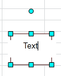
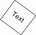
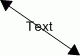
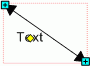

# Ввод и редактирование текста: Регламентный отчёт, настольное приложение

Ввод и редактирование текста: Регламентный отчёт, настольное приложение
-

# Ввод и редактирование текста

Каждая фигура может содержать текст. Для ввода или редактирования уже
 имеющегося текста дважды щелкните по фигуре. Появится поле ввода:

В данном поле разместите или отредактируйте текст. Для закрытия поля
 ввода произведите щелчок за его пределами.

После перехода в режим редактирования становятся доступными операции
 над содержимым фигуры:

[Форматирование
 текста](javascript:TextPopup(this))

	Для настройки параметров форматирования введенного в фигуру текста:

		- выполните команду контекстного меню «Формат»
		 содержимого фигуры;

		- нажмите сочетание клавиш CTRL+1.

	Откроется окно «Формат»,
	 содержащее вкладку «[Шрифт](../UiReport_format.htm)».

	Также для настройки форматирования текста фигуры:

		- задайте параметры форматирования в группе «Шрифт»,
		 расположенной на вкладке «Главная»
		 ленты инструментов;

		- задайте параметры форматирования в группе «Формат»,
		 расположенной на вкладке «Объект. Фигура»
		 ленты инструментов;

		- выполните команду контекстного меню «Формат»
		 для фигуры. В открывшемся окне «[Формат
		 объектов](UiReport_AutoObj_Format.htm)» задайте параметры форматирования на вкладках «[Текстовый
		 блок](uinav.chm::/GUI/format/uietl_objprop_text.htm)» и «[Шрифт](uinav.chm::/GUI/format/uireport_table_attribute_type.htm)».

[Отмена и повтор
 действия](javascript:TextPopup(this))

	Для отмены последнего выполняемого действия над содержимым фигуры:

		- выполните команду контекстного меню «Отменить»;

		- нажмите сочетание клавиш CTRL+Z.

	Для возврата отмененного действия:

		- выполните команду контекстного меню «Повторить»;

		- нажмите сочетание клавиш CTRL+Y.

[Работа с буфером
 обмена](javascript:TextPopup(this))

	Для перемещения выделенного
	 содержимого фигуры в буфер обмена:

		- нажмите кнопку «Вырезать»,
		 расположенную в группе «Буфер
		 обмена» на вкладке «Главная»
		 ленты инструментов;

		- выполните команду контекстного меню «Вырезать»
		 содержимого фигуры;

		- нажмите сочетание клавиш CTRL+X.

	Содержимое фигуры будет перемещено в буфер обмена.

	Для копирования выделенного
	 содержимого фигуры в буфер обмена:

		- нажмите кнопку «Копировать»,
		 расположенную в группе «Буфер
		 обмена» на вкладке «Главная»
		 ленты инструментов;

		- выполните команду контекстного меню «Копировать»
		 содержимого фигуры;

		- нажмите сочетание клавиш CTRL+C.

	Содержимое фигуры будет скопировано в буфер обмена.

	Для вставки данных в фигуру из
	 буфера обмена:

		- нажмите кнопку «Вставить»,
		 расположенную в группе «Буфер
		 обмена» на вкладке «Главная»
		 ленты инструментов;

		- выполните команду контекстного меню «Вставить»;

		- нажмите сочетание клавиш CTRL+V.

	В фигуру будут вставлены данные из буфера обмена.

[Удаление](javascript:TextPopup(this))

	Для удаления выделенного содержимого фигуры:

		- выполните команду контекстного меню «Удалить»;

		- нажмите клавишу DELETE.

	Выделенное содержимое фигуры будет удалено.

[Выделение всего
 текста](javascript:TextPopup(this))

	Для выделения всего текста, содержащегося в фигуре:

		- выполните команду контекстного меню «Выделить
		 все»;

		- нажмите сочетание клавиш CTRL+A.

	Весь текст фигуры будет выделен.

[Выравнивание
 текста](javascript:TextPopup(this))

	Для выравнивания содержимого фигуры выберите способ выравнивания
	 в группе «Выравнивание», расположенной
	 на вкладке «Главная» ленты
	 инструментов.

	Доступны способы выравнивания текста фигуры:

		- выравнивание текста по левому краю;

		- выравнивание текста по центру;

		- выравнивание текста по правому краю.

	Примечание.
	 Выравнивание распространяется на весь текст, содержащийся в фигуре.

[Поворот и перемещение
 текста](javascript:TextPopup(this))

	Поворот фигуры с замкнутым контуром, содержащей текст, происходит
	 вместе с текстом:

	

	Текст, созданный для линий, всегда располагается горизонтально:

	

	Для перемещения подписи линии выделите линию (при отметке надписи
	 также выделяется и сама линия, которой принадлежит надпись) и переместите
	 текст, «захватив» желтый маркер, размещенный в центре подписи:

	

См. также:

[Начало
 работы с инструментом «Отчёты» в веб-приложении](../../../Web/organizational_management/Starting.htm) | [Фигуры](UiReport_AutoObject.htm) | [Вставка иллюстраций, фигур и текстовых
 блоков](../UiReport_Objects.htm) | [Построение отчёта](../../CreateReport.htm) | [Работа с
 готовыми отчётами](../../Reports/OperationReport/Work_witn_report.htm)

		Справочная
		 система на версию 10.9
		 от 18/08/2025,
		 © ООО «ФОРСАЙТ»,
