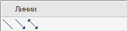
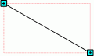
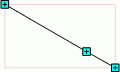
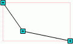

# Изменение размера и формы фигур типа «Линия»

Изменение размера и формы фигур типа «Линия»
-

# Изменение размера и формы фигур типа «Линия»

Фигуры типа «Линия» могут быть
 следующими:

## Изменение размера

Изменение размера линий осуществляется с использованием точек выделения
  или  (для
 соединительной линии).

Для изменения размера и положения линии наведите курсор на точку выделения.
 При этом стрелка мыши примет форму четырехнаправленной стрелки: .
 После выбора точки, зажмите кнопку мыши и переместите точку в необходимом
 направлении. Как только линия приняла нужный размер и положение, отпустите
 кнопку мыши.

## Изменение формы

Для создания ломаной линии:

	- Выделите линию:

	- Затем, удерживая нажатой клавишу CTRL, наведите курсор мыши на
	 линию и щелкните левой кнопкой. На линии появится дополнительная точка
	 выделения:

Подобным образом на линии можно добавить
 несколько дополнительных точек выделения.

	- С помощью дополнительной точки выделения измените форму линии:

Для удаления добавленной дополнительной точки выделения наведите курсор
 мыши на данную точку, удерживая нажатой клавишу CTRL, и щелкните дополнительной
 кнопкой мыши.

Примечание.
 Ломаную линию нельзя создать из соединительной линии.

См. также:

[Начало
 работы с инструментом «Отчёты» в веб-приложении](../../../Web/organizational_management/Starting.htm) | [Фигуры](UiReport_AutoObject.htm) | [Вставка иллюстраций, фигур и текстовых
 блоков](../UiReport_Objects.htm) | [Построение отчёта](../../CreateReport.htm) | [Работа с
 готовым отчётом](../../Reports/OperationReport/Work_witn_report.htm)

		Справочная
		 система на версию 10.9
		 от 18/08/2025,
		 © ООО «ФОРСАЙТ»,
