# Изменение размера и вращение фигур с замкнутым контуром

Изменение размера и вращение фигур с замкнутым контуром
-

# Изменение размера и вращение фигур с замкнутым контуром

К фигурам с замкнутым контуром относятся все фигуры, за исключением
 линий.

При выделении фигуры будут отображены ее точки выделения. Для различных
 фигур точки выделения могут отличаться:

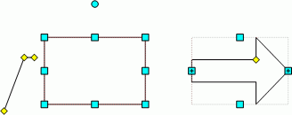

Круглая точка выделения , расположенная
 над фигурой, является точкой вращения.

Квадратные точки выделения 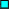,
 расположенные по периметру фигуры, являются точками изменения размера.

Квадратные точки выделения со знаком «+» 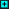,
 являются точками изменения размера и вращения фигуры.

Точки выделения в виде ромба ,
 являются точками изменения формы фигуры.

## Вращение фигур

### Вращение фигуры относительно центра

Вращение фигуры относительно ее центра осуществляется с использованием
 точки вращения: . При наведении
 курсора мыши на данную точку фигуры, стрелка мыши принимает вид закругленной
 стрелки:

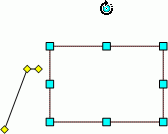

После того как стрелка мыши приняла данный вид, зажмите кнопку мыши
 и вращайте фигуру. В момент вращения стрелка принимает следующий вид:

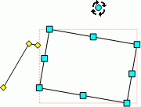

После того как фигура приняла нужное положение, отпустите кнопку мыши.

Примечание.
 Вращение фигуры будет происходить на 45 градусов, если при вращении удерживать
 клавишу CTRL.

### Вращение фигуры относительно точки выделения

Вращение фигуры осуществляется при помощи одной точки вращения , относительно другой точки вращения .
 Например, вращение фигуры при помощи точки «2» относительно точки «1»:

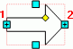

При наведении курсора мыши на точку вращения фигуры, стрелка мыши принимает
 вид четырехнаправленной стрелки:

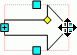

После того как стрелка мыши приняла данный вид, зажмите кнопку мыши
 и вращайте фигуру. В момент вращения стрелка принимает следующий вид:

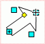

После того как фигура приняла нужное положение, отпустите кнопку мыши.

## Изменение размера фигур и выносок

Изменение размера фигуры осуществляется с использованием точек выделения:
  и .

Для изменения размера фигуры наведите курсор на точку выделения. Стрелка
 мыши может при этом принять следующий вид:

	-  - изменение длины фигуры;

	- 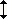 - изменение высоты фигуры;

	- 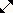 или 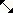 или
	 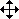 - изменение длины и высоты фигуры одновременно.

После выбора точки зажмите кнопку мыши и переместите точку в соответствующем
 направлении. Как только фигура приняла нужный размер, отпустите кнопку
 мыши.

Изменение формы фигуры осуществляется с использованием точки выделения
 . Для изменения формы фигуры наведите курсор на точку
 выделения. При этом стрелка мыши останется в форме указателя 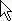.
 После выбора точки зажмите кнопку мыши и переместите точку в необходимом
 направлении. Как только выноска приняла нужный размер и форму, отпустите
 кнопку мыши.

См. также:

[Начало
 работы с инструментом «Отчёты» в веб-приложении](../../../Web/organizational_management/Starting.htm) | [Фигуры](UiReport_AutoObject.htm) | [Вставка иллюстраций, фигур и текстовых
 блоков](../UiReport_Objects.htm) | [Построение отчёта](../../CreateReport.htm) | [Работа с
 готовым отчётом](../../Reports/OperationReport/Work_witn_report.htm)

		Справочная
		 система на версию 10.9
		 от 18/08/2025,
		 © ООО «ФОРСАЙТ»,
