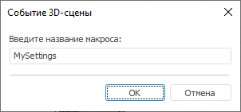

# Обработчик событий 3D-сцены

Обработчик событий 3D-сцены
-

# Обработчик событий 3D-сцены

Обработка событий 3D-сцены позволяет отчету реагировать на события,
 генерируемые сценой. Обработчик событий – это модуль, написанный на языке
 Fore.

Обработчик событий позволяет выполнять определенное действие при обращении
 к трехмерной сцене.

Для задания обработчика событий сцены выполните команду контекстного
 меню «Обработчик событий» сцены.

После выполнения команды будет открыто окно:

Введите в поле ввода название макроса, который будет использоваться
 в качестве обработчика.

При нажатии на кнопку «ОК» для
 сцены будет использоваться заданный макрос.

См. также:

[Начало
 работы с инструментом «Отчёты» в веб-приложении](../../Web/organizational_management/Starting.htm) | [3D-сцена](UiReport_Objects_3D.htm)

		Справочная
		 система на версию 10.9
		 от 18/08/2025,
		 © ООО «ФОРСАЙТ»,
