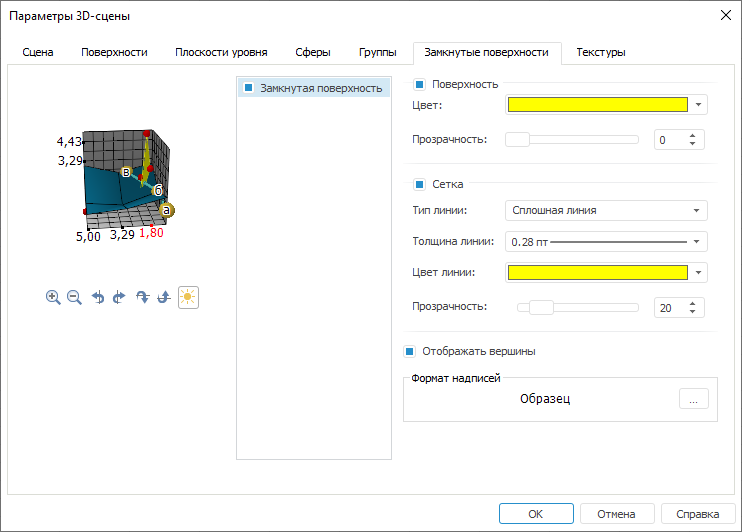

# Замкнутые поверхности

Замкнутые поверхности
-

# Замкнутые поверхности

Для настройки параметров замкнутых поверхностей перейдите на вкладку
 «Замкнутые поверхности» окна «[Параметры
 3D-сцены](UiReport_Objects_3DParameters.htm)»:

Примечание.
 Вкладка присутствует в окне «[Параметры
 3D-сцены](UiReport_Objects_3DParameters.htm)», если в [источниках
 данных](UiReport_Objects_3DSource.htm) был создан ряд типа «Замкнутая
 поверхность».

Установленные флажки с названиями замкнутых поверхностей включают видимость
 замкнутых поверхностей на сцене. По умолчанию все имеющиеся поверхности
 отображаются на сцене.

Для настройки выделенной в списке замкнутой поверхности задайте следующие
 параметры:

[Поверхность](javascript:TextPopup(this))

	При установленном флажке «Поверхность»
	 будет включена возможность использования заливки поверхности. При
	 установке флажка в группе определяются следующие параметры:

		- Цвет. Задайте цвет
		 заливки, выбрав его из раскрывающейся палитры цветов;

		- Прозрачность. Задайте
		 прозрачность заливки в процентах.

[Сетка](javascript:TextPopup(this))

	При установленном флажке «Сетка»
	 будет отображена сетка на поверхности. При установке флажка в группе
	 определяются следующие параметры:

		- Тип линии. Задайте
		 вариант линии сетки: «Сплошная
		 линия» или «Точечная линия»;

		- Толщина линии. Задайте
		 толщину линий. Для задания пользовательской толщины в раскрывающемся
		 списке выберите пункт «Пользовательский».
		 Будет открыт диалог задания толщины линий;

	Примечание.
	 Толщина линий может задаваться в [разных единицах
	 измерения](UiNav.chm::/GUI/Format/Different_units.htm), однако значение в поле ввода будет всегда
	 отображаться в единицах point (1/72 дюйма).

		- Цвет линии. Задайте
		 цвет линии, выбрав его из раскрывающейся палитры цветов;

		- Прозрачность. Задайте
		 прозрачность линии в процентах.

[Отображать вершины](javascript:TextPopup(this))

	При установленном флажке «Отображать
	 вершины» будет включено отображение вершин поверхности на сцене.

[Формат надписей](javascript:TextPopup(this))

	Настройте формат выводимых заголовков для вершин. Для этого нажмите
	 на кнопку . Будет
	 открыт диалог для настройки формата надписей вершин. Данный диалог
	 идентичен вкладке «[Шрифт](UiReport_Objects_3DParametersScena2.htm#text_font)» диалога
	 «Формат оси».

См. также:

[Начало
 работы с инструментом «Отчёты» в веб-приложении](../../Web/organizational_management/Starting.htm) | [Параметры 3D-сцены](UiReport_Objects_3DParameters.htm)

		Справочная
		 система на версию 10.9
		 от 18/08/2025,
		 © ООО «ФОРСАЙТ»,
