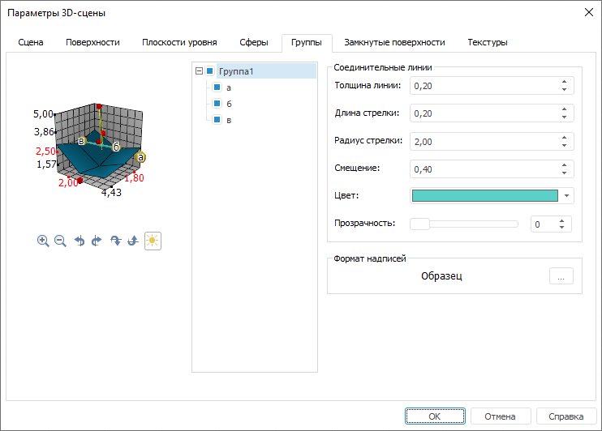
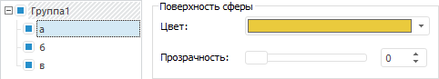

# Группы

Группы
-

# Группы

Для настройки параметров групп перейдите на вкладку «Группы»
 окна «[Параметры
 3D-сцены](UiReport_Objects_3DParameters.htm)»:

Примечание.
 Вкладка присутствует в окне «[Параметры
 3D-сцены](UiReport_Objects_3DParameters.htm)», если в [источниках
 данных](UiReport_Objects_3DSource.htm) был создан ряд типа «Группа
 именованных сфер».

Установленные флажки с названиями групп включают видимость группы/сфер
 на сцене. По умолчанию все имеющиеся поверхности отображаются на сцене.

При выделении в списке элемента, соответствующего группе, параметры
 справа принимают вид, изображенный на рисунке выше.

Для настройки выделенной в списке группы/сферы задайте следующие параметры
 в группе «Соединительные линии»:

[Толщина линии](javascript:TextPopup(this))

	Задайте толщину линии, соединяющей сферы. Допустимые значения толщины
	 стрелки [0, 1].

[Длина стрелки](javascript:TextPopup(this))

	Задайте длину стрелки соединительной линии. Допустимые значения
	 длины стрелки [0, 1].

[Радиус стрелки](javascript:TextPopup(this))

	Задайте радиус стрелки соединительной линии. Допустимые значения
	 радиуса [1, 3].

[Смещение](javascript:TextPopup(this))

	Задайте смещение стрелки от начала линии. Допустимые значения смещения
	 [0, 1].

[Цвет](javascript:TextPopup(this))

	Задайте цвет заливки, выбрав его из раскрывающейся палитры цветов.

[Прозрачность](javascript:TextPopup(this))

	Задайте прозрачность заливки в процентах.

Для настройки формата выводимых заголовков сфер нажмите кнопку ,
 расположенную в группе «Формат надписей».
 Будет открыт диалог для настройки формата надписей сфер, аналогичный вкладке
 «[Шрифт](UiReport_Objects_3DParametersScena2.htm#text_font)»
 диалога «Формат оси».

При выделении в списке элемента, соответствующего сфере, параметры справа
 принимают следующий вид:

Для настройки выделенной в списке сферы задайте следующие параметры
 в группе «Поверхность сферы»:

[Цвет](javascript:TextPopup(this))

	Задайте цвет заливки, выбрав его из раскрывающейся палитры цветов.

[Прозрачность](javascript:TextPopup(this))

	Задайте прозрачность заливки в процентах.

См. также:

[Начало
 работы с инструментом «Отчёты» в веб-приложении](../../Web/organizational_management/Starting.htm) | [Параметры 3D-сцены](UiReport_Objects_3DParameters.htm)

		Справочная
		 система на версию 10.9
		 от 18/08/2025,
		 © ООО «ФОРСАЙТ»,
