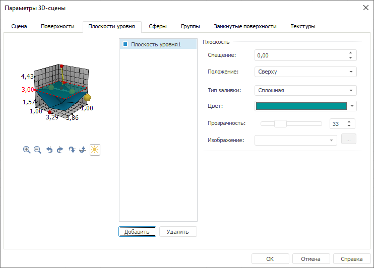

# Плоскости уровня

Плоскости уровня
-

# Плоскости уровня

Для настройки параметров плоскости уровня перейдите на вкладку «Плоскости уровня» окна «[Параметры 3D-сцены](UiReport_Objects_3DParameters.htm)»:

Справа от образца сцены расположен список плоскостей уровня.

При работе с плоскостями уровня доступны следующие операции

[Добавление плоскости
 уровня](javascript:TextPopup(this))

	Для добавления плоскости уровня в список:

		- нажмите кнопку «Добавить»;

		- нажмите клавишу INSERT, когда фокус ввода находится в списке.

	После выполнения одного из действий в список будет добавлена плоскость
	 с идентификатором «Плоскость уровня
	 N», где N - номер плоскости в списке.

	Примечание.
	 По умолчанию плоскость уровня создается полупрозрачной.

[Удаление плоскости
 уровня](javascript:TextPopup(this))

	Для удаления выбранной из списка плоскости:

		- нажмите кнопку «Удалить»;

		- нажмите клавишу DELETE, когда фокус ввода находится в списке.

	После выполнения одного из действий появится диалог подтверждения
	 выполняемого действия.

Установленные флажки с названиями плоскостей уровня включают видимость
 поверхности на сцене. По умолчанию все имеющиеся поверхности отображаются
 на сцене.

Для настройки выделенной в списке плоскости уровня задайте следующие
 параметры в группе «Плоскость»:

[Смещение](javascript:TextPopup(this))

	Задайте смещение плоскости вдоль оси, перпендикулярной плоскости
	 уровня. Допустимые значения смещения [-0.5,0.5].

	Примечание.
	 Положение плоскости уровня можно менять на образце сцены. Для этого
	 выделите плоскость, зажмите кнопку мыши и клавишу CTRL, после
	 чего с помощью перемещения мыши определите смещение плоскости уровня
	 вдоль оси перпендикулярной ей.

[Положение](javascript:TextPopup(this))

	Задайте вариант расположения плоскости уровня, выбор производится
	 из раскрывающегося списка.

[Тип заливки](javascript:TextPopup(this))

	Задайте вариант заливки плоскости уровня: «Сплошная»
	 или «Изображение».

[Цвет](javascript:TextPopup(this))

	Задайте цвет заливки, выбрав его из раскрывающейся палитры цветов.
	 Параметр доступен, если установлен тип заливки «Сплошная».

[Прозрачность](javascript:TextPopup(this))

	Задайте прозрачность заливки в процентах.

[Изображение](javascript:TextPopup(this))

	Параметр доступен, если установлен тип заливки «Изображение».

	Задайте изображение в раскрывающемся списке из уже загруженных ранее
	 или загрузите изображение, которое будет использоваться в качестве
	 заливки.

	Для загрузки изображения нажмите кнопку . Будет
	 открыт стандартный диалог выбора файла.

См. также:

[Начало
 работы с инструментом «Отчёты» в веб-приложении](../../Web/organizational_management/Starting.htm) | [Параметры 3D-сцены](UiReport_Objects_3DParameters.htm)

		Справочная
		 система на версию 10.9
		 от 18/08/2025,
		 © ООО «ФОРСАЙТ»,
