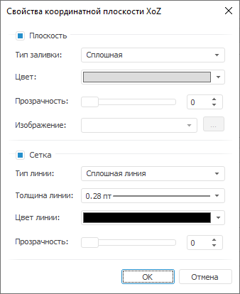

# Свойства координатной плоскости

Свойства координатной плоскости
-

# Свойства координатной плоскости

Для настройки координатных плоскостей используйте диалог «Свойства
 координатной плоскости»:

Задайте следующие настройки:

[Плоскость](javascript:TextPopup(this))

	Установленный флажок «Плоскость»
	 включает отображение плоскости на сцене. При снятом флажке заливка
	 для координатной плоскости не используется. По умолчанию флажок установлен.
	 При установленном флажке в группе задаются следующие параметры:

		- Тип заливки. Задайте
		 вариант заливки: «Сплошная»
		 или «Изображение»;

		- Цвет. Задайте цвет
		 заливки, выбрав его из раскрывающейся палитры цветов. Параметр
		 доступен, если установлен тип заливки «Сплошная»;

		- Прозрачность. Задайте
		 прозрачность заливки в процентах;

		- Изображение. Задайте
		 изображение в раскрывающемся списке из уже загруженных ранее или
		 загрузите изображение, которое будет использоваться в качестве
		 заливки. Для загрузки изображения нажмите кнопку . Будет открыт стандартный
		 диалог выбора файла. Параметр доступен, если установлен тип заливки
		 «Изображение».

[Сетка](javascript:TextPopup(this))

	Установленный флажок «Сетка»
	 включает отображение сетки на координатной плоскости. При снятом флажке
	 сетка не отображается. По умолчанию флажок установлен. При установленном
	 флажке в группе задаются следующие параметры:

		- Тип линии. Задайте
		 вариант линии: «Сплошная линия»
		 и «Точечная линия»;

		- Толщина линии. Задайте
		 толщину линий. Для задания пользовательской толщины в раскрывающемся
		 списке выберите пункт «Пользовательский»,
		 после чего будет открыт диалог задания толщины линий;

	Примечание.
	 Толщина линий может задаваться в [разных единицах
	 измерения](UiNav.chm::/GUI/Format/Different_units.htm), однако значение в поле ввода будет всегда
	 отображаться в единицах point (1/72 дюйма).

		- Цвет линии. Задайте
		 цвет линии, выбрав его из раскрывающейся палитры цветов;

		- Прозрачность. Задайте
		 прозрачность линии в процентах.

См. также:

[Начало
 работы с инструментом «Отчёты» в веб-приложении](../../Web/organizational_management/Starting.htm) | [Сцена](UiReport_Objects_3DParametersScena.htm)

		Справочная
		 система на версию 10.9
		 от 18/08/2025,
		 © ООО «ФОРСАЙТ»,
