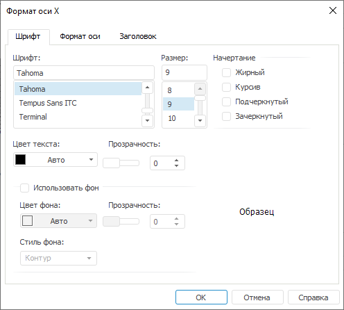
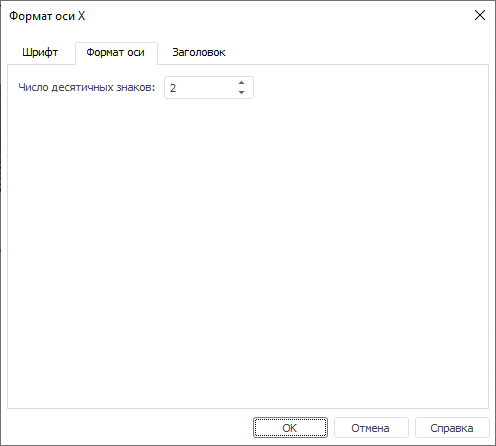

# Формат оси: Регламентный отчёт, настольное приложение

Формат оси: Регламентный отчёт, настольное приложение
-

# Формат оси

Для настройки формата соответствующей оси используйте диалог «Формат оси»:

Для настройки формата оси задайте параметры на вкладках диалога:

[Шрифт](javascript:TextPopup(this))

	На вкладке «Шрифт» задайте
	 следующие параметры:

		- Шрифт. Определите
		 тип шрифта;

		- Размер. Определите
		 размер шрифта;

		- Начертание. Определите
		 тип начертания текста. Возможно одновременное использование нескольких
		 начертаний (установка нескольких флажков);

		- Цвет текста. Определите
		 цвет текста, выбрав его из раскрывающейся палитры цветов;

		- Прозрачность. Задайте
		 прозрачность текста в процентах;

		- Использовать фон.
		 Установленный флажок определяет использование фона для текста.
		 При установке флажка задайте следующие параметры:

		-

			- Цвет фона. Определите
			 цвет фона текста, выбрав его из раскрывающейся палитры цветов;

			- Прозрачность.
			 Определите прозрачность фона в процентах;

			- Стиль фона.
			 Определите вариант фона: «Заливка»
			 или «Контур». «Заливка» определяет фон
			 прямоугольника, в который помещается выводимая надпись. «Контур» определяет стиль
			 внешнего контура выводимой надписи;

		- Образец. В области
		 будет отображен текст, оформленный согласно параметрам, установленным
		 на вкладке. Проверьте, соответствует ли внешний вид надписи ожидаемому
		 результату.

[Формат
 оси](javascript:TextPopup(this))

	Для настройки формата оси перейдите на вкладку «Формат
	 оси» окна «Формат оси»:

	

	В поле «Число десятичных знаков»
	 задайте количество выводимых знаков в дробной части числового значения.

[Заголовок](javascript:TextPopup(this))

	Для настройки заголовка оси перейдите на вкладку «Заголовок»
	 окна «Формат оси»:

	

	Задайте следующие настройки:

		- Отображать заголовок оси.
		 Установленный флажок включает отображение заголовка оси на сцене;

		- Формат. При нажатии
		 на кнопку открывается диалог «Формат
		 заголовка», предназначенный для настройки параметров заголовка
		 оси. Диалог «Формат заголовка»
		 аналогичен диалогу «[Формат надписей](UiReport_Objects_3DParametersScena3.htm)».

	По умолчанию флажок «Отображать
	 заголовок оси» снят, поэтому поле ввода текста заголовка и
	 кнопка «Формат» недоступны.

См. также:

[Начало
 работы с инструментом «Отчёты» в веб-приложении](../../Web/organizational_management/Starting.htm) | [Сцена](UiReport_Objects_3DParametersScena.htm)

		Справочная
		 система на версию 10.9
		 от 18/08/2025,
		 © ООО «ФОРСАЙТ»,
