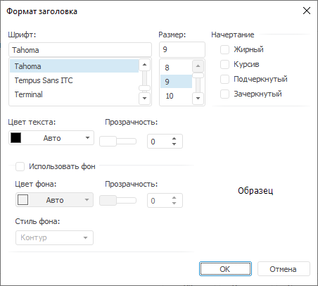

# Формат надписей: Регламентный отчёт, настольное приложение

Формат надписей: Регламентный отчёт, настольное приложение
-

# Формат надписей

Для настройки формата надписей используйте диалог «Формат
 надписей», аналогичен вкладке «[Шрифт](UiReport_Objects_3DParametersScena2.htm#text_font)»:

См. также:

[Начало
 работы с инструментом «Отчёты» в веб-приложении](../../Web/organizational_management/Starting.htm) | [Сцена](UiReport_Objects_3DParametersScena.htm)

		Справочная
		 система на версию 10.9
		 от 18/08/2025,
		 © ООО «ФОРСАЙТ»,
