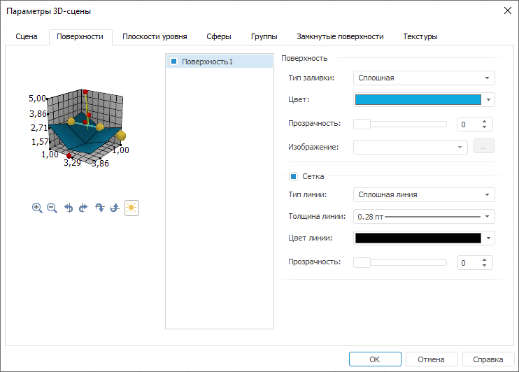

# Поверхности

Поверхности
-

# Поверхности

Для настройки параметров поверхности перейдите на вкладку «Поверхности»
 окна «[Параметры
 3D-сцены](UiReport_Objects_3DParameters.htm)»:

Примечание.
 Вкладка присутствует в окне «[Параметры
 3D-сцены](UiReport_Objects_3DParameters.htm)», если в [источниках
 данных](UiReport_Objects_3DSource.htm) был создан ряд типа «Поверхность».

Справа от образца сцены расположен список всех поверхностей, добавленных
 на 3D-сцену. Установленные флажки с названиями поверхностей включают видимость
 поверхности на сцене. По умолчанию все имеющиеся поверхности отображаются
 на сцене.

Задайте следующие настройки выделенной в списке поверхности:

[Поверхность](javascript:TextPopup(this))

	Определите в группе «Поверхность»
	 следующие параметры:

		- Тип заливки. Определите
		 вариант заливки поверхности: «Сплошная»
		 или «Изображение»;

		- Цвет. Определите
		 цвет заливки, выбрав его из раскрывающейся палитры цветов. Параметр
		 доступен, если установлен тип заливки «Сплошная»;

		- Прозрачность. Задайте
		 прозрачность заливки в процентах;

		- Изображение. Задайте
		 изображение в раскрывающемся списке из уже загруженных ранее или
		 загрузите изображение, которое будет использоваться в качестве
		 заливки. Для загрузки изображения нажмите кнопку . Будет открыт стандартный
		 диалог выбора файла. Параметр доступен, если установлен тип заливки
		 «Изображение».

[Сетка](javascript:TextPopup(this))

	Установленный флажок «Сетка»
	 включает отображение сетки на поверхности. При установке флага в группе
	 определяются следующие параметры:

		- Тип линии. Определите
		 вариант линии сетки: «Сплошная
		 линия» или «Точечная линия»;

		- Толщина линии. Определите
		 толщину линий. Для задания пользовательской толщины в раскрывающемся
		 списке выберите пункт «Пользовательский»,
		 после чего будет открыт диалог задания толщины линий;

	Примечание.
	 Толщина линий может задаваться в [разных единицах
	 измерения](UiNav.chm::/GUI/Format/Different_units.htm), однако значение в поле ввода будет всегда
	 отображаться в единицах point (1/72 дюйма).

		- Цвет линии. Определите
		 цвет линии, выбрав его из раскрывающейся палитры цветов;

		- Прозрачность. Задайте
		 прозрачность линии в процентах.

См. также:

[Начало
 работы с инструментом «Отчёты» в веб-приложении](../../Web/organizational_management/Starting.htm) | [Параметры 3D-сцены](UiReport_Objects_3DParameters.htm)

		Справочная
		 система на версию 10.9
		 от 18/08/2025,
		 © ООО «ФОРСАЙТ»,
