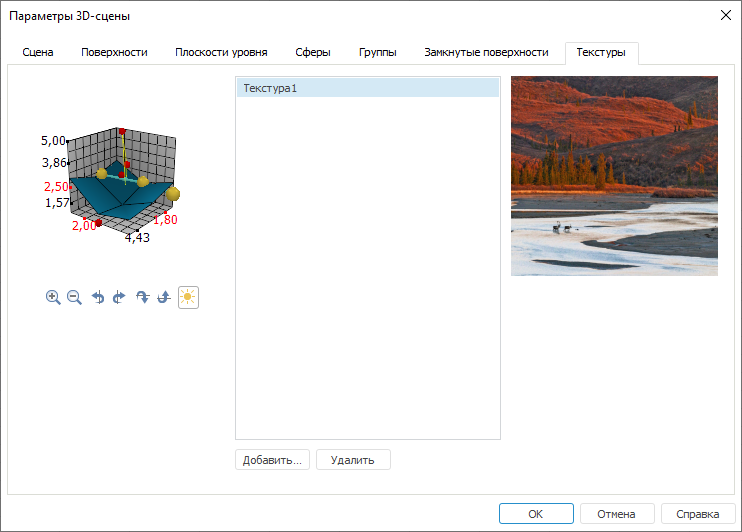

# Текстуры

Текстуры
-

# Текстуры

Для настройки изображений, используемых в качестве заливки, перейдите
 на вкладку «Текстуры» окна «[Параметры
 3D-сцены](UiReport_Objects_3DParameters.htm)»:

Справа от образца сцены расположен список всех текстур, загруженных
 в сцену. При выделении текстуры она отображается в области справа.

При работе с текстурами доступны следующие операции:

[Добавление текстуры](javascript:TextPopup(this))

	Для добавления текстуры в список:

		- нажмите кнопку «Добавить»;

		- нажмите клавишу INSERT, когда фокус ввода находится в списке.

	После выполнения одного из действий будет открыт стандартный диалог
	 выбора графического файла.

[Удаление текстуры](javascript:TextPopup(this))

	Для удаления выбранной из списка текстуры:

		- нажмите кнопку «Удалить»;

		- нажмите клавишу DELETE, когда фокус ввода находится в списке.

	После выполнения одного из действий появится диалог подтверждения
	 выполняемого действия.

Примечание.
 В список текстур добавляются также текстуры, которые были загружены при
 настройке параметров объектов многомерной сцены.

См. также:

[Начало
 работы с инструментом «Отчёты» в веб-приложении](../../Web/organizational_management/Starting.htm) | [Параметры 3D-сцены](UiReport_Objects_3DParameters.htm)

		Справочная
		 система на версию 10.9
		 от 18/08/2025,
		 © ООО «ФОРСАЙТ»,
