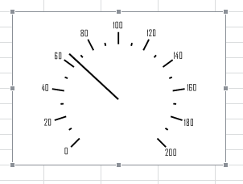

# Спидометр: Регламентный отчёт, настольное приложение

Спидометр: Регламентный отчёт, настольное приложение
-

# Спидометр

Спидометры позволяют отображать какую-либо информацию на панели, оформленной
 в виде спидометра.

Для добавления спидометра на лист отчета:

	- Задайте диапазон ячеек, в котором будет располагаться спидометр.

	- Выполните команду «Иллюстрации
	 > Спидометр», расположенную в группе «Иллюстрации»
	 на вкладке «Вставка» ленты
	 инструментов.

После выполнения последовательности действий в заданный диапазон ячеек
 будет добавлен объект «Спидометр»:

Настройки спидометра осуществляются только при помощи языка [Fore](Speedometer.chm::/Interface/Speedometer_InterfaseList.htm).

См. также:

[Начало
 работы с инструментом «Отчёты» в веб-приложении](../../Web/organizational_management/Starting.htm) | [Вставка
 иллюстраций, фигур и текстовых блоков](UiReport_Objects.htm) | [Построение
 отчёта](../CreateReport.htm) | [Работа
 с готовым отчётом](../Reports/OperationReport/Work_witn_report.htm)

		Справочная
		 система на версию 10.9
		 от 18/08/2025,
		 © ООО «ФОРСАЙТ»,
