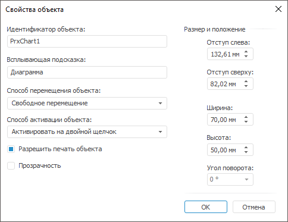

# Стандартные свойства объекта: Регламентный отчёт, настольное приложение

Стандартные свойства объекта: Регламентный отчёт, настольное приложение
-

# Стандартные свойства объекта

Для настройки стандартных свойств объекта предусмотрены следующие подходы:
 быстрая и расширенная настройка.

## Быстрая настройка

Для быстрой настройки свойств объекта перейдите на вкладку «Объект. Формат»
 ленты инструментов.

## Расширенная настройка

Для расширенной настройки стандартных свойств объекта выполните команду
 контекстного меню «Свойства объекта»
 объекта.

После выполнения одного из действий будет открыто окно «Свойства
 объекта»:

## Настройка свойств объекта

В зависимости от выбранного подхода доступны следующие операции:

[Редактирование
 идентификатора объекта](javascript:TextPopup(this))

	Для редактирования идентификатора выбранного объекта укажите новый
	 идентификатор:

		- в поле «Идентификатор объекта»
		 в окне «Свойства объекта»;

		- в поле «Имя объекта»
		 в группе «Свойства объекта»
		 на вкладке «Объект. Формат»
		 ленты инструментов.

	После выполнения одного из действий объекту будет присвоен новый
	 идентификатор.

[Установка всплывающей
 подсказки для объекта](javascript:TextPopup(this))

	Для установки всплывающей подсказки введите текст подсказки:

		- в поле «Всплывающая подсказка»
		 в окне «Свойства объекта»;

		- в поле «Подсказка»
		 в группе «Свойства объекта»
		 на вкладке «Объект. Формат»
		 ленты инструментов.

	После выполнения одного из действий для объекта будет установлена
	 всплывающая подсказка.

[Выбор способа
 перемещения объекта](javascript:TextPopup(this))

	Для выбора способа перемещения объекта в поле «Способ
	 перемещения объекта» в окне «Свойства
	 объекта» выберите способ перемещения:

		- Не перемещать. Объект
		 не изменяет размер и положение;

		- С фиксированным размером.
		 Перемещение объекта осуществляется с фиксированным размером;

		- С фиксированной высотой.
		 Перемещение объекта осуществляется только с фиксированной высотой;

		- С фиксированной шириной.
		 Перемещение объекта осуществляется только с фиксированной шириной;

		- Свободное перемещение.
		 Обеспечивает свободное перемещение объекта;

		- Перемещение и изменение
		 вместе с ячейками. Перемещение объекта осуществляется вместе
		 с ячейками.

	Примечание.
	 Если для объекта установлен способ «Перемещение
	 и изменение вместе с ячейками», то при скрытии ячеек, полностью
	 содержащих объект, объект будет скрыт. При отображении ячеек размер
	 и расположение объекта восстановятся.

[Выбор
 способа активации объекта](javascript:TextPopup(this))

	Для настройки режима активации объекта:

		- выберите способ активации объектов в поле «Способ
		 активации объекта» в окне «Свойства
		 объекта»;

		- нажмите кнопку «Способ
		 активации», расположенную в группе «Свойства
		 объекта» на вкладке «Объект. Формат»
		 ленты инструментов, и в раскрывающемся меню кнопки выберите способ
		 активации объектов.

	Для активации объекта доступны следующие варианты:

		- Активировать на движение
		 мыши. Активация объекта произойдет при наведении курсора
		 мыши на объект;

		- Активировать на выделение
		 объекта. Активация объекта произойдет при выделении объекта
		 (один щелчок мыши по объекту);

		- Активировать на двойной
		 щелчок. Активация объекта произойдет при двойном щелчке
		 мыши по объекту. Установлено по умолчанию;

		- Не активировать.
		 Объект не будет активирован никаким из перечисленных способов;

		- Активировать при открытии
		 отчета. Активация объекта произойдет при открытии отчета.

[Вывод объекта
 на печать](javascript:TextPopup(this))

	Для вывода на печать объекта при печати отчета установите флажок
	 «Разрешить печать объекта»
	 в окне «Свойства объекта».

	Примечание.
	 По умолчанию флажок «Разрешить печать
	 объекта» установлен.

[Установка прозрачности
 объекта](javascript:TextPopup(this))

	Для установки прозрачности объекта установите флажок «Прозрачность»
	 в окне «Свойства объекта».

	При установке данного флажка фон изображения становится прозрачным,
	 то есть сквозь объект видно ячейки с их содержанием.

	Примечание.
	 Флажок «Прозрачность» доступен
	 объектам с типом «[Диаграмма](../Diagrams/UiReport_Diagrams_appointment.htm)»,
	 «[Рисунок](Picture/UiReport_Objects_Picture.htm)»,
	 «[Карта](../Maps/svgmap.htm)»,
	 «[Спидометр](UiReport_Objects_Spedometer.htm)»,
	 «[Легенда
	 диаграмм](../Diagrams/UiDiagrams_Legend.htm)» и «[Текстовый
	 блок](UiReport_Objects_formatted_text.htm)».

[Изменение размера
 и положения объекта](javascript:TextPopup(this))

	Для изменения размера и положения объекта:

		- мышкой растяните/сожмите объект;

		- мышкой переместите объект на [рабочей
		 области](../organizational_management/Starting.htm). Для перемещения объекта/группы объектов строго по
		 горизонтали или по вертикали удерживайте нажатой клавишу SHIFT;

		- задайте отступы (между левой/верхней границей отчета и левой/верхней
		 границей объекта) и размеры объекта в группе «Размер
		 и положение» на вкладке «Объект. Формат»
		 ленты инструментов;

		- задайте отступы (между левой/верхней границей отчета и левой/верхней
		 границей объекта), размеры и угол поворота объекта в группе «Размер и положение» в окне «Свойства объекта».

	Примечание.
	 Доступен [ввод
	 значения в разных системах измерения](UiNav.chm::/GUI/Format/Different_units.htm). В поле ввода редактора
	 отображаются значения в единицах измерения, соответствующих текущим
	 региональным настройкам операционной системы.

См. также:

[Начало
 работы с инструментом «Отчёты» в веб-приложении](../../Web/organizational_management/Starting.htm) | [Вставка
 иллюстраций, фигур и текстовых блоков](UiReport_Objects.htm) | [Построение
 отчёта](../CreateReport.htm) | [Работа
 с готовым отчётом](../Reports/OperationReport/Work_witn_report.htm)

		Справочная
		 система на версию 10.9
		 от 18/08/2025,
		 © ООО «ФОРСАЙТ»,
