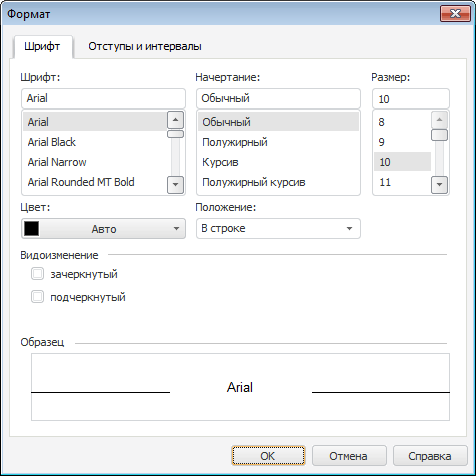

# Шрифт: Регламентный отчёт, настольное приложение

Шрифт: Регламентный отчёт, настольное приложение
-

# Шрифт

Для настройки [форматирования](UiReport_Objects_formatted_text.htm#text_layout)
 текста в текстовом блоке перейдите на вкладку «Шрифт»
 окна «Формат».

[Для открытия
 диалога](javascript:TextPopup(this))

	Выполните команду «Формат»
	 в контекстном меню текста, размещенного в [текстовом
	 блоке](UiReport_Objects_formatted_text.htm).

Задайте следующие параметры форматирования текста:

[Шрифт](javascript:TextPopup(this))

	Задайте тип шрифта.

	Примечание.
	 «Форсайт. Аналитическая платформа»
	 поддерживает шрифты типа TrueType
	 и ограниченно поддерживает шрифты OpenType.
	 При попытке использовать неподдерживаемый шрифт или шрифт, не установленный
	 на компьютере, где выполняется приложение, вместо него будет подставлен
	 шрифт Microsoft Sans Serif.
	 Данное правило распространяется на объекты native
	 GDI+, класс Font и
	 метод DrawString.

[Начертание](javascript:TextPopup(this))

	Задайте тип начертания текста.

[Размер](javascript:TextPopup(this))

	Задайте размер шрифта.

	Примечание.
	 Размер шрифта задается в единицах point (1/72 дюйма).

[Цвет](javascript:TextPopup(this))

	Задайте цвет текста, выбрав его из раскрывающейся палитры цветов.

[Положение](javascript:TextPopup(this))

	Задайте положение текста относительно строки, выбрав его из раскрывающегося
	 списка.

	Доступны варианты:

		- в строке;

		- надстрочный;

		- подстрочный.

[Видоизменение](javascript:TextPopup(this))

	Установите флажки, преобразующие текст в зачеркнутый и/или подчеркнутый.

[Образец](javascript:TextPopup(this))

	В области будет отображен текст, оформленный согласно параметрам,
	 установленным на вкладке.

	Проверьте, соответствует ли внешний вид надписи ожидаемому результату.

См. также:

[Начало
 работы с инструментом «Отчёты» в веб-приложении](../../Web/organizational_management/Starting.htm) | [Текстовый
 блок](UiReport_Objects_formatted_text.htm) | [Вставка иллюстраций,
 фигур и текстовых блоков](UiReport_Objects.htm) | [Построение
 отчёта](../CreateReport.htm) | [Работа
 с готовым отчётом](../Reports/OperationReport/Work_witn_report.htm)

		Справочная
		 система на версию 10.9
		 от 18/08/2025,
		 © ООО «ФОРСАЙТ»,
