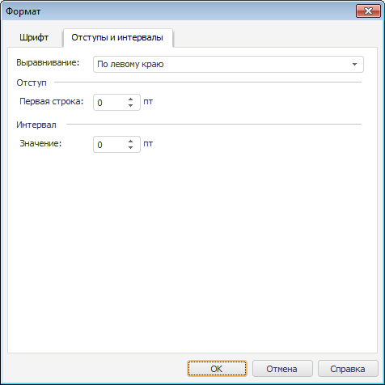

# Отступы и интервалы: Регламентный отчёт, настольное приложение

Отступы и интервалы: Регламентный отчёт, настольное приложение
-

# Отступы и интервалы

Для настройки [выравнивания](UiReport_Objects_formatted_text.htm#text_layout)
 текста в текстовом блоке перейдите на вкладку «Отступы
 и интервалы» окна «Формат».

[Для открытия
 диалога](javascript:TextPopup(this))

	Выполните команду «Формат»
	 в контекстном меню текста, размещенного в [текстовом
	 блоке](UiReport_Objects_formatted_text.htm).

Задайте на вкладке следующие параметры:

[Выравнивание](javascript:TextPopup(this))

	В раскрывающемся списке выберите расположение текста в строке.

	Доступны варианты:

		- по левому краю;

		- по центру;

		- по правому краю;

		- по ширине.

[Отступ и Интервал](javascript:TextPopup(this))

	С помощью редакторов чисел или клавиатуры задайте значения отступа
	 и интервала.

	Примечание.
	 Отступ и интервал, как и [размер шрифта](UiReport_format.htm),
	 задаются в единицах point (1/72 дюйма).

См. также:

[Начало
 работы с инструментом «Отчёты» в веб-приложении](../../Web/organizational_management/Starting.htm) | [Текстовый
 блок](UiReport_Objects_formatted_text.htm) | [Вставка иллюстраций,
 фигур и текстовых блоков](UiReport_Objects.htm) | [Построение
 отчёта](../CreateReport.htm) | [Работа
 с готовым отчётом](../Reports/OperationReport/Work_witn_report.htm)

		Справочная
		 система на версию 10.9
		 от 18/08/2025,
		 © ООО «ФОРСАЙТ»,
