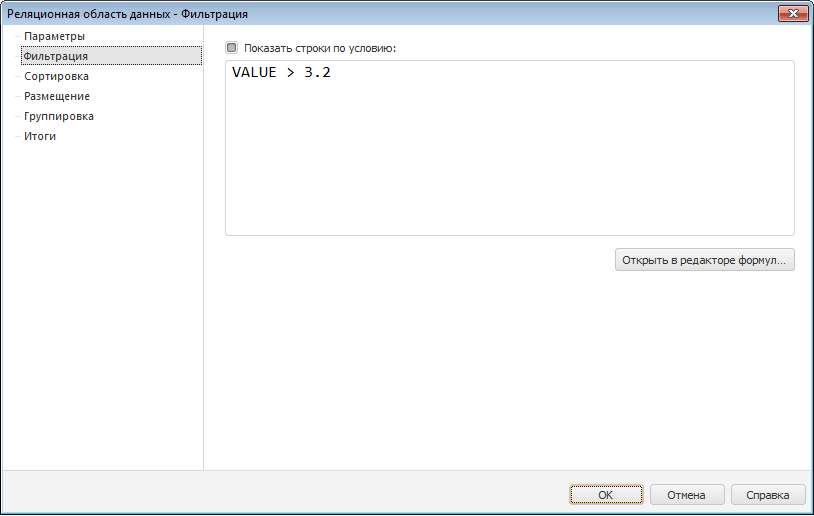

# Настройка фильтрации: Реляционная область данных

Настройка фильтрации: Реляционная область данных
-

# Настройка фильтрации

Фильтрация данных осуществляется
 перед непосредственным размещением реляционной области данных на листе
 отчета. Выражение фильтрации задается для всего размещения. В случае,
 если текущее размещение не удовлетворяет условию фильтрации, то размещение
 не будет выводиться на лист отчета.

Для настройки параметров фильтрации реляционной области данных перейдите
 на вкладку «Фильтрация» окна «[Реляционная
 область данных](UiReport_Relation_Parameters.htm)»:

Для включения фильтрации данных установите флажок «Показать
 строки по условию». После установки флажка становится активным
 поле «Выражение».

Введите условие фильтрации одним из способов:

	- вручную. Введите условие в поле ввода;

	- с помощью [редактора выражения](UiNav.chm::/GUI/ExpressionEditor.htm). Для запуска редактора выражения нажмите
	 кнопку «Открыть в редакторе формул».

После настройки параметров фильтрации в реляционной области данных будут
 отображены только те данные, которые соответствуют заданным условиям.

См. также:

[Начало
 работы с инструментом «Отчёты» в веб-приложении](../../../Web/organizational_management/Starting.htm) | [Настройка параметров реляционной
 области данных](UiReport_Relation_Parameters.htm) | [Визуализация
 данных в виде таблиц](../../AreaData/Table_Types.htm) | [Реляционная
 область данных](../UIReport_Relational_data_area.htm) | [Пример
 создания реляционной области](../UIReport_Relational_data_area_Example.htm)

		Справочная
		 система на версию 10.9
		 от 18/08/2025,
		 © ООО «ФОРСАЙТ»,
