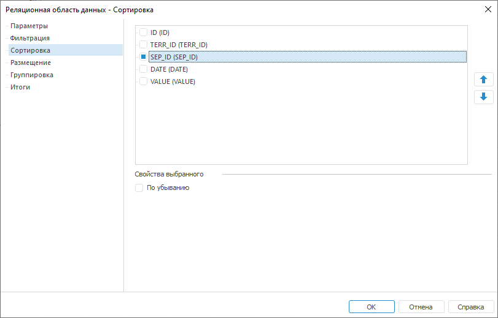

# Настройка сортировки: Реляционная область данных

Настройка сортировки: Реляционная область данных
-

# Настройка сортировки

Сортировка данных осуществляется
 по заданному полю размещения.

Для настройки параметров сортировки реляционной области данных перейдите
 на вкладку «Сортировка» окна «[Реляционная
 область данных](UiReport_Relation_Parameters.htm)»:

На данной вкладке установите флажки напротив идентификаторов столбцов,
 в которых необходимо настроить сортировку данных. Для ячеек, привязанных
 к источнику, после идентификатора в скобках указано наименование. После
 этого становится доступным установка флажка «По
 убыванию». Установите его, если требуется отсортировать данные
 по убыванию.

Сортировка данных по столбцам выполняется в обратном порядке: чем выше
 расположен идентификатор столбца, тем ниже его приоритет сортировки. Для
 изменения порядка сортировки по столбцам используйте кнопки  и .

См. также:

[Начало
 работы с инструментом «Отчёты» в веб-приложении](../../../Web/organizational_management/Starting.htm) | [Настройка параметров реляционной
 области данных](UiReport_Relation_Parameters.htm) | [Визуализация
 данных в виде таблиц](../../AreaData/Table_Types.htm) | [Реляционная
 область данных](../UIReport_Relational_data_area.htm) | [Пример
 создания реляционной области](../UIReport_Relational_data_area_Example.htm)

		Справочная
		 система на версию 10.9
		 от 18/08/2025,
		 © ООО «ФОРСАЙТ»,
