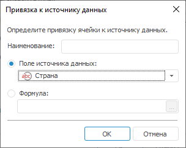

# Настройка группировки: Реляционная область данных

Настройка группировки: Реляционная область данных
-

# Настройка группировки

Для настройки параметров группировки реляционной области данных перейдите
 на вкладку «Группировка»
 окна «[Реляционная
 область данных](UiReport_Relation_Parameters.htm)»:

Примечание.
 При настройке группируются только одинаковые значения заданного поля,
 расположенные друг за другом.

При настройке параметров группировки доступны следующие операции:

[Добавление группы](javascript:TextPopup(this))

	Для добавления группы:

		- нажмите кнопку «Добавить»;

		- выполните команду «Добавить»
		 в контекстном меню поля «Группы».

	После выполнения одного из действий появится окно «Параметры
	 группы». Настройте в нем [параметры
	 группировки](#group_parameters).

	Примечание.
	 При создании групп важен [порядок их расположения](#group_order),
	 так как именно в этом порядке они будут выведены на лист отчета.

[Изменение
 порядка расположения групп](javascript:TextPopup(this))

	Для изменения порядка расположения группы:

		- нажмите кнопку «Выше»
		 или «Ниже»;

		- выполните команду «Переместить
		 выше» или «Переместить
		 ниже» в контекстном меню поля «Группы»;

		- перетащите группу, используя механизм Drag&Drop.

[Настройка
 параметров группы](javascript:TextPopup(this))

	Для настройки параметров выбранной группы:

		- нажмите кнопку «Редактировать»;

		- выполните команду «Редактировать»
		 в контекстном меню поля «Группы».

	После выполнения одного из действий будет открыто окно
	«Параметры группы»:

	

	Определите в окне следующие параметры:

		- Заголовок группы.
		 Введите в поле заголовок группы одним из способов:

			- введите в поле значение с клавиатуры;

			- нажмите кнопку .
			 Откроется окно [редактора
			 выражения](UiNav.chm::/GUI/ExpressionEditor.htm);

		- Привязка к источнику.
		 Установите привязку к полю источника, для которого будет осуществлена
		 группировка. Для создания привязки к полю источника нажмите кнопку
		 .

	После выполнения действия будет открыто
	 окно «Привязка к источнику данных»:

	

	Задайте наименование привязки.

	Для определения параметров привязки установите
	 переключатель:

			- Поле источника данных.
			 В качестве источника будет использоваться одно из полей реляционного
			 источника данных. После установки переключателя выберите из
			 раскрывающегося списка одно из имеющихся полей источника;

			- Формула. В качестве
			 источника будет использоваться формула. После установки переключателя
			 нажмите кнопку 
			 для задания формулы. Откроется окно [редактора
			 выражения](UiNav.chm::/GUI/ExpressionEditor.htm).

		- Отступ. Задайте
		 в поле расстояние от заголовка группы от левого края ячейки;

		- Оформление. Настройте
		 в поле оформление группы.

	Для редактирования
	 параметров оформления:

			- нажмите на кнопку ;

			- выполните пункт «Редактировать
			 оформление» контекстного меню.

	Будет открыто окно «[Формат ячейки](../../Table/Attribute/UiReport_Table_Attribute.htm)».

	Для очищения
	 оформления и использования параметров оформления по образцу,
	 заданному по умолчанию:

			- нажмите на кнопку ;

			- выполните пункт «Очистить»
			 контекстного меню.

	Для копирования/вставки
	 настроенного оформления из одного компонента в другой используйте
	 пункты «Копировать»/«Вставить» контекстного меню.

		- Отобразить группу в отдельном
		 столбце. При установленном флажке появляется возможность
		 располагать заголовки группируемых данных в отдельном столбце.
		 По умолчанию флажок установлен. Если флажок снят заголовки групп
		 не выводятся;

		- Раскрывающаяся иерархия.
		 Раскрывающаяся иерархия позволяет сворачивать и разворачивать
		 сгруппированные данные непосредственно на листе при помощи кнопок  (свернутая иерархия) и  (развернутая иерархия).По умолчанию флажок установлен. Параметр доступен только при установленном
		 флажке «Отобразить группу в отдельном столбце».

[Удаление группы](javascript:TextPopup(this))

	Для удаления выбранной группы:

		- нажмите кнопку «Удалить»;

		- выполните команду «Удалить»
		 в контекстном меню поля «Группы».

	После выполнения одного из действий появится диалог подтверждения
	 выполняемых действий.

См. также:

[Начало
 работы с инструментом «Отчёты» в веб-приложении](../../../Web/organizational_management/Starting.htm) | [Настройка параметров реляционной
 области данных](UiReport_Relation_Parameters.htm) | [Визуализация
 данных в виде таблиц](../../AreaData/Table_Types.htm) | [Реляционная
 область данных](../UIReport_Relational_data_area.htm) | [Пример
 создания реляционной области](../UIReport_Relational_data_area_Example.htm)

		Справочная
		 система на версию 10.9
		 от 18/08/2025,
		 © ООО «ФОРСАЙТ»,
