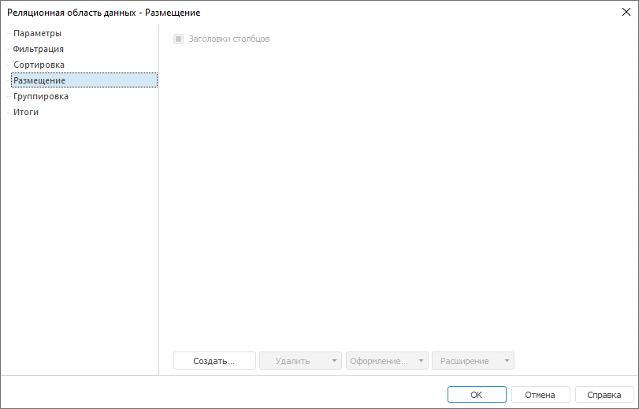
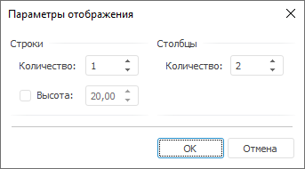

# Настройка размещения: Реляционная область данных, регламентный отчёт, настольное приложение

Настройка размещения: Реляционная область данных, регламентный отчёт, настольное приложение
-

# Настройка размещения

Для настройки структуры отображения реляционного источника на листе
 отчета перейдите на вкладку «Размещение»
 окна «[Реляционная
 область данных](UiReport_Relation_Parameters.htm)»:

При создании реляционной области данных при помощи команды «Другие
 области > Реляционная область», расположенной в группе «Области данных» на вкладке «Вставка» ленты инструментов, появляется
 возможность создания шаблона записей.

Шаблон вывода записей может быть задан произвольно. Например, первые
 два поля таблицы могут быть выведены в одну строку, а третье поле – во
 вторую и т.д.

Создание и настройка шаблона записей:

	- Создайте шаблон записей.

	- Привяжите ячейки к полям источника данных.

[Создание
 шаблона записей](javascript:TextPopup(this))

	Для определения шаблона вывода записей, нажмите кнопку «Создать».
	 Появится окно «Параметры отображения»:

	

	В данном окне задайте количество строк и столбцов, которые будут
	 выводиться для каждой записи реляционного источника. Для задания высоты
	 строки в миллиметрах установите флажок «Высота»
	 и введите в числовое поле значение высоты.

	После определения структуры кнопка «Создать»
	 будет изменена на «Добавить»:

	

[Привязка
 ячейки к источнику данных](javascript:TextPopup(this))

	Ячейки созданного шаблона необходимо привязать к полям источника
	 данных или задать формулу, по которой будет вычисляться значение.
	 Для этого выполните команду контекстного меню «Привязать
	 к полю источника» для ячейки. Откроется окне «Привязка
	 к источнику данных»:

	

	Определите параметры привязки:

		- Наименование. Введите
		 наименование, которое должно будет отображаться в заголовке столбца
		 реляционной области данных. По умолчанию наименование CELL1;

		- Идентификатор. Уникальная
		 последовательность букв латинского алфавита, цифр и знаков, которая
		 должна начинаться с буквы. Однозначно идентифицирует столбец
		 с данными реляционной области данных в пределах данной области.
		 Каждому столбцу данных реляционной области данных по умолчанию
		 присваивается идентификатор, который отражается в данном поле.
		 Для смены идентификатора введите в данное поле новое значение.
		 По умолчанию наименование CELLID1;

		- Поле источника данных.
		 После установки переключателя выберите из раскрывающегося списка
		 одно из имеющихся полей источника;

		- Формула. После установки
		 переключателя в соответствующем поле задайте формулу. Для этого
		 нажмите кнопку .
		 Откроется окно [редактора выражения](UiNav.chm::/GUI/ExpressionEditor.htm).

	Для удаления привязки выполните команду контекстного меню «Очистить привязку» выбранной ячейки.

	Если ячейка не имеет привязки, то на листе отчета для всех записей
	 источника будет отображена пустая ячейка.

При создании реляционной области данных при помощи панели «Источники
 и срезы данных» первоначальная структура соответствует структуре
 источника данных. Для всех столбцов реляционной области данных наименование
 и идентификатор соответствуют наименованиям и идентификаторам источника
 данных.

Изменить структуру размещения можно путем добавления и удаления из него
 элементов:

[Добавление элемента
 структуры](javascript:TextPopup(this))

	Для добавления элементов структуры:

		- нажмите кнопку «Добавить»;

		- выполните команду контекстного меню «Добавить»
		 структуры.

	Из раскрывающегося списка выберите один из вариантов:

		- Строку выше. Будет
		 добавлена строка выше выделенной ячейки;

		- Строку ниже. Будет
		 добавлена строка ниже выделенной ячейки;

		- Столбец слева. Будет
		 добавлен столбец слева от выделенной ячейки;

		- Столбец справа.
		 Будет добавлен столбец справа от выделенной ячейки;

		- Ячейку слева. Будет
		 добавлен ячейка слева от выделенной ячейки;

		- Ячейку справа. Будет
		 добавлен ячейка справа от выделенной ячейки.

	Для добавленных ячеек укажите привязку к источнику. Привязка аналогична
	 привязке ячеек при настройке шаблона записей.

[Удаление элемента
 структуры](javascript:TextPopup(this))

	Для удаления элементов структуры:

		- нажмите кнопку «Удалить»;

		- выполните команду контекстного меню «Удалить»
		 структуры.

	Из раскрывающегося списка выберите один из вариантов:

		- Строку целиком.
		 Будет удалена вся строка целиком;

		- Столбец целиком.
		 Будет удален весь столбец целиком;

		- Ячейку. Будет удалена
		 выбранная ячейка.

	Для одновременного удаления нескольких выделенных ячеек выполните
	 команду контекстного меню «Удалить
	 ячейки» выделенного диапазона.

[Объединение
 ячеек](javascript:TextPopup(this))

	Для объединения нескольких выделенных ячеек:

		- выполните команду контекстного меню «Объединить
		 ячейки» ячеек;

		- нажмите кнопку «Расширение»
		 и из раскрывающегося списка выберите пункт «Объединить
		 ячейки».

	После выполнения одного из действий выделенные ячейки будут объединены
	 в одну.

[Расширение структуры](javascript:TextPopup(this))

	Для расширения структуры
	 реляционной области данных выделите диапазон ячеек и:

		- выполните команду контекстного меню «Расширить
		 на выделение» ячеек;

		- нажмите кнопку «Расширение»
		 и из раскрывающегося списка выберите пункт «Расширить
		 на выделение».

	Первая левая ячейка из выделенных будет расширена на заданное выделение,
	 при этом все ячейки, расположенные после будут смещены

	Для отмены расширения структуры
	 реляционной области данных:

		- выполните команду контекстного меню «Убрать
		 расширение»;

		- нажмите кнопку «Расширение»
		 и из раскрывающегося списка выберите пункт «Убрать
		 расширение».

	После выполнения одного из действий выберите необходимый вариант
	 отмены расширения:

		- по горизонтали;

		- по вертикали;

		- по горизонтали и вертикали.

[Отображение/скрытие
 заголовков столбцов](javascript:TextPopup(this))

	Для отображения/скрытия заголовков столбцов установите/снимите флажок
	 «Заголовки столбцов». По умолчанию
	 флажок установлен.

Для каждой ячейки структуры размещения можно настроить оформление:

[Настройка оформления](javascript:TextPopup(this))

	Для настройки оформления ячейки:

		- нажмите кнопку «Оформление»
		 и выберите пункт «Настроить»;

		- выполните команду контекстного «Оформление
		 ячейки > Настроить» ячейки.

	Откроется окно «[Формат ячейки](uinav.chm::/GUI/format.htm)», в котором можно настроить [выравнивание](uinav.chm::/GUI/Format/UiReport_Table_Attribute_Arrange.htm)
	 ячеек и задать [текст
	 подсказки](uinav.chm::/GUI/Format/UiReport_Table_Attribute_Others.htm).

	Для возврата настроек оформления по умолчанию:

		- нажмите на кнопку «Оформление»
		 и выберите пункт «По умолчанию»;

		- выполните команду контекстного меню «Оформление
		 ячейки > По умолчанию» ячейки.

См. также:

[Начало
 работы с инструментом «Отчёты» в веб-приложении](../../../Web/organizational_management/Starting.htm) | [Настройка параметров реляционной
 области данных](UiReport_Relation_Parameters.htm) | [Визуализация
 данных в виде таблиц](../../AreaData/Table_Types.htm) | [Реляционная
 область данных](../UIReport_Relational_data_area.htm) | [Пример
 создания реляционной области](../UIReport_Relational_data_area_Example.htm)

		Справочная
		 система на версию 10.9
		 от 18/08/2025,
		 © ООО «ФОРСАЙТ»,
