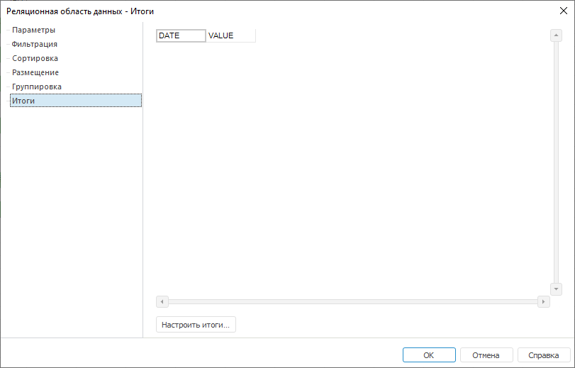
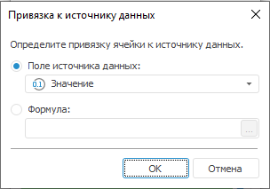

# Настройка итогов: Реляционная область данных

Настройка итогов: Реляционная область данных
-

# Настройка итогов

Для настройки итогов реляционной области данных перейдите на вкладку
 «Итоги» окна «[Реляционная
 область данных](UiReport_Relation_Parameters.htm)»:

Для настройки итогов выделите ячейку ранее созданного [шаблона](UiReport_Relation_Placing.htm)
 и выполните одно из действий:

	- нажмите кнопку «Настроить итоги»;

	- выполните команду «Настроить
	 итоги» контекстного меню шаблона.

Примечание.
 Для настройки итогов в области должна присутствовать хотя бы одна [группа](UiReport_Relation_Grouping.htm).

После выполнения действия будет открыто диалог «Параметры
 итогов».

## Параметры итогов

Параметры итогов настраиваются в окне «Параметры
 итогов»:

Настройте следующие параметры итогов:

[Группа](javascript:TextPopup(this))

	В раскрывающемся списке «Группа»
	 выберите группу, по которой будет рассчитан итог.

[Отображать итоги](javascript:TextPopup(this))

	Для отображения итогов установите флажок «Отображать
	 итоги». По умолчанию флажок установлен.

[Заголовок](javascript:TextPopup(this))

	В поле «Заголовок» введите
	 заголовок итогов одним из способов:

		- введите в поле значение с клавиатуры;

		- нажмите кнопку .
		 Откроется окно [редактора выражения](UiNav.chm::/GUI/ExpressionEditor.htm);

	В данном поле будет отображен заголовок, если он ранее был задан
	 на вкладке «[Группировка](UiReport_Relation_Grouping.htm)».

[Привязка
 к источнику](javascript:TextPopup(this))

	В поле «Привязка к источнику»
	 установите привязку к полю источника, для которого будут отображены
	 итоги. Для создания привязки нажмите кнопку .

	После выполнения действия будет открыто окно «Привязка
	 к источнику данных»:

	

	Определите в нем параметры привязки, установив переключатель:

		- Поле источника данных.
		 В качестве источника будет использоваться одно из полей реляционного
		 источника данных. После установки переключателя выберите из раскрывающегося
		 списка одно из имеющихся полей источника;

		- Формула. В качестве
		 источника будет использоваться формула. После установки переключателя
		 нажмите кнопку 
		 для задания формулы. Откроется окно [редактора
		 выражения](UiNav.chm::/GUI/ExpressionEditor.htm).

[Метод](javascript:TextPopup(this))

	Выберите метод вычисления итогов в раскрывающемся списке «Метод». Доступные варианты:

		- Нет. Вычисления
		 не производятся;

		- Сумма. Значения
		 суммируются;

		- Минимум. Выбирается
		 минимальное числовое значение;

		- Максимум. Выбирается
		 максимальное числовое значение;

		- Количество непустых.
		 Определяется количество непустых значений;

		- Количество пустых.
		 Определяется количество пустых значений;

		- Количество всех дочерних.
		 Определяется количество дочерних элементов;

		- Арифметическое среднее.
		 Определяется среднее значение с учетом пустых значений;

		- Фактическое среднее.
		 Определяется среднее значение без учета пустых значений;

		- Первое фактическое.
		 Берется первое имеющееся (фактическое) значение;

		- Последнее фактическое.
		 Берется последнее имеющееся (фактическое) значение;

		- Среднеквадратическое отклонение
		 по выборке. Определяется среднеквадратическое
		 отклонение ряда по выборке;

		- Медиана.
		 Определяется медиана ряда;

		- Среднеквадратическое отклонение.
		 Определяется среднеквадратическое отклонение ряда по генеральной
		 совокупности.

[Оформление](javascript:TextPopup(this))

	В поле «Оформление» задайте
	 настройки оформления ячеек, в которых будут расположены итоги.

Для редактирования параметров оформления:

	- нажмите на кнопку ;

	- выполните пункт «Редактировать
	 оформление» контекстного меню.

Будет открыто окно «[Формат ячейки](../../Table/Attribute/UiReport_Table_Attribute.htm)».

Для очищения оформления и использования
 параметров оформления по образцу, заданному по умолчанию:

	- нажмите на кнопку ;

	- выполните пункт «Очистить»
	 контекстного меню.

Для копирования/вставки настроенного
 оформления из одного компонента в другой используйте пункты «Копировать»/«Вставить»
 контекстного меню.

	Примечание.
	 Если ранее на вкладке «[Группировка](UiReport_Relation_Grouping.htm)»
	 было задано оформление итогов, то данные настройки будут отображены
	 в данном компоненте и, соответственно, на вкладках окна «Формат
	 ячейки».

Примечание.
 Не закрывая окна «Параметры итогов»,
 можно настроить итоги для нескольких групп по одному полю источника. Для
 этого последовательно выберите необходимую группу и задайте соответствующие
 настройки.

См. также:

[Начало
 работы с инструментом «Отчёты» в веб-приложении](../../../Web/organizational_management/Starting.htm) | [Настройка параметров реляционной
 области данных](UiReport_Relation_Parameters.htm) | [Визуализация
 данных в виде таблиц](../../AreaData/Table_Types.htm) | [Реляционная
 область данных](../UIReport_Relational_data_area.htm) | [Пример
 создания реляционной области](../UIReport_Relational_data_area_Example.htm)

		Справочная
		 система на версию 10.9
		 от 18/08/2025,
		 © ООО «ФОРСАЙТ»,
