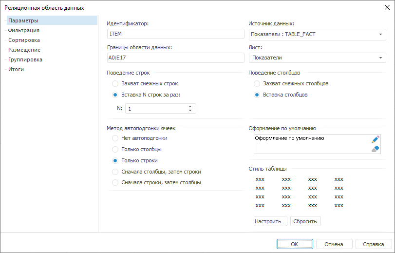
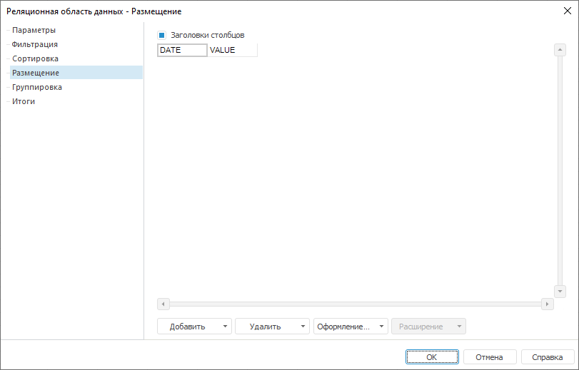
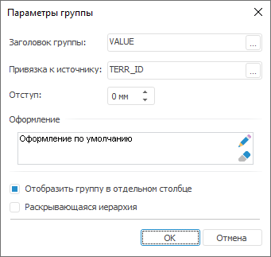
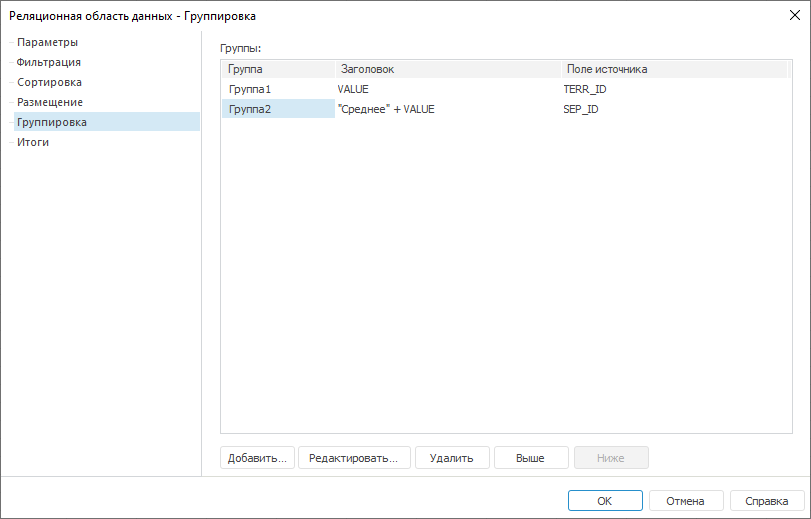
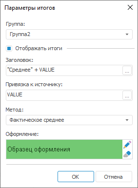
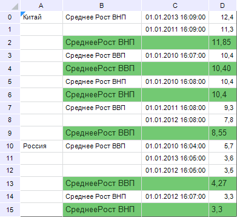

# Пример создания реляционной области

Пример создания реляционной области
-

# Пример создания реляционной области

В качестве примера реляционного источника данных будет использована
 таблица со следующим содержимым:

Для создания реляционной области данных:

	- Добавьте таблицу в регламентный
	 отчет в качестве [источника
	 данных](../Source/UiReport_Source.htm).

	- Поместите созданный источник на
	 лист отчета. Будет открыт диалог «Реляционная
	 область данных»:

	- На вкладке «[Параметры](Parameter/UiReport_Relation_Param.htm)»
	 задайте следующие настройки:

		- границы области данных: A0:E14;

		- поведение строк: Вставка
		 N строк за раз (N = 1);

		- поведение столбцов: Вставка
		 столбцов;

		- метод автоподгонки ячеек: Только
		 строки;

	- На вкладке «[Фильтрация](Parameter/Relation_Filtering.htm)»
	 задайте следующие настройки:

		- установите флажок «Показать
		 строки по условию»;

		- введите условие фильтрации: VALUE > 3.2;

	- На вкладке «[Сортировка](Parameter/Relation_Sorting.htm)» задайте
	 следующие настройки:

		- установите флажок напротив идентификатора последнего столбца;

		- в области «Свойства выбранного»
		 установите флажок «По убыванию»;

	- Перейдите на вкладку «[Размещение](Parameter/UiReport_Relation_Placing.htm)»
	 и удалите столбцы, соответствующие следующим столбцам таблицы:

		- Идентификатор;

		- Страна;

		- Показатель.

Таким образом, вкладка примет вид:

	- Перейдите на вкладку «[Группировка](Parameter/UiReport_Relation_Grouping.htm)»
	 и нажмите кнопку «Добавить».
	 Будет открыт диалог «Параметры группы»:

Задайте следующие параметры:

	-

		- Заголовок группы.
		 Нажмите кнопку .
		 Будет открыт [редактор выражения](UiNav.chm::/GUI/ExpressionEditor.htm). Задайте формулу: «Значение
		 в ячейке»;

		- Привязка к источнику.
		 Нажмите кнопку .
		 Будет открыт диалог «Привязка
		 к источнику данных». Установите в нем переключатель «Поле источника данных» и выберите
		 поле «Страна»;

		- Оформление. Нажмите
		 кнопку . Будет
		 открыт диалог «Формат ячеек».
		 Перейдите на вкладку «[Шрифт](UiNav.Chm::/GUI/Format/UiReport_Table_Attribute_Type.htm)». Задайте
		 размер и начертание шрифта.

Все остальные параметры оставьте без изменения.

Создайте еще одну группу со следующими параметрами:

	-

		- заголовок группы: "Среднее
		 " + VALUE;

		- привязка к источнику: поле «Показатель».

Таким образом, вкладка примет вид:

	- Перейдите на вкладку «[Итоги](Parameter/UiReport_Relation_Totals.htm)».
	 Выберите ячейку, соответствующую значениям в таблице («VALUE»),
	 и нажмите кнопку «Настроить итоги».
	 Будет открыт диалог «Параметры
	 итогов»:

Задайте следующие параметры:

	-

		- Группа. Выберите
		 «Группа2»;

		- Отображать итоги.
		 Установите данный флажок;

		- Заголовок. Нажмите
		 кнопку . Будет
		 открыт [редактор
		 выражения](UiNav.chm::/GUI/ExpressionEditor.htm). Задайте формулу: "Среднее
		 " + Значение в ячейке;

		- Привязка к источнику.
		 Нажмите кнопку .
		 Будет открыт диалог «Привязка
		 к источнику данных». Установите в нем переключатель «Поле источника данных» и выберите
		 поле «Значение»;

		- Метод. Выберите
		 метод «Фактическое среднее»;

		- Оформление. Нажмите
		 кнопку . Будет
		 открыт диалог «Формат ячеек».
		 Перейдите на вкладку «[Заливка](UiNav.Chm::/GUI/Format/UiReport_Table_Attribute_View.htm)».
		 Настройте однотонный фон для заливки итогов.

Настройка реляционной области данных завершена. Для сохранения настроек
 нажмите кнопку «ОК» в диалоге
 «Реляционная область данных».

Вычислите лист отчета. Реляционная область данных примет вид:

См. также:

[Начало
 работы с инструментом «Отчёты» в веб-приложении](../../Web/organizational_management/Starting.htm) | [Визуализация
 данных в виде таблиц](../AreaData/Table_Types.htm) | [Реляционная
 область данных](UIReport_Relational_data_area.htm) | [Настройка
 параметров реляционной области данных](Parameter/UiReport_Relation_Parameters.htm)

		Справочная
		 система на версию 10.9
		 от 18/08/2025,
		 © ООО «ФОРСАЙТ»,
