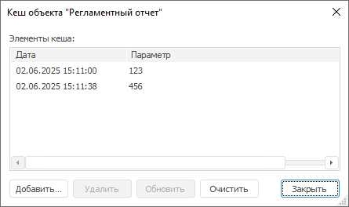

# Ускорение работы объёмного отчёта

Ускорение работы объёмного отчёта
-

# Ускорение работы объёмного отчёта

Для ускорения работы объёмного отчёта при вычислении результатов используйте
 [кеширование
 объектов репозитория](UiNav.chm::/02_Navigator/object_caching.htm#report).

Кеширование применяется для отчётов, содержащих:

	- обширные области данных или несколько областей данных;

	- объемную отметку, превышающую 10 000 элементов;

	- большое количество параметров, связанных между собой и источниками
	 данных;

	- гиперссылки, формулы, обработчики событий.

Ускорение происходит при [открытии
 отчёта на просмотр](organizational_management/Starting.htm).

## Кеширование отчёта для ускорения открытия
 в режиме просмотра

При добавлении элемента кеша создается экземпляр отчёта с сохраненными
 результатами вычисления. При [открытии
 отчёта на просмотр](organizational_management/Starting.htm) осуществляется проверка наличия в кеше записи.
 Если запись будет найдена, то будет извлечена и открыта кешированная версия
 отчёта. Если запись отсутствует, то будет открыта последняя версия отчёта
 из репозитория. Кеш экземпляра регламентного отчёта хранится в базе репозитория.

Для кеширования отчётов выполните команду контекстного меню «Кеш объекта» регламентного отчёта
 в навигаторе объектов. Откроется окно «Кеш
 объекта».

При кешировании доступны следующие операции:

[Создание элемента
 кеша](javascript:TextPopup(this))

	Для создания элемента кеша нажмите кнопку «Добавить».

	Примечание.
	 Для непараметрических отчётов можно создать только один элемент кеша.
	 Если элемент кеша уже существует, то при нажатии кнопки «Добавить»
	 элемент кеша будет обновляться.

[Обновление элемента
 кеша](javascript:TextPopup(this))

	Для обновления выбранного в списке элемента кеша нажмите кнопку
	 «Обновить».

[Удаление элементов
 кеша](javascript:TextPopup(this))

	Для удаления всех созданных элементов кеша нажмите кнопку «Очистить»;

	Для удаления одного выбранного элемента кеша нажмите кнопку «Удалить».

## Особенности кеширования параметрического отчёта

При кешировании параметрического отчёта создаются экземпляры отчёта,
 открытого с определенными значениями [параметров
 отчёта](Reports/UiReport_Reports_Param1.htm). При открытии отчёта с какими-либо параметрами осуществляется
 проверка наличия в кеше записи, соответствующей данным параметрам. Если
 запись будет найдена, то будет извлечена и открыта кешированная версия
 отчёта. Если запись для указанных параметров отсутствует, то будет открыта
 последняя версия отчёта из репозитория.

См. также:

[Построение
 отчёта](CreateReport.htm)

		Справочная
		 система на версию 10.9
		 от 18/08/2025,
		 © ООО «ФОРСАЙТ»,
