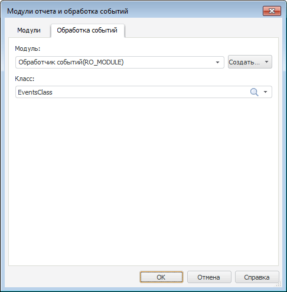

# Обработка событий: Модули отчёта и обработка событий

Обработка событий: Модули отчёта и обработка событий
-

# Вкладка «Обработка событий»

Для работы с [обработчиками событий](UiReport_Reports_Event.htm)
 перейдите на вкладку «Обработка событий»
 окна «Модули отчета и обработка событий»:

В раскрывающемся списке «Модуль»
 выберите объект, который содержит в себе реализацию класса для обработки
 событий регламентного отчёта. Список содержит все объекты, добавленные
 на вкладке «[Модули](UiReport_Reports_Event_Module.htm)».
 В выбранном объекте должен быть описан класс, унаследованный от класса
 [ReportEvents](KeReport.chm::/Class/ReportEvents/ReportEvents.htm)
 и содержащий реализацию методов для обработки событий регламентного отчёта.
 Имя данного класса укажите в поле «Класс».

Описание класса-обработчика событий может быть создано автоматически.
 Для создания нового модуля нажмите кнопку «Создать»
 и выберите нужный тип обработчика. В указанной папке репозитория будет
 создан класс, содержащий шаблоны обработчиков всех событий отчёта.

Класс для обработки событий может иметь конструктор, который будет вызываться
 при каждой инициализации класса. Конструктор должен быть без параметров.
 Если в классе несколько конструкторов без параметров, то будет вызываться
 самый первый (расположенный в коде выше других).

Примечание.
 Инициализация класса-обработчика происходит каждый раз, когда в отчёте
 выполняется какое-либо действие. При этом может генерироваться как одно
 событие, так и целая цепочка событий.

## Пример обработчика события

Для вывода информационного сообщения, содержащего определенную информацию,
 после каждого вычисления области данных регламентного отчёта создайте
 модуль в окне «Навигатор объектов».
 Добавьте ссылку на системные сборки Report и Ui:

	Class EventsClass: ReportEvents

	    // Конструктор, вызываемый при инициализации класса EventsClass

	    Constructor Create;

	    Begin

	        //
	 Инициализация каких-либо объектов

	    End Constructor Create;

	    // Событие, происходящее после вычисления области данных регламентного отчёта

	    Public Sub OnAfterExecuteDataIsland(DataIsland: IPrxDataIsland);

	    Begin

	        WinApplication.InformationBox("Была вычислена область данных: " + DataIsland.Id);

	    End Sub OnAfterExecuteDataIsland;

	End Class EventsClass;

При наступлении события будет выдано информационное сообщение, содержащее
 идентификатор вычисленной области данных.

См. также:

[Начало
 работы с инструментом «Отчёты» в веб-приложении](../../../Web/organizational_management/Starting.htm) | [Обработка
 событий отчёта](UiReport_Reports_Event.htm)

		Справочная
		 система на версию 10.9
		 от 18/08/2025,
		 © ООО «ФОРСАЙТ»,
