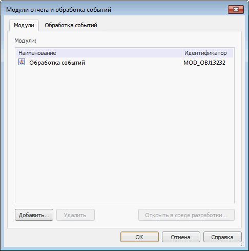

# Модули: Модули отчёта и обработка событий

Модули: Модули отчёта и обработка событий
-

# Вкладка «Модули»

Вкладка позволяет подключить модули [обработки
 событий](UiReport_Reports_Event.htm) и модули, содержащие [пользовательские
 Fore-функции](../../organizational_management/Function/UiReport_Function.htm), которые могут быть использованы для преобразования
 данных.

При подключении модуля обработки события появляется возможность выводить
 информационные сообщения, содержащие определенную информацию (например,
 идентификатор измененного элемента управления, [тип
 гиперссылки](TabSheet.chm::/Interface/ITabHyperlinkClickEventArgs/ITabHyperlinkClickEventArgs.Type.htm) и т.д.) и другие [возможности](UiReport_Reports_Event.htm).

В качестве обработчиков событий можно использовать ресурсы объектов
 среды разработки: модули, формы, сборки.

Для работы со списком модулей, доступных для использования в регламентном
 отчёте, перейдите на вкладку «Модули»
 окна «Модули отчета и обработка событий»:

При работе с модулями доступны следующие операции:

[Добавление объекта
 среды разработки](javascript:TextPopup(this))

	Для добавления нового объекта среды разработки:

		- нажмите кнопку «Добавить»;

		- нажмите клавишу INSERT.

	После выполнения одного из действий будет открыт стандартный диалог
	 выбора объектов репозитория.

[Удаление объекта
 среды разработки](javascript:TextPopup(this))

	Для удаления выбранных объектов среды разработки из списка:

		- нажмите кнопку «Удалить»;

		- выполните команду контекстного меню «Удалить»

		- нажмите клавишу DELETE.

	После выполнения любого из действий появится диалог подтверждения
	 выполняемой операции.

[Открытие объекта
 в среде разработки](javascript:TextPopup(this))

	Для открытия выбранного объекта в среде разработки:

		- дважды щёлкните по наименованию выбранного объекта;

		- нажмите на кнопку «Открыть
		 в среде разработки»;

		- выполните команду контекстного
		 меню «Открыть в среде разработки»
		 объекта.

	При открытии объектов в среде разработки текущий диалог закрывается
	 и фокус переходит в среду разработки.

В списке модулей доступна множественная отметка объектов с зажатой клавишей
 SHIFT или CTRL. Для выделения всех объектов списка нажмите сочетание клавиш
 CTRL+A.

Для работы с [обработчиками событий](UiReport_Reports_Event.htm)
 перейдите на вкладку «[Обработка
 событий](UiReport_Reports_Event_Event.htm)» окна «Модули отчета и обработка
 событий».

См. также:

[Начало
 работы с инструментом «Отчёты» в веб-приложении](../../../Web/organizational_management/Starting.htm) | [Обработка
 событий отчёта](UiReport_Reports_Event.htm)

		Справочная
		 система на версию 10.9
		 от 18/08/2025,
		 © ООО «ФОРСАЙТ»,
