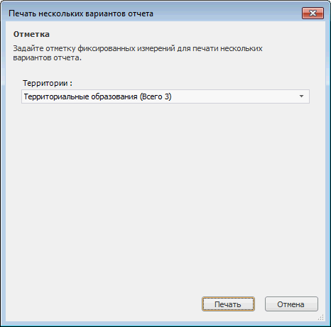

# Пакетная печать отчёта

Пакетная печать отчёта
-

# Пакетная печать отчёта

Пакетная печать - [печать](UiReport_Reports_Operation_Print.htm)
 нескольких вариантов отчёта, которые формируются по отметке фиксированных
 измерений.

Примечание.
 Пакетная печать доступна только в настольном приложении.

Для пакетной печати отчёта выполните команду главного меню «Отчет
 > Печать > Пакетная печать».

Откроется окно «Печать нескольких
 вариантов отчета»:

В диалоге задайте отметку фиксированных измерений, по которой будет
 производиться печать, и нажмите кнопку «Печать».
 Откроется диалог «[Печать](UiReport_Reports_Operation_Print.htm)»,
 задайте в нем параметры печати и выберите используемый принтер.

См. также:

[Начало
 работы с инструментом «Отчёты» в веб-приложении](../../../Web/organizational_management/Starting.htm) | [Предварительный
 просмотр и печать отчёта](UiReport_Reports_Operation_Print.htm) | [Пакетный
 экспорт отчёта](UiReport_PackExp.htm)

		Справочная
		 система на версию 10.9
		 от 18/08/2025,
		 © ООО «ФОРСАЙТ»,
