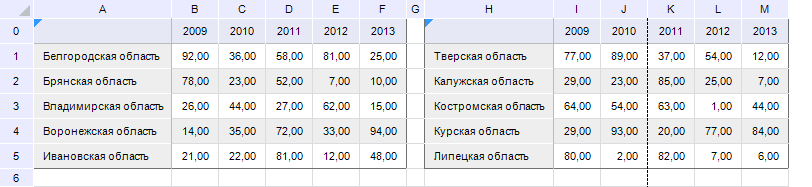
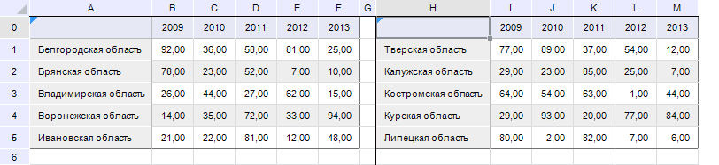

# Настройка разрывов страницы: Регламентный отчёт, настольное приложение

Настройка разрывов страницы: Регламентный отчёт, настольное приложение
-

# Настройка разрывов страницы

Настройка разрывов страницы доступна только для табличного листа при
 открытии на редактирование [регламентного
 отчёта](../../organizational_management/Starting.htm) или [формы
 ввода](DataEntryForms.chm::/Desktop/Starting/Starting.htm).

Для отображения определенных данных листа на одной странице настройте
 вертикальные и горизонтальные разрывы страницы:

	- Установите курсор мыши в ячейку, которая будет являться левой
	 верхней ячейкой новой границы страницы.

	- Нажмите кнопку  «Разрывы», расположенную в группе
	 «Параметры страницы» на вкладке
	 «[Разметка
	 страницы](../../Tuning/ParamPage/UiReport_Tuning_ParamPage.htm#quick)» ленты инструментов.

	- В раскрывающемся меню кнопки «Разрывы»
	 выберите пункт «Вставить разрыв».

После выполнения действий для активного листа отчёта будут отображены
 разрывы страницы в виде сплошной линии и автоматически включено отображение
 [границ
 страниц](../../Tuning/ParamPage/UiReport_Tuning_ParamPage.htm#quick).

Примечание.
 При добавлении пользовательского разрыва страницы будут перемещены
 автоматические границы, устанавливаемые в зависимости от [параметров
 страницы](../../Tuning/ParamPage/UiReport_Tuning_ParamPage_1.htm) и [полей
 на странице](../../Tuning/ParamPage/UiReport_Tuning_ParamPage_2.htm).

На один лист отчёта можно добавить несколько разрывов страницы.

Для удаления одного разрыва страницы:

	- Установите курсор мыши в ячейку, которая является левой верхней
	 ячейкой границы страницы.

	- Нажмите кнопку  «Разрывы», расположенную в группе
	 «Параметры страницы» на вкладке
	 «Разметка страницы» ленты
	 инструментов.

	- В раскрывающемся меню кнопки «Разрывы»
	 выберите пункт «Удалить разрыв».

После выполнения действий будет удален текущий разрыв страницы.

Для удаления всех разрывов страниц:

	- Нажмите кнопку  «Разрывы», расположенную в группе
	 «Параметры страницы» на вкладке
	 «Разметка страницы» ленты
	 инструментов.

	- В раскрывающемся меню кнопки «Разрывы»
	 выберите пункт «Сброс разрывов страниц».

После выполнения действий будут удалены все разрывы страницы. Для листа
 отчёта будут восстановлены автоматические границы страниц, заданные в
 зависимости от [параметров
 страницы](../../Tuning/ParamPage/UiReport_Tuning_ParamPage_1.htm) и [полей
 на странице](../../Tuning/ParamPage/UiReport_Tuning_ParamPage_2.htm).

## Пример

Рассмотрим пример листа отчёта, для которого включено отображение границ
 страниц:

Как видно, автоматическая вертикальная граница, обозначаемая пунктирной
 линией, отображается между столбцами «J» и «K» листа.

Установим для этого листа разрывы страниц таким образом, чтобы вторая
 область данных размещалась при печати и экспорте на отдельной странице.
 Для этого:

	- Установите курсор мыши в ячейку H0, которая будет являться левой
	 верхней ячейкой границы страницы.

	- Нажмите кнопку  «Разрывы», расположенную в группе
	 «Параметры страницы» на вкладке
	 «Разметка страницы» ленты
	 инструментов.

	- В раскрывающемся меню кнопки «Разрывы»
	 выберите пункт «Вставить разрыв».

Лист отчёта с заданными разрывами страниц примет вид:

При [печати](UiReport_Reports_Operation_Print.htm) и/или
 [экспорте](UiReport_Reports_Operation_Export.htm) области данных,
 размещённые на листе отчёта, будут выводиться на отдельных листах:

Совет. Если ширина
 и/или длина данных слишком велика для размещения на одной странице, [настройте отображение
 сквозных столбцов и/или строк](../../../FAQ/Print_on_every_page.htm).

См. также:

[Начало
 работы с инструментом «Отчёты» в веб-приложении](../../../Web/organizational_management/Starting.htm) | [Настройка
 отчёта под печать](../../Tuning/ParamPage/UiReport_Tuning_ParamPage.htm) | [Построение
 отчёта](../../CreateReport.htm) | [Работа с готовым
 отчётом](Work_witn_report.htm)

		Справочная
		 система на версию 10.9
		 от 18/08/2025,
		 © ООО «ФОРСАЙТ»,
