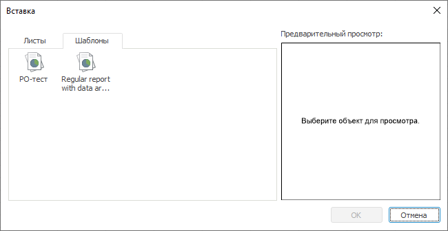
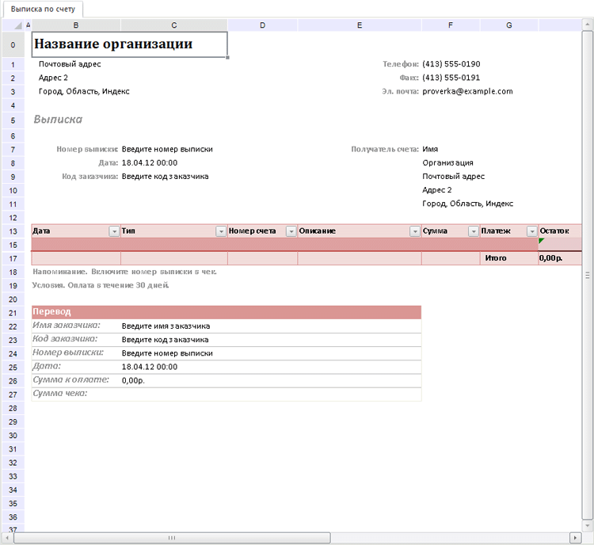

# Работа с шаблонами отчёта

Работа с шаблонами отчёта
-

# Работа с шаблонами отчёта

Инструмент «Отчёты» позволяет
 создавать отчёты по шаблонам. Шаблоны предназначены для сохранения единого
 оформления и структуры при создании группы отчётов.

Шаблоны регламентного отчёта создаются пользователями.

## Создание шаблона отчёта

Для создания шаблона сохраните отчёт, выполнив команду главного меню
 «Отчет > Сохранить как > Шаблон
 отчета». Будет открыт диалог для сохранения отчёта в репозитории.

Шаблоны отчёта сохраняются в папке с наименованием и идентификатором
 «PROC_REPORT_TEMPLATES», которая создается автоматически в корневой папке
 репозитория. В дальнейшем название папки и место ее размещения можно изменить.

## Создание отчёта по шаблону

Для создания в настольном приложении отчёта по существующему шаблону
 выполните команду главного меню «Отчет
 > Создать > Отчет из шаблона». Будет открыт диалог выбора
 шаблона. Если в репозитории отсутствуют шаблоны регламентного отчёта,
 то будет отображено соответствующее сообщение.

## Открытие шаблона отчёта

Для открытия шаблона отчёта в настольном приложении выполните команду
 главного меню «Отчет > Открыть >
 Шаблон отчета».

## Добавление листа из шаблона

Для добавления нового листа отчёта из шаблона, выполните команду контекстного
 меню «Добавить лист» для вкладки
 листа. Будет открыто окно «Вставка».
 Перейдите на вкладку «Шаблоны»:

В области «Предварительный просмотр»
 отображается выделенный шаблон отчёта, если он включает в себя не больше
 одного листа. Иначе в области «Предварительный
 просмотр» выводится сообщение «Просмотр
 невозможен».

При добавлении шаблона в отчёт будут добавляться все его листы. При
 этом, если наименования шаблонных листов совпадают с существующими
 листами отчёта, то при добавлении они будут корректироваться (например,
 наименование «Лист 1» изменится на «Лист 1(1)».

При добавлении шаблонного листа будет добавляться все его содержимое,
 включая оформление, объекты, области данных и реляционные области данных
 (без источников), области формул.

## Пример шаблона отчёта

См. также:

[Начало
 работы с инструментом «Отчёты» в веб-приложении](../../../Web/organizational_management/Starting.htm) | [Построение
 отчёта](../../CreateReport.htm)

		Справочная
		 система на версию 10.9
		 от 18/08/2025,
		 © ООО «ФОРСАЙТ»,
