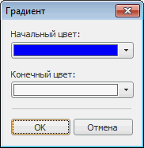

# Создание цветовой шкалы

Создание цветовой шкалы
-

# Создание цветовой шкалы

Для добавления цветовой шкалы нажмите кнопку «Добавить»
 и в раскрывающемся меню выберите пункт «Добавить
 цветовую шкалу». Окно «[Шкалы
 отчета](UiReport_Reports_Operation_Scale.htm)» примет следующий вид:

Задайте следующие параметры для настройки цветовой шкалы:

[Цвет](javascript:TextPopup(this))

	В раскрывающейся палитре выберите цвет фона, либо выберите новый
	 цвет в расширенной палитре цветов, вызываемой при нажатии на кнопку
	 «Другой».

[Значение](javascript:TextPopup(this))

	Задайте значение показателя, которое будет сопоставляться цвету,
	 при помощи редактора чисел или вручную.

	Одному значению соответствуют три деления шкалы.

	Если значение показателя совпадает с заданным значением, то заливка
	 примет цвет, расположенный в делении шкалы напротив указателя заданного
	 значения. Если значение показателя больше (меньше) заданного значения,
	 то заливка примет цвет, расположенный в делении шкалы выше (ниже)
	 указателя заданного значения.

	Значения в шкале необходимо задавать в возрастающем порядке. Минимальное
	 значение расположено слева, максимальное - справа.

[Всего
 значений](javascript:TextPopup(this))

	Задайте количество интервалов шкалы.

[Градиент](javascript:TextPopup(this))

	Для задания начального и конечного цветов градиента нажмите кнопку
	 «Градиент». Будет открыто
	 одноименное окно:

	

	Выберите необходимые цвета в раскрывающихся палитрах.

[Автоматическая
 шкала и метод расчёта шкалы](javascript:TextPopup(this))

	При установленном флажке «Автоматическая
	 шкала» значения для шкалы отчета будут рассчитываться автоматически.
	 Метод расчета выбирается в поле «Метод
	 расчета шкалы»:

		- Равные интервалы.
		 Весь диапазон данных разбивается на заданное количество равных
		 по длине диапазонов. Установлен по умолчанию;

		- Относительное разбиение.
		 Весь диапазон данных разбивается на заданное количество диапазонов,
		 содержащих одинаковое число территориальных единиц, которые при
		 этом получаются разными по длине.

	Результаты расчетов зависят от данных, содержащихся в срезе, и от
	 заданного количества значений на шкале (поле «Всего
	 значений»).

См. также:

[Шкалы отчета](UiReport_Reports_Operation_Scale.htm)

		Справочная
		 система на версию 10.9
		 от 18/08/2025,
		 © ООО «ФОРСАЙТ»,
