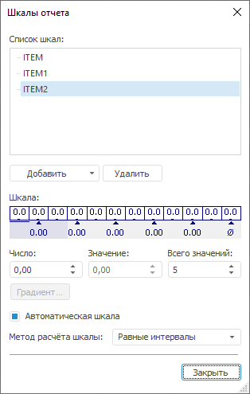

# Создание числовой шкалы

Создание числовой шкалы
-

# Создание числовой шкалы

Для добавления числовой шкалы нажмите на кнопку «Добавить»
 и в раскрывающемся меню выберите пункт «Добавить
 числовую шкалу». Окно «[Шкалы
 отчета](UiReport_Reports_Operation_Scale.htm)» при этом примет вид:

Задайте следующие параметры для настройки числовой шкалы:

[Число](javascript:TextPopup(this))

	Задайте число для выбранного деления шкалы. Данное число будет влиять
	 на высоту или ширину частей показателя (например, высота столбика
	 в столбиковом показателе или радиус кругового показателя).

[Значение](javascript:TextPopup(this))

	Задайте значение показателя, которое будет сопоставляться цвету,
	 при помощи редактора чисел или вручную.

	Одному значению соответствуют три деления шкалы.

	Если значение показателя совпадает с заданным значением, то размер
	 части будет совпадать с числом, расположенным в делении шкалы напротив
	 указателя заданного значения. Если значение показателя больше (меньше)
	 заданного значения, то размер части будет совпадать с числом, расположенным
	 в делении шкалы выше (ниже) указателя заданного значения.

	Значения в шкале необходимо задавать в возрастающем порядке. Минимальное
	 значение расположено слева, а максимальное значение справа.

[Всего значений](javascript:TextPopup(this))

	Задайте количество интервалов шкалы.

[Автоматическая
 шкала и метод расчёта шкалы](javascript:TextPopup(this))

	При установленном флажке «Автоматическая
	 шкала» значения для шкалы отчета будут рассчитываться автоматически.
	 Метод расчета выбирается в поле «Метод
	 расчета шкалы»:

		- Равные интервалы.
		 Весь диапазон данных разбивается на заданное количество равных
		 по длине диапазонов. Установлен по умолчанию;

		- Относительное разбиение.
		 Весь диапазон данных разбивается на заданное количество диапазонов,
		 содержащих одинаковое число территориальных единиц, которые при
		 этом получаются разными по длине.

	Результаты расчетов зависят от данных, содержащихся в срезе, и от
	 заданного количества значений на шкале (поле «Всего
	 значений»).

См. также:

[Шкалы отчета](UiReport_Reports_Operation_Scale.htm)

		Справочная
		 система на версию 10.9
		 от 18/08/2025,
		 © ООО «ФОРСАЙТ»,
