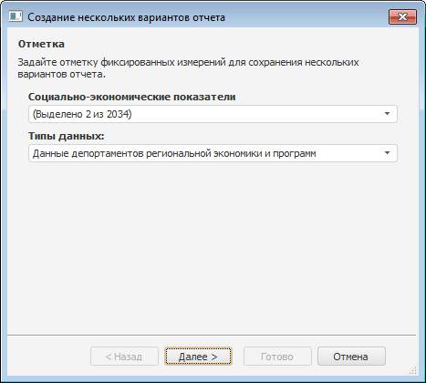
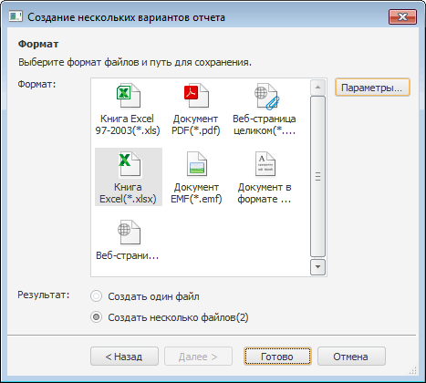

# Пакетный экспорт отчёта

Пакетный экспорт отчёта
-

# Пакетный экспорт отчёта

Пакетный экспорт - экспорт нескольких
 вариантов отчёта. Варианты отчёта формируются по отметке фиксированных
 измерений [источника данных](../../Source/UiReport_Source.htm).

Примечание.
 Пакетный экспорт регламентного отчёта доступен только в настольном приложении.

Пакетный экспорт регламентного отчёта возможен, если имеются [элементы
 управления](../../Source/Controls.htm), общие для всех экспортируемых листов отчёта. Элементы
 управления должны быть связаны с фиксированными измерениями. Если элементы
 управления являются общими для экспортируемых листов отчёта, но при этом
 не связаны с фиксированными измерениями, то пакетный экспорт не будет
 произведен.

Чтобы выполнить пакетный экспорт:

	- Убедитесь, что для всех листов
	 отчёта имеются общие элементы управления.

	- Выполните
	 команду главного меню «Отчет >
	 Экспорт > Пакетный экспорт». Будет открыта первая страница
	 мастера пакетного экспорта:

	- В раскрывающихся списках выберите элементы фиксированных измерений,
	 по которым нужно создать варианты отчёта. Количество отчётов, которые
	 будут экспортированы, равно декартовому произведению отмеченных элементов
	 в фиксированных измерениях. Например, на рисунке выше видим, что в
	 первом измерении отмечено 2 элемента, а во втором - 1 элемент. Количество
	 возможных пар, которые можно составить из этих элементов (т.е. декартово
	 произведение) - 2, соответственно, будет создано 2 варианта отчёта.

	- Нажмите кнопку «Далее».
	 Будет открыта вторая страница мастера пакетного экспорта:

	- Выберите формат файла и результат экспорта:

		- Создать один файл;

		- Создать несколько файлов.

При сохранении вариантов отчёта в нескольких
 файлах, названия файлов будут формироваться по следующему шаблону:

<наименование
 файла>+(<комбинация фиксированных
 элементов>)+.+<формат>

Например: Социально-экономические
 показатели (Данные регионов; Туризм).xls.

	- После того, как выбраны формат и результат экспорта, нажмите
	 кнопку «Готово». Будет открыт
	 стандартный диалог размещения созданного файла. Если отчёт сохранялся
	 в несколько файлов, после сохранения будет предложено перейти в папку,
	 содержащую созданные файлы.

## Особенности пакетного экспорта

При выполнении пакетного экспорта отчёта учитывайте следующие особенности:

	- при выполнении пакетного экспорта отчёта в несколько файлов
	 название создаваемого файла формируется следующим образом:

<наименование
 файла>+(<комбинация фиксированных
 элементов>)

При этом:

		- если название файла не превышает 218 символов, название
		 файла не сокращается;

		- если название файла превышает 218 символов, то часть названия
		 файла, включающая фиксированную отметку сокращается следующим
		 образом:

<наименование
 файла>+(<комбинация фиксированных
 элементов>(сокр.));

	- если в наименованиях измерений присутствуют недопустимые символы,
	 то при пакетном экспорте в несколько файлов недопустимые символы заменяются
	 символом «_»;

	- если в измерении присутствуют одинаковые наименования, то при
	 экспорте к имени экспортируемого файла добавляется «(N)».
	 Где «(N)» - порядковый номер.

	Например:

		- Социально-экономические
		 показатели (Данные регионов; Туризм).xls;

		- Социально-экономические
		 показатели (Данные регионов; Туризм(1)).xls.

См. также:

[Начало
 работы с инструментом «Отчёты» в веб-приложении](../../../Web/organizational_management/Starting.htm) | [Экспорт
 отчёта](UiReport_Reports_Operation_Export.htm) | [Пакетная печать отчёта](PackPrint.htm)

		Справочная
		 система на версию 10.9
		 от 18/08/2025,
		 © ООО «ФОРСАЙТ»,
