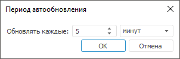

# Обновление отчёта

Обновление отчёта
-

# Обновление отчёта

Обновление данных необходимо после изменения данных в источнике или
 при изменении настроек [областей
 с данными](../../AreaData/Table_Types.htm).

В регламентном отчёте доступно:

	- Обновление всего отчёта.
	 Выполните одно из действий:

		- нажмите кнопку  «Обновить» на вкладке «Главная» на ленте инструментов.
		 Кнопка дублируется на большинстве вкладок ленты инструментов;

		- нажмите клавишу F9 в настольном приложении.

Для обновления отчёта с последующим открытием
 отчёта на просмотр в настольном приложении нажмите сочетание клавиш CTRL+F9;

	- Обновление текущего листа.
	 Выполните команду «Обновить лист»
	 в раскрывающемся меню кнопки  «Обновить» на вкладке «Главная»
	 на ленте инструментов;

	- Переоткрытие источников данных.
	 Выполните команду «Переоткрыть источники
	 данных» в раскрывающемся меню кнопки  «Обновить» на вкладке «Главная»
	 ленты инструментов. При переоткрытии источников данных происходит
	 очистка кеша источников и их вложенных объектов;

	- Автоматическое обновление всего
	 регламентного отчёта. Используйте кнопку  «Автоматическое обновление» на вкладке
	 «Главная» ленты инструментов.

При обновлении обновляются источники данных и данные в отчёте, заново
 вычисляются формулы. Все настройки обновления данных сохраняются вместе
 с регламентным отчётом.

## Автоматическое обновление

Автоматическое обновление позволяет обновлять данные при каждом их изменении
 в источнике или с заданной периодичностью.

[Для
 включения автоматического обновления](javascript:TextPopup(this))

	Для включения автоматического обновления нажмите кнопку  «Автоматическое
	 обновление».

	Автоматическое обновление регламентного отчёта будет включено. При
	 каждом изменении набора данных будет производиться автоматическое
	 обновление источника данных.

[Для
 периодического обновления данных](javascript:TextPopup(this))

		- Перейдите на вкладку «Главная»
		 ленты инструментов.

		- Установите переключатель «Задать
		 период» в раскрывающемся меню кнопки  «Автоматическое обновление».
		 Будет открыт диалог «Период автообновления»:

	

	В диалоге задайте период обновления данных
	 в регламентном отчёте. Обновление может выполняться каждые N
	 секунд, минут или часов.

	Примечание.
	 Если для регламентного отчёта уже настраивался период обновления,
	 то его можно выбрать в раскрывающемся меню кнопки  «Автоматическое обновление».

	Обновление регламентного отчёта будет выполняться раз в заданный
	 период времени.

	Для отключения периодического обновления данных установите переключатель
	 «Не использовать» в раскрывающемся
	 меню кнопки  «Автоматическое обновление».

[Для
 отключения автоматического обновления](javascript:TextPopup(this))

	Для отключения автоматического обновления переведите кнопку  «Автоматическое
	 обновление» в ненажатое состояние.

	Автоматическое обновление регламентного отчёта будет отключено.

См. также:

[Начало
 работы с инструментом «Отчёты» в веб-приложении](../../../Web/organizational_management/Starting.htm) | [Работа
 с готовым отчётом](Work_witn_report.htm)

		Справочная
		 система на версию 10.9
		 от 18/08/2025,
		 © ООО «ФОРСАЙТ»,
