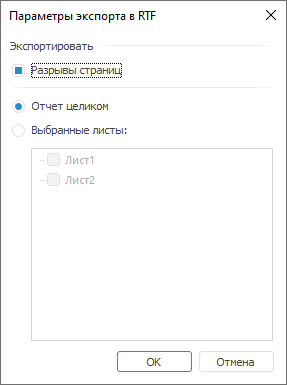
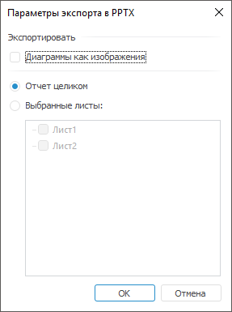
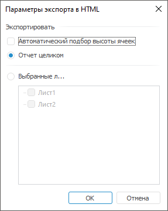
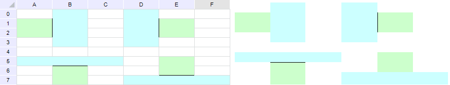
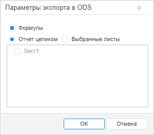
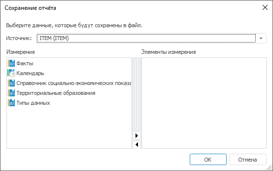

# Экспорт отчёта: Регламентный отчёт, настольное приложение

Экспорт отчёта: Регламентный отчёт, настольное приложение
-

# Экспорт отчёта

В отчёте можно экспортировать выбранные данные или отчёт целиком. Для
 экспорта данных в XML, CSV и другие форматы используйте [приёмники
 задачи ETL](UiEtl.chm::/Desktop/03_ETLObjects/03_Outputs/UiEtl_Outputs.htm), а для экспорта отчёта целиком во внешние
 форматы выполните команду главного меню «Отчет
 > Экспорт» и выберите формат:

	- книга Excel (*.xlsx);

	- книга Excel 97-2003 (*.xls);

	- документ PDF (*.pdf);

	- документ в формате RTF (*.rtf);

	- презентация PowerPoint (*.pptx);

	- веб-страница (*.html);

	- веб-страница, архив в одном файле (*.mht);

	- электронная таблица OpenDocument (*.ods);

	- изображение (*.emf);

	- регламентный отчёт (*.ppreport).

Примечание.
 Формат PPREPORT является внутренним форматом продукта «Форсайт. Аналитическая платформа»
 и служит для выгрузки отчётов в локальный файл для последующей работы
 без связи с репозиторием.

После выбора формата внешнего файла будет открыто окно для задания параметров
 экспорта.

Для разных форматов экспорта вид данного окна меняется, но всегда присутствуют
 следующие переключатели:

	- Отчет целиком. При установке
	 данного переключателя будет экспортироваться весь отчёт;

	- Выбранные листы. При
	 установке данного переключателя отметьте флажками листы, которые будут
	 экспортироваться. В данном списке отсутствуют скрытые листы.

Примечание.
 При экспорте в форматы XLS и XLSX в списке «Выбранные
 листы» присутствуют скрытые листы, если в диалоге «Параметры
 экспорта в XLS» установлен флажок «Скрытые
 листы».

Для экспорта нескольких вариантов отчёта, сформированных по отметке
 фиксированных измерений, используйте [пакетный
 экспорт](UiReport_PackExp.htm).

## Особенности экспорта

При экспорте отчётов в файлы различных форматов учитывайте следующие
 особенности:

		 XLS, XLSX
		 PDF
		 RTF
		 HTML, MHT

		 Экспорт из веб-приложения
		 

		 

		 

		 

		 Колонтитулы
		 

		 

		 

		 

		 Гиперссылки
		 

		 

		 

		 

		 Штампы маркировки
		 

		 

		 

		 

		 Пиктограммы в ячейках, подключенные с помощью
		 [языка
		 Fore](TabSheet.chm::/Interface/ITabCellStyle/ITabCellStyle.NormalPicture.htm)
		 

		 

		 

		 

		 Сноски, подключенные с помощью языка Fore
		 

		 

		 

		 

		 ODS
		 EMF
		 PPTX
		 PPREPORT

		 Экспорт из веб-приложения
		 

		 

		 

		 

		 Колонтитулы
		 

		 

		 

		 

		 Гиперссылки
		 

		 

		 

		 

		 Штампы маркировки
		 

		 

		 

		 

		 Пиктограммы в ячейках, подключенные с помощью
		 [языка
		 Fore](TabSheet.chm::/Interface/ITabCellStyle/ITabCellStyle.NormalPicture.htm)
		 

		 

		 

		 

		 Сноски, подключенные с помощью языка Fore
		 

		 

		 

		 

Условные обозначения:

 - экспорт отчёта доступен;

 - экспорт отчёта недоступен.

В зависимости от настроек регламентного отчёта можно выделить следующие
 особенности экспорта:

	- если для ячеек снят флажок «[Выводить на печать](UiNav.chm::/GUI/Format/UiReport_Table_Attribute_Others.htm)»,
	 то при экспорте в XLS, XLSX, PDF, HTML не будут экспортироваться:
	 текст, пиктограммы и гиперссылки, содержащиеся в такой ячейке, а также
	 настройки ее фона;

	- при экспорте в XLS, XLSX или ODS [гиперссылки](uinav.chm::/GUI/Format/UiReport_Table_Attribute_Hyperlink.htm)
	 экспортируются в отчёт для действий «Открыть
	 ссылку», «Открыть лист отчёта»
	 и «Показать диапазон ячеек»
	 с сохранением настроек параметра «Отдельный
	 текст», если флажок установлен. Для действия «Открыть
	 лист отчёта» гиперссылка экспортируется как текст, если лист
	 отчёта, на который осуществляется переход при нажатии на гиперссылку,
	 не включен в экспорт;

	- колонтитулы, настроенные в отчёте, экспортируются во все форматы,
	 кроме HTML и ODS:

	-

		- в результирующем файле форматов XLS и XLSX с колонтитулами
		 можно работать средствами Microsoft Excel (диалог «Параметры
		 страницы», вкладка «Колонтитулы»);

		- если были настроены [колонтитулы](../../Tuning/ParamPage/UiReport_Tuning_ParamPage_3.htm)
		 для чётных, нечётных и первой страниц, то после экспорта в форматы
		 ODS и XLS (версии ниже 2007) для колонтитулов на первой странице
		 будут применены настройки, заданные для колонтитулов на нечётных
		 страницах;

		- если при экспорте в формат RTF секции колонтитула в
		 отчёте содержали изображения, то:

		-

			- при наличии пустых секций соседние секции растягиваются
			 на место пустых;

			- при пустой центральной секции и непустых боковых секциях
			 растягивается изображение, расположенное в правой секции;

	- при экспорте в форматы PDF и RTF лист отчёта, для которого снят
	 флажок «Печатать лист вместе с отчетом»
	 в настройках [параметров
	 страницы](../../Tuning/ParamPage/UiReport_Tuning_ParamPage.htm), не экспортируется;

Примечание.
 Если экспорт выполняется при открытом непечатном листе отчёта, то для
 экспорта будет доступен только данный лист.

	- лист с [подключённым
	 плагином](DataAnalysis.chm::/Plugins/Connecting_Plugins_Report.htm) не экспортируется;

	- вид результирующего файла зависит от заданных [параметров
	 страницы](../../Tuning/ParamPage/UiReport_Tuning_ParamPage.htm);

	- для экспорта гиперссылок в формат HTML или PPTX необходимо при
	 помощи языка Fore установить в True
	 свойство [IPrxReportExporter.ExportHyperlinkOpenURLAction](KeReport.chm::/Interface/IPrxReportExporter/IPrxReportExporter.ExportHyperlinkOpenURLAction.htm);

	- [текстовый
	 блок](../../Objects/UiReport_Objects_formatted_text.htm) при экспорте в формат XLSX экспортируется в объект типа «Надпись», при экспорте в другие
	 форматы экспортируется как изображение;

	- [сноски](UiAnalyticalArea.chm::/TableView/Table_footnotes.htm):

		- при экспорте в формат RTF нумерация сносок в документе будет
		 упорядочена по листам: от первого к последнему;

		- при экспорте в XLS или XLSX по умолчанию сноски не экспортируются.
		 Номера сносок экспортируются, если с помощью Fore
		 заданы соответствующие настройки. Текст сносок не экспортируется.

		Формат ячеек, содержащих сноски, будет изменен на текстовый. В
		 связи с этим:

			- вид диаграммы может отличаться от вида в исходном отчёте;

			- формулы, для которых были заданы сноски, будут отображаться
			 в виде текста;

			- не будут рассчитаны формулы, которые ссылаются на ячейки
			 со сносками.

Примечание.
 При печати и экспорте отчёта в результирующем файле может быть отображен
 [штамп](Admin.chm::/04_SecurityPolicy/Editor_of_Politicy/Admin_MandatAccess_Marking.htm)
 № 1 в соответствии с Инструкцией № 0126-87, если в качестве политики безопасности
 используется [мандатный
 доступ](admin.chm::/04_SecurityPolicy/Admin_MandatAccess.htm), и для уровня безопасности данного объекта включена
 маркировка при экспорте и печати.

[Экспорт
 в файл формата XLS и XLSX](javascript:TextPopup(this))

	При сохранении отчёта в файл формата XLS и XLSX окно «Параметры
	 экспорта в <формат>» выглядит следующим образом:

	

	Задайте параметры:

		- Скрытые строки и столбцы.
		 По умолчанию флажок установлен. При установленном флажке скрытые
		 области, если они имеются, будут экспортироваться, с ними можно
		 будет работать средствами Microsoft Excel;

		- Скрытые листы. По
		 умолчанию флажок установлен. При установленном флажке в списке
		 «Выбранные листы» доступны
		 для отметки скрытые листы отчёта. При экспорте отчёта целиком
		 скрытые листы также будут экспортированы;

		- Цветовая палитра. По
		 умолчанию флажок снят. При установленном флажке, в случае использования
		 оригинальных цветов, появляется возможность заменить палитру,
		 используемую в Microsoft Excel, на палитру, используемую в «Форсайт. Аналитическая платформа».
		 При снятии флажка будет подобран наиболее подходящий цвет из палитры
		 Microsoft Excel, палитра не будет изменена;

	Примечание.
	 Параметр доступен только при экспорте в формат XLS.

		- Экспандеры. По умолчанию
		 флажок снят. При установленном флажке экспортируются отображаемые
		 экспандеры в текущем виде регламентного отчёта. Если экспандеры
		 свернуты, то экспортируются все вложенные элементы регламентного
		 отчёта и содержащиеся в нем свернутые\развернутые экспандеры.
		 Экспандеры доступны для работы средствами Microsoft Excel;

	Примечание.
	 Параметр доступен только при экспорте в формат XLSX. Экспортируются
	 экспандеры только для элементов иерархии [табличных
	 визуализаторов](../../AreaData/DataTable.htm).

		- Диаграммы как изображения.
		 По умолчанию флажок снят. При установленном флажке диаграммы экспортируются
		 как изображения в формате EMF. Если флажок снят, работа с ними
		 осуществляется как с диаграммами средствами Microsoft Excel. Типы
		 диаграмм, с которыми доступна работа средствами Microsoft Excel:
		 [гистограмма](UiDiagrams.chm::/Type_diagrams/UiDiagrams_Bar.htm),
		 [диаграмма
		 с областями](UiDiagrams.chm::/Type_diagrams/UiDiagrams_Area.htm), [круговая](UiDiagrams.chm::/Type_diagrams/UiDiagrams_round.htm),
		 [линейная](UiDiagrams.chm::/Type_diagrams/UiDiagrams_lenear.htm),
		 [смешанная](UiDiagrams.chm::/Type_diagrams/UiDiagrams_mixed_diagram.htm),
		 [точечная](UiDiagrams.chm::/Type_diagrams/UiDiagrams_scatter.htm),
		 [каскадная](UiDiagrams.chm::/Type_diagrams/WaterFall_chart.htm),
		 [пузырьковая](UiDiagrams.chm::/Type_diagrams/Bubble_Chart.htm),
		 [лепестковая](UiDiagrams.chm::/Type_diagrams/UiDiagrams_petalous.htm),
		 [биржевая](UiDiagrams.chm::/Type_diagrams/UiDiagrams_birg.htm);

	Примечание.
	 При экспорте [каскадной
	 диаграммы](uidiagrams.chm::/Type_diagrams/WaterFall_chart.htm) в формат XLSX вид диаграммы будет отличаться
	 от исходного из-за несоответствия настроек продукта «Форсайт. Аналитическая платформа»
	 с Microsoft Excel; при экспорте в формат XLS будет рекомендовано использовать
	 формат XLSX.

		- Защита листов и ячеек.
		 По умолчанию флажок установлен. При установленном флажке будет
		 экспортироваться [защита
		 листов](../../Sheets/UiReport_Sheets_defence.htm) и [ячеек](UiNav.chm::/GUI/Format/UiReport_Table_Attribute_Others.htm). Необходимо
		 помнить, что в Microsoft Excel будет устанавливаться защита листа
		 с пустым паролем, даже если в регламентном отчёте при защите листа
		 был задан пароль;

		- Формулы. По умолчанию
		 флажок установлен. При установленном флажке будут экспортироваться
		 формулы, расположенные на листе отчёта. Если флажок снят, экспортируются
		 только значения.

	Примечание.
	 В веб-приложении не экспоритруются формулы с использованием оператора
	 OR.

	Если в Excel [функция](../../organizational_management/Function/UiReport_Function.htm)
	 не поддерживается, то в ячейке с формулой будет отображаться текстовое
	 или числовое значение.

	Если экспортируемый отчёт содержит [формулы](../../organizational_management/Function/UiReport_Function.htm),
	 имеющие ссылки на другие листы отчёта, которые не были включены в
	 экспорт, то в качестве результата вычисления таких формул будет указана
	 ошибка вычисления.

	В Microsoft Excel не поддерживаются следующие
	 виды функций:

			- [Текстовые
			 функции](../../organizational_management/Function/Text/UiReport_Func_Text.htm). Microsoft Excel не распознает формулы, введенные
			 вручную. Например, формула «=A1+A2», где в ячейках A1 и A2
			 содержатся текстовые значения, не будет экспортирована в Microsoft
			 Excel;

	Примечание.
	 Для корректного экспорта отчёта, содержащего формулы сложения строк,
	 используйте функцию [Concatenate](../../organizational_management/Function/Text/UiReport_Func_Text_Concatenate.htm)
	 вместо знака сложения «+».

			- [Функции
			 для работы с отчётом](../../organizational_management/Function/Report/UiReport_Func_Report.htm). Независимо от того, установлен или
			 снят флажок «Формулы»,
			 в файл Microsoft Excel экспортируются значения;

			- [Финансовые
			 функции](../../organizational_management/Function/Finance/UiReport_Func_Finance.htm). Microsoft Excel не распознает формулы с датами,
			 введенными вручную. Например, формула «=TBillPrice("01.01.2007",
			 "01.09.2008", 0.05)», где содержится дата, не будет
			 экспортирована в Microsoft Excel;

	Примечание.
	 Для корректного экспорта отчёта, содержащего даты, используйте функцию
	 [Date](../../organizational_management/Function/Date_Time/UiReport_Func_DateTime_Date.htm).

			- Функции, использующие классы [PrxReport](KeReport.chm::/Class/PrxReport/PrxReport.htm)
			 и [MetabaseClass](KeSom.chm::/Class/MetabaseClass/MetabaseClass.htm);

			- Пользовательские [Fore-функции](../../organizational_management/Function/UiReport_Function.htm#custom_functions)
			 и [функции,
			 созданные с использованием интерфейса ISharedParams](../../organizational_management/Function/UiReport_Function.htm#isharedparams). При
			 экспорте ячеек, содержащих пользовательские функции, в результирующем
			 файле будут отображаться текстовые или числовые значения.

	Подробнее об экспортируемых функциях
	 см. раздел «[Какие функции экспортируются в Microsoft
	 Excel?](../../../FAQ/Exported_Functions.htm)».

	Особенности экспорта диаграммы:

		- если [диапазон
		 наименований рядов (точек)](../../Diagrams/UiDiagrams_Report_create_source.htm) задан в виде открытого диапазона
		 (весь столбец или строка), то после экспорта в качестве наименования
		 ряда (точки) будет задана ячейка, находящаяся на пересечении диапазона
		 данных и диапазона наименований рядов (точек);

		- типы заливки рядов данных в результирующем файле и в регламентном
		 отчёте могут не совпадать;

		- если при настройке вида отображения линейной или смешанной
		 диаграммы, содержащей линейные ряды, установлен флажок «[Инвертировать](UiDiagrams.chm::/params_diagram/uidiagrams_params_diagram.htm)»,
		 то диаграмма будет экспортироваться как изображение;

		- если при настройке вида отображения диаграммы установлен
		 флажок «[Масштабировать
		 ось категорий](UiDiagrams.chm::/params_diagram/uidiagrams_params_diagram.htm)»,
		 то диаграмма будет экспортироваться как изображение;

		- если диаграмма построена на данных, расположенных на другом
		 листе, и при экспорте отчёта не выбран лист с данными, то диаграмма
		 будет экспортироваться как изображение.

	Особенности экспорта формул:

		- при расчёте формул с функциями Irr,
		 TBillEq, TBillPrice,
		 TBillYield в экспортированных
		 файлах возникает ошибка в связи с особенностями их реализации
		 в документах Microsoft Excel;

		- результаты расчёта формул с функцией Rand
		 отличаются в экспортированных файлах от соответствующих значений
		 в отчёте в связи с особенностями их реализации в документах Microsoft
		 Excel;

		- результаты расчёта формул с функциями GetSelectionEl,
		 GetSelection, JarqueBeraStat,
		 NormsDist, OddlPrice,
		 OddlYield, RedemptionYield,
		 RndPermutation, RndSample, Slope,
		 Sum, TimeValue
		 экспортируются в виде текста.

	Особенности экспорта экспандеров:

		- если в шапке или боковике таблицы содержится более одного
		 иерархического измерения, то экспандеры будут экспорироваться
		 только для первого измерения, расположенного в первом столбце
		 или строке таблицы. Если для первого измерения экспандеры [скрыты](UiAnalyticalArea.chm::/TableView/Layout/Layout_Dim.htm#expander),
		 то экспортируются отображаемые экспандеры у следующего измерения;

		- если в шапке или боковике таблицы содержится несколько [объединенных
		 измерений](UiAnalyticalArea.chm::/TableView/Layout/Merging_Dimensions.htm), то экспортируются экспандеры только
		 для первого столбца или строки с учётом объединения. Если первое
		 измерение содержит несколько [уровней](UiNavObj.chm::/reference_book/Master_Table_reference_book/UiMd_reference_book_Master_Table_page4.htm),
		 которые размещены по нескольким столбцам или строкам, то экспортируются
		 экспандеры только нулевого уровня;

		- если регламентный отчёт экспортируется без скрытых [строк](../../Table/OperationRow/UiReport_Table_Row.htm#hiding_rows)
		 и [столбцов](../../Table/OperationColumn/UiReport_Table_Column.htm#hiding_columns),
		 то свернутые экспандеры и их дочерние элементы не экспортируются;

		- если регламентный отчёт состоит из нескольких таблиц с экспандерами,
		 то экспортируются экспандеры на всех таблицах в боковике и шапке.
		 Если таблицы расположены по вертикали, то экспандеры в шапке экспортируются
		 только для верхних таблиц. Если таблицы расположены по горизонтали,
		 то экспандеры в боковике экспортируются только для крайних таблиц
		 слева.

	Условное форматирование ячеек экспортируется со следующими ограничениями:

		- поддерживается только в Microsoft Excel 2007 и выше;

		- некоторые обозначения в результирующем файле могут
		 не совпадать с обозначениями в регламентном отчёте.

	При экспорте существуют следующие ограничения на количество строк
	 и столбцов:

		- XLS. Максимальное
		 число столбцов - 256, максимальное число строк - 65536;

		- XLSX. Максимальное
		 число столбцов - 16385, максимальное число строк - 1048576.

	Для корректного отображения иерархии [отступ](UiNav.chm::/GUI/Format/UiReport_Table_Attribute_Arrange.htm)
	 для уровня должен отличаться от отступа другого уровня не менее чем
	 на 3мм.

	Если в отчёте имеются ячейки [текстового
	 формата](UiNav.chm::/GUI/Format/UiReport_Table_Attribute_Format.htm), содержащие более 255 символов, то содержание
	 таких ячеек в результирующем файле будет отображено в виде «решёток»
	 - ###. Для отображения содержания ячейки измените ее формат на общий.

	Если в отчёте используются ячейки, формат которых настроен с помощью
	 [редактора
	 ячейки](UiNav.chm::/GUI/Format/UiReport_Table_Attribute_Format.htm#cell_editor), то будет экспортировано текущее значение,
	 заданное в ячейке в момент экспорта.

	Высота/ширина ячеек в регламентном отчёте и Microsoft Excel совпадают,
	 но результат экспорта может отличаться вследствие разного межстрочного
	 интервала, который зависит от типа и размера шрифта.

	Если в регламентном отчёте были заданы текстуры ячеек, то результат
	 экспорта может визуально отличаться от исходного отчёта, так как текстуры
	 в «Форсайт. Аналитическая платформа»
	 и Microsoft Excel различаются.

	Если в отчёте было отключено отображение только заголовков столбцов
	 или только заголовков строк, то в результирующем файле будет отключено
	 отображение заголовков строк и столбцов. При экспорте отчёта будет
	 отображено информационное сообщение.

	При экспорте настроек сортировки диапазона в файл формата XLS необходимо
	 учитывать ограничения для более ранних версий Microsoft Excel. При
	 количестве условий сортировки более трех после экспорта будет выводиться
	 сообщение о том, что результат экспорта в версиях более ранних чем
	 2007 будет открыт с ограничением.

	При экспорте отчёта с настроенным [составным
	 диапазоном сквозных строк/столбцов](../../Tuning/ParamPage/UiReport_Tuning_ParamPage_4.htm#print_every_page) экспортируется первый из заданных
	 диапазонов.

	При экспорте отчёта с [именованными
	 диапазонами](UiReport_Reports_Operation_Name.htm) в экспортированном файле сохраняется возможность работы
	 с именованными диапазонами.

[Экспорт
 в файл формата PDF](javascript:TextPopup(this))

	В результирующем файле формата PDF отчёт будет выглядеть так же,
	 как регламентный отчёт, открытый на предварительный просмотр перед
	 печатью.

	Если карты, диаграммы и фигуры, расположенные на листе отчёта, не
	 содержат неподдерживаемых для экспорта в файл формата PDF настроек
	 (штриховых линий, альфа-канала), то они экспортируется в PDF в виде
	 векторного изображения; в противном случае - в виде битового изображения.

	При экспорте в данный формат необходимо помнить, что:

		- текстура ячеек в результирующем файле и в регламентном отчёте
		 могут различаться;

		- отображение в легенде обозначений рядов данных диаграммы
		 в результирующем файле и в регламентном отчёте могут различаться;

		- отображение в легенде названий рядов данных может быть неполным;

		- отображение символов китайского или арабского языка может
		 быть неполным или некорректным;

		- в зависимости от выбранного шрифта отображение текста, написанного
		 с использованием русского алфавита и курсивного начертания, может
		 быть некорректным.

[Экспорт
 в файл формата RTF](javascript:TextPopup(this))

	При сохранении отчёта в файл формата RTF окно «Параметры
	 экспорта в <формат>» выглядит следующим образом:

	

	Используйте флажок «Разрывы страниц»
	 для настройки экспорта разрывов страниц между листами отчёта. По умолчанию
	 флажок установлен и разрывы страниц экспортируются.

	При экспорте в данный формат необходимо помнить, что:

		- параметры шрифта и межстрочного интервала в результирующем
		 файле и в регламентном отчёте могут различаться;

		- карты и диаграммы экспортируются в формат RTF в виде метафайлов;

		- не поддерживается экспорт верхнего и нижнего отступов ячейки;

		- не поддерживается экспорт поворота текста ячейки;

		- [условное
		 форматирование](UiAnalyticalArea.chm::/Analysis/Conditional_formatting.htm) «Гистограмма»
		 экспортируется в виде изображения.

[Экспорт
 в файл формата PPTX](javascript:TextPopup(this))

	При сохранении отчёта в файл формата PPTX окно «Параметры
	 экспорта» выглядит следующим образом:

	

	По умолчанию флажок «Диаграммы
	 как изображения» не установлен. При установленном флажке диаграммы
	 будут экспортироваться как изображения в формате EMF. Если флажок
	 снят, то работа с ними осуществляется как с диаграммами средствами
	 Microsoft PowerPoint.

	Примечание.
	 Все типы диаграмм регламентного отчёта экспортируются в виде интерактивных
	 объектов, кроме вторичной гистограммы, точечной диаграммы и вторичной
	 круговой диаграммы.

	При экспорте в данный формат необходимо помнить, что:

		- [условное
		 форматирование](UiAnalyticalArea.chm::/Analysis/Conditional_formatting.htm) «Гистограмма»
		 поддерживается только в Microsoft PowerPoint 2007 и выше;

		- некоторые обозначения в результирующем файле могут
		 не совпадать с обозначениями в регламентном отчёте;

		- экспортируются только [гиперссылки](UiNav.chm::/GUI/Format/UiReport_Table_Attribute_Hyperlink.htm)
		 с действием «Открыть ссылку»
		 в заданном формате. Если для гиперссылок был изменён формат, заданный
		 в [параметрах отчёта](../UiReport_Reports_Param3.htm),
		 то при экспорте к гиперссылке будет применён цвет по умолчанию
		 и начертание «Подчёркнутый»;

		- если регламентный отчёт содержит оформление ячеек, то будет
		 выгружен только один тип оформления со следующим приоритетом:

			- Изображение.

			- Условное форматирование.

			- Заливка ячейки.

[Экспорт
 в файл формата HTML и MHT](javascript:TextPopup(this))

	При экспорте в формат HTML появляется дополнительный флажок «Автоматический подбор высоты ячеек»:

	

	В данном окне доступны следующие настройки:

		- Автоматический подбор высоты
		 ячеек. Установка данного флажка позволяет при экспорте
		 произвести автоматический подбор высоты ячеек в соответствии с
		 содержащейся в них информацией;

	Примечание.
	 Высота строк и ширина столбцов в результирующем html-файле будет больше
	 по сравнению с размерами в исходном отчёте, даже если при экспорте
	 был установлен флажок «Автоматический
	 подбор высоты ячеек». Это особенность работы браузеров с текстом.

	При экспорте в данный формат необходимо помнить, что:

		- учитывается установленный масштаб отображения данных на
		 листах отчёта;

		- текстуры ячеек в результирующем файле и в регламентном отчёте
		 могут различаться;

		- не поддерживается экспорт поворота текста ячейки;

		- не поддерживается экспорт параметров переноса текста в ячейках;

		- не поддерживается экспорт диагональных границ ячеек;

		- не поддерживается экспорт средней и двойной сплошных границ
		 ячеек: данные границы будут заменены на тонкую сплошную;

	Примечание.
	 В регламентном отчёте можно применять следующие сплошные границы ячеек:
	 тонкая, средняя, толстая, двойная.

		- при открытии регламентного отчёта в веб-приложении на предварительный
		 просмотр (в новом окне браузера) и печать (фактически экспорт
		 в HTML) отображается заголовок, настроенный в настольном приложении.

	Для избежания размытия объекта при экспорте в данный формат, запрос
	 экспортируемой картинки передается серверной части после верстки таблицы
	 на клиентской части веб-приложения. Точно сохранить размер объекта,
	 заданный в настольном приложении, при отображении в веб-приложении,
	 можно при использовании следующих режимов перемещения объекта:

		- С фиксированным размером.
		 Перемещение объекта осуществляется только с фиксированным размером;

		- С фиксированной высотой.
		 Перемещение объекта осуществляется с фиксированной высотой;

		- Не перемещать. Возможность
		 перемещения отсутствует.

	В этом случае нижний край объекта размещается иначе, чем в настольном
	 приложении (относительно ячеек), но размер объекта сохраняется. При
	 отображении отчёта в веб-приложении защита листа регламентного отчёта от
	 перемещения объектов (установленная в толстом клиенте) не влияет на
	 положение объектов относительно строк таблицы и относительно друг
	 друга.

	Если используются режимы перемещения «Свободное
	 перемещение» и «С фиксированной
	 шириной», размер объекта в веб-приложении может отличаться
	 от размера в настольном приложении, но сохранится его позиция относительно
	 углов ячеек:

		- если в настольном приложении при помощи языка Fore задано
		 выравнивание картинок в ячейках отчёта, то в веб-приложении в
		 форматах HTML и Silverlight они будут отображаться аналогично,
		 с заданным выравниванием;

		- если рядом располагаются две объединенные ячейки различных
		 размеров, то для меньшей ячейки экспортируются лишь левая и верхняя
		 границы. Ниже приведен пример отчёта (слева) и html-файла (справа),
		 в который он был экспортирован:

	

	Границы установлены для ячеек зеленого
	 цвета.

[Экспорт
 в файл формата ODS](javascript:TextPopup(this))

	При сохранении отчёта в файл формата ODS окно «Параметры
	 экспорта в <формат>» в веб-приложении и [бизнес-приложении](Constructor.chm::/Intro/Designer_business_applications.htm)
	 выглядит следующим образом:

	

	Установите флажок «Формулы»
	 для экспорта [формул](../../organizational_management/Function/UiReport_Function.htm),
	 расположенных на листе отчёта. По умолчанию флажок снят и экспортируются
	 только значения формул.

	Примечание.
	 Флажок отображается только для отчёта, открытого в веб-приложении
	 или [бизнес-приложении](Constructor.chm::/Intro/Designer_business_applications.htm).

	Особенности экспорта формул:

		- функция PercentRank
		 экспортируется без учёта параметра Significance;

		- функции OddfPrice,
		 OddfYield возвращают ошибочные
		 результаты в связи с их некорректной реализацией в документах
		 OpenOffice;

		- при расчёте формул с функциями NormsInv,
		 Irr, Prob,
		 TBillEq, TBillYield
		 в экспортированных файлах возникает ошибка в связи с особенностями
		 их реализации в документах OpenOffice;

		- результаты расчёта формул с функциями MDuration,
		 PercentRank, Price,
		 Rand, RndPermutation,
		 RndSample, TBillPrice,
		 YieldF отличаются в экспортированных
		 файлах от соответствующих значений в отчёте в связи с особенностями
		 их реализации в документах OpenOffice;

		- результаты расчёта формул с функциями Aggregate,
		 GetSelectionEl, GetSelection, JarqueBeraStat,
		 NormInv, NormsDist,
		 OddfPrice, OddlPrice,
		 OddfYield, OddlYield,
		 RedemptionYield, RndPermutation, RndSample,
		 Slope, Sum,
		 TimeValue экспортируются
		 в виде текста.

	При экспорте в данный формат не будут экспортированы скрытые страницы.

	Объекты листа (диаграммы, карты и другие) экспортируются как изображения.

	При экспорте существуют следующие ограничения на количество строк
	 и столбцов:

		- максимальное число столбцов - 1024;

		- максимальное число строк - 1048576.

	При экспорте отчёта с [именованными
	 диапазонами](UiReport_Reports_Operation_Name.htm) в экспортированном файле сохраняется возможность работы
	 с именованными диапазонами.

[Экспорт
 в файл формата EMF](javascript:TextPopup(this))

	Размеры шрифтов в результирующем файле и в регламентном отчёте могут
	 не совпадать.

[Экспорт
 в файл формата PPREPORT](javascript:TextPopup(this))

	При экспорте отчёта в файл формата PPREPORT откроется окно «Сохранение отчёта»:

	

	Для сохранения данных в файл:

		- Выберите источник данных из раскрывающегося списка.

		- Выберите измерение выбранного источника.

		- Выберите элементы по соответствующему измерению.

	По умолчанию отметка совпадает с [отметкой](UiSelection.chm::/Selection/Dimension.htm)
	 в регламентном отчёте.

	В файл данного формата не экспортируются [подключенные
	 модули](../Event/UiReport_Reports_Event_Module.htm) и [настройки
	 по обработке событий](../Event/UiReport_Reports_Event_Event.htm).

	Примечание.
	 Экспорт в файл формата PPREPORT недоступен, если измерение источника
	 данных содержит [вычисляемый
	 элемент](UiSelection.chm::/Selection/Dimension_edit.htm#add_elem).

См. также:

[Начало
 работы с инструментом «Отчёты» в веб-приложении](../../../Web/organizational_management/Starting.htm) | [ImageList](UiDevEnv.chm::/02_Components_constructor_forms/02_Additional_components/ImageList.htm)
 | [Пакетный экспорт регламентного отчёта](UiReport_PackExp.htm) | [Работа с готовым отчётом](Work_witn_report.htm)

		Справочная
		 система на версию 10.9
		 от 18/08/2025,
		 © ООО «ФОРСАЙТ»,
