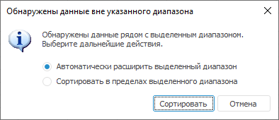
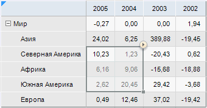
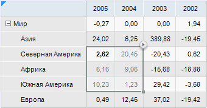

# Работа с данными в таблице

Работа с данными в таблице
-

# Работа с данными в таблице

В режиме просмотра доступны операции с данными в таблице:

	- [сортировка и фильтрация](Work_with_data.htm#filter);

	- [поиск и замена](Work_with_data.htm#find);

	- [редактирование и сохранение](Work_with_data.htm#edit);

	- [использование
	 буфера обмена](../../Table/Work/UiReport_Table_Work_insert.htm).

## Сортировка и фильтрация

Сортировка диапазона таблицы позволяет быстро отсортировать выделенный
 диапазон листа регламентного отчёта. Доступна в настольном приложении.

Совет. Не применяйте
 сортировку диапазона листа к ячейкам [таблиц](../../AreaData/Table_Types.htm).
 Используйте встроенные возможности сортировки [табличного
 визуализатора](UiAnalyticalArea.chm::/Working_with_table_data/Sorting_table_data.htm), [области
 данных](../../AreaData/Param/UiReport_AreaData_Param_Sort.htm), [реляционной
 области данных](../../Relational_data_area/Parameter/Relation_Sorting.htm).

Для сортировки значений в выделенном диапазоне листа:

	- Нажмите на кнопку / в группе «Сортировка
	 и фильтрация» на вкладке «Данные»
	 ленты инструментов или выберите пункт «Сортировка
	 по возрастанию/Сортировка
	 по убыванию» раскрывающегося меню кнопки 
	 «Сортировка и фильтрация»
	 на вкладке ленты «Главная».

	- Если у выделенного диапазона есть примыкающие данные, будет
	 выдан запрос на расширение выделенного диапазона:

Чтобы отсортировать:

		- все обнаруженные данные.
		 Установите флажок «Автоматически
		 расширить выделенный диапазон»;

		- данные выделенного диапазона.
		 Установите флажок «Сортировать
		 в пределах выделенного диапазона».

	- Нажмите кнопку «Сортировать».

Значения выделенного диапазона будут отсортированы по первому столбцу.
 Наименьшее (при сортировке по возрастанию) или наибольшее (при сортировке
 по убыванию) значение будет выделено жирным шрифтом.

[Пример сортировки](javascript:TextPopup(this))

	Выделенный диапазон до сортировки:

	

	После сортировки по возрастанию в пределах выделенного диапазона:

	

	Примечание.
	 Для сортировки табличного визуализатора задайте настройки [сортировки
	 таблицы](UiAnalyticalArea.chm::/Working_with_table_data/Sorting_table_data.htm).

Фильтрация - способ поиска подмножества
 данных и работы с ним в списке. В отфильтрованном списке отображаются
 только те строки, которые удовлетворяют условиям отбора, заданным для
 данного столбца. Строки, неудовлетворяющие условиям фильтрации, будут
 скрыты. Доступна в настольном приложении.

В регламентном отчёте встречается несколько типов [фильтрации](UiAnalyticalArea.chm::/Working_with_table_data/Filtering.htm#filter_report):

	- фильтрация табличного визуализатора;

	- фильтрация области данных;

	- автофильтр диапазона листа.

## Поиск и замена

На листе отчёта можно произвести поиск и замену данных и/или текста.

### Поиск

Для осуществления поиска на листе отчёта:

	- выполните команду «Найти и
	 заменить > Найти», расположенную в группе «Фильтрация
	 и поиск» на вкладке «Главная»
	 ленты инструментов;

	- нажмите сочетание клавиш CTRL+F.

В результате появится окно «[Найти
 и заменить](UiAnalyticalArea.chm::/Working_with_table_data/Search.htm)».

В поле «Найти» введите текст
 для поиска или выберите из раскрывающегося списка текст, который искали
 ранее. Если необходимо, задайте параметры «Учитывать
 регистр» для учета регистра символов и «Только
 слово целиком» для поиска текста, полностью совпадающего с введенным
 в поле. Выберите направление поиска, установив нужный флажок в группе
 «Направление».

### Поиск и замена

Для поиска и замены:

	- выполните команду «Заменить»
	 в раскрывающемся меню кнопки  «Найти
	 и заменить» на вкладке «Главная»
	 ленты инструментов;

	- нажмите сочетание клавиш CTRL+H.

В результате появится окно «[Найти
 и заменить](UiAnalyticalArea.chm::/Working_with_table_data/Search.htm)».

В поле «Найти» введите текст
 для поиска, в поле «Заменить на»
 введите текст, которым требуется заменить искомый текст. Доступна возможность
 выбора текста из раскрывающихся списков. Если необходимо, задайте параметры
 «Учитывать регистр» для учета
 регистра символов и «Только слово целиком»
 для поиска текста, полностью совпадающего с введенным в поле. Выберите
 направление поиска, установив нужный флажок в группе «Направление».

## Редактирование и сохранение

Для редактирования содержимого ячеек:

	- выделите ячейку на листе отчёта и введите необходимые данные;

	- дважды щёлкните по выбранной ячейке;

	- выделите ячейку и нажмите клавишу F2, после чего введите данные.

Примечание.
 Редактирование данных в ячейках при установленном флажке «[Не вычислять отчет при открытии](../UiReport_Reports_Param3.htm#notcalculation)»
 доступно после обновления отчёта.

Для внесения изменений данных в отчёт сохраните изменения, нажав кнопку
  «Сохранить
 изменения» на вкладке «Главная»
 ленты инструментов. Для отмены изменений нажмите кнопку  «Отменить
 изменения» на вкладке «Главная»
 ленты инструментов.

Примечание.
 Кнопки «Сохранить изменения»
 и «Отменить изменения» доступны,
 если в ячейках таблицы были [введены](../../Table/Work/UiReport_Table_Work_Data.htm)
 или [изменены](../../Table/Work/UiReport_Table_Work_Data_Edit.htm)
 данные.

См. также:

[Начало
 работы с инструментом «Отчёты» в веб-приложении](../../../Web/organizational_management/Starting.htm) | [Работа
 с готовым отчётом](Work_witn_report.htm)

		Справочная
		 система на версию 10.9
		 от 18/08/2025,
		 © ООО «ФОРСАЙТ»,
