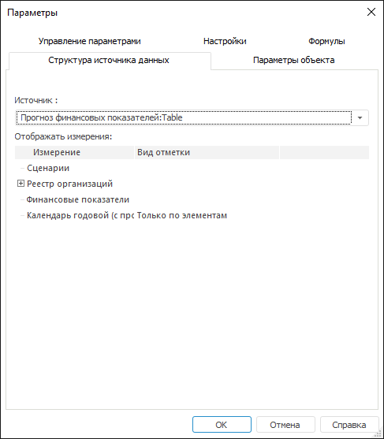

# Настройка структуры источника данных: Параметры отчёта

Настройка структуры источника данных: Параметры отчёта
-

# Настройка структуры источника данных

Для просмотра и настройки вида отметки или отображения альтернативных
 иерархий в качестве измерений в отчете перейдите на вкладку «Структура
 источника данных» окна «Параметры».

[Для открытия
 окна](javascript:TextPopup(this))

	Выполните команду главного меню «Сервис
	 > Параметры».

Для настройки структуры источника данных выполните на вкладке следующие
 шаги:

	- В раскрывающемся списке «Источник»
	 выберите срез данных. После выбора среза данных в области «Показать
	 только отмеченные измерения» будет сформирован список всех
	 измерений, содержащихся в данном срезе.

	- В области «Отображать
	 измерения» установите флажки
	 напротив атрибутов измерения, которые необходимо отобразить в группе
	 вкладок «Отметка» на боковой
	 панели.

Примечание.
 Возможность доступна, если [источником
 данных](../Source/UiReport_Source.htm) регламентного отчета является:

              •
   стандартный куб, атрибуты справочников которого используются
 в качестве [альтернативной
 иерархии](UiNavObj.chm::/reference_book/look-and-feel_Reference_book/Attributes_as_alt_hier.htm);

              •
   куб ADOMD, для справочников которого настроена [альтернативная
 иерархия](UiNavObj.chm::/reference_book/look-and-feel_Reference_book/Use_AlterHier_ForRefBook.htm).

Измерения, для которых настроены альтернативные
 иерархии, отображаются в виде дерева (по умолчанию дерево свернуто). В
 развернутом дереве перечисляются справочники/атрибуты справочников, использующиеся
 в качестве альтернативных иерархий.

	- В столбце «Вид отметки»
	 задайте режим [отметки](UiSelection.chm::/Selection/Selection_of_the_CalendarDimension_elements.htm)
	 для календарных измерений. Для этого выделите наименование календарного
	 измерения и в раскрывающемся списке выберите вид отметки:

		- Только по элементам.
		 На вкладке «Отметка» на
		 боковой панели будут отображаться только элементы календаря;

		- Только по уровням.
		 На вкладке «Отметка» на
		 боковой панели будут отображаться только уровни календаря;

		- По элементам и уровням.
		 На вкладке «Отметка» на
		 боковой панели будут отображаться элементы и уровни календаря.

В результате выполнения шагов будет настроено размещение измерений.

См. также:

[Начало
 работы с инструментом «Отчёты» в веб-приложении](../../Web/organizational_management/Starting.htm) | [Выбор
 источников данных и работа с ними](../Source/UiReport_Source.htm) | [Настройка
 параметров отчёта](UiReport_Reports_Param.htm)

		Справочная
		 система на версию 10.9
		 от 18/08/2025,
		 © ООО «ФОРСАЙТ»,
