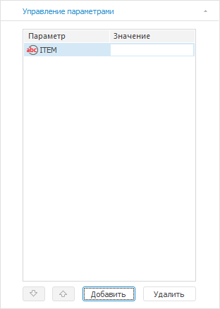

# Настройка параметров отчёта

Настройка параметров отчёта
-

# Настройка параметров отчёта

Параметры отчета предназначены
 для динамического управления данными, отображаемыми в отчёте.

Для настройки параметров отчёта выполните шаги:

	- [Добавьте параметры отчёта](UiReport_Reports_Param1.htm).

	- Настройте [управление параметрами
	 источника](UiReport_Reports_Param2.htm), используя параметры отчёта.

	- Используйте параметры отчёта для [настройки
	 элементов управления](../Source/Controls.htm) для изменения отметки при работе с отчётом.

Настройка параметров отчёта осуществляется:

	- на вкладке «Управление параметрами»
	 группы вкладок «Документ»
	 боковой панели;

	- в окне «Параметры».
	 Для открытия окна выполните команду главного меню «Сервис
	 > Параметры». Используется для совместимости с версиями
	 Prognoz Platform.

Примечание.
 Команда доступна в меню «Сервис»,
 если регламентный отчет открыт в [режиме
 редактирования](../organizational_management/Starting.htm#open). Для отчета, открытого в [режиме
 просмотра](../organizational_management/Starting.htm#open), данная команда недоступна.

Вид вкладки «Управление параметрами»
 группы вкладок «Документ» боковой
 панели:

Вид окна «Параметры»:

Вкладки окна «Параметры»:

	- [Параметры
	 объекта](UiReport_Reports_Param1.htm). Предназначена для формирования списка параметров;

	- [Управление
	 параметрами](UiReport_Reports_Param2.htm). Предназначена для управления параметрами источников
	 данных;

	- [Структура
	 источника данных](Parameters_DataSource.htm). Предназначена для просмотра и настройки
	 вида отметки или отображения альтернативных иерархий в качестве измерений
	 в отчете;

	- [Настройки](UiReport_Reports_Param3.htm).
	 Предназначена для настройки общих параметров отчёта;

	- [Формулы](UiReport_Reports_Param4.htm).
	 Предназначена для определения параметров расчета [формул](../organizational_management/Function/UiReport_Function.htm)
	 с циклическими ссылками и стиля ссылок.

Список параметров отчёта отображается как на вкладке «Управление
 параметрами» группы вкладок «Документ»
 боковой панели, так и на вкладке «Параметры
 объекта» окна «Параметры».

## Особенности работы с параметрами
 отчета при создании ярлыка

Пользователи могут задавать свои значения по умолчанию для параметров,
 не меняя значений в исходном регламентном отчете. Для этого необходимо
 создать ярлык на регламентный отчет.

При создании [ярлыка](UiNavObj.chm::/UiNavObj_label.htm)
 на регламентный отчет с параметрами [списки
 параметров](UiReport_Reports_Param1.htm) формируются отдельно для исходного регламентного отчета
 и для ярлыка. Работая с регламентным отчетом, открытым по ярлыку, можно
 добавлять и редактировать параметры, при этом в исходном регламентном
 отчете список параметров останется прежним.

Важно. Удалять
 параметры исходного регламентного отчета в регламентном отчете, открытом
 по ярлыку, нельзя.

См. также:

[Начало
 работы с инструментом «Отчёты» в веб-приложении](../../Web/organizational_management/Starting.htm) | [Построение
 отчёта](../CreateReport.htm)

		Справочная
		 система на версию 10.9
		 от 18/08/2025,
		 © ООО «ФОРСАЙТ»,
