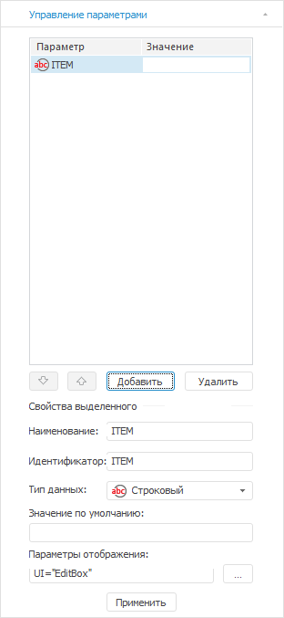
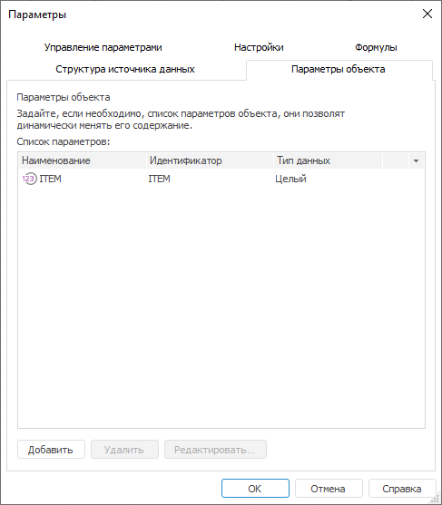
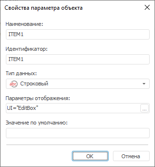

# Добавление параметров отчёта и работа с ними

Добавление параметров отчёта и работа с ними
-

# Добавление параметров отчёта и работа с ними

Для добавления параметров, которые позволят динамически менять содержание
 отчета, и формирования их списка:

	- используйте вкладку «Управление
	 параметрами» группы вкладок «Документ»
	 боковой панели;

	- перейдите на вкладку «Параметры
	 объекта» окна «Параметры».
	 Используется для совместимости с версиями Prognoz Platform.

[Для отображения
 вкладки](javascript:TextPopup(this))

		- Убедитесь, что боковая панель отображается.

		- На боковой панели выберите группу вкладок «Документ».

		- Перейдите на вкладку «Управление
		 параметрами».

[Для открытия
 окна](javascript:TextPopup(this))

	Выполните команду главного меню «Сервис
	 > Параметры».

При работе с параметрами объекта доступны следующие операции:

[Добавление
 параметров](javascript:TextPopup(this))

	Для добавления параметров:

		- нажмите кнопку «Добавить»
		 на вкладке «Управление параметрами»
		 группы вкладок «Документ»
		 боковой панели. Укажите свойства в отобразившейся области настройки
		 свойств;

		- нажмите кнопку «Добавить»
		 на вкладке «Параметры объекта»
		 окна «Параметры». Укажите
		 свойства в окне «Свойства параметра
		 отчета»:

	

	Укажите свойства:

		- Наименование. Наименование
		 параметра;

		- Идентификатор. Уникальный в
		 рамках отчета идентификатор параметра;

		- Тип данных. Тип
		 данных параметров, которые будут храниться в таблице. Для задания
		 типа параметров выберите в раскрывающемся списке одно из значений:
		 строка, число, вещественный, дата, пользовательский;

		- Значение по умолчанию.
		 Введите в поле ввода значение параметра по умолчанию;

		- Параметры отображения.
		 Определите внешний вид и поведение редактора значений параметра.
		 Для настройки
		 редактора нажмите кнопку . Будет открыто окно «[Параметры редактора
		 значений](UiNav.chm::/GUI/ValueEditorParameters.htm)».

	Для завершения настройки свойств параметра нажмите кнопку «Применить» при использовании боковой
	 панели или «Ок» при использовании
	 окна.

[Удаление
 параметров](javascript:TextPopup(this))

	Для удаления выбранного параметра нажмите кнопку «Удалить».

	После выполнения данного действия появится запрос на подтверждение
	 производимого действия.

[Редактирование
 параметров](javascript:TextPopup(this))

	Для редактирования выбранного параметра, используя боковую панель
	 перейдите на вкладку «Управление
	 параметрами» группы вкладок «Документ».

	Для редактирования выбранного параметра через окно «Параметры»:

		- дважды щёлкните по наименованию параметра;

		- нажмите кнопку «Редактировать».

	В открывшемся окне «[Свойства
	 параметра отчета](#add)» внесите необходимые изменения.

См. также:

[Начало
 работы с инструментом «Отчёты» в веб-приложении](../../Web/organizational_management/Starting.htm) | [Настройка
 параметров отчёта](UiReport_Reports_Param.htm) | [Построение
 отчёта](../CreateReport.htm) | [Работа
 с готовым отчётом](OperationReport/Work_witn_report.htm)

		Справочная
		 система на версию 10.9
		 от 18/08/2025,
		 © ООО «ФОРСАЙТ»,
