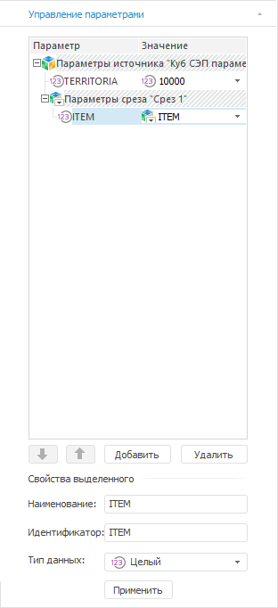
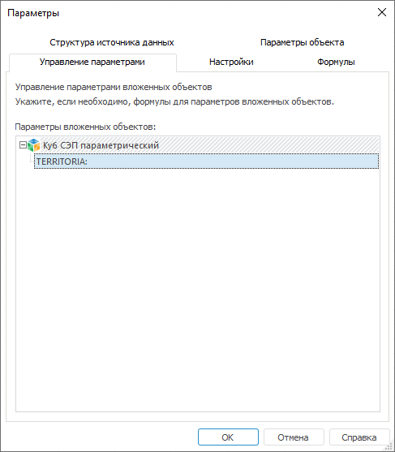

# Управление параметрами источников: Параметры отчёта

Управление параметрами источников: Параметры отчёта
-

# Управление параметрами источников

Для управления параметрами источников/срезов:

	- перейдите на вкладку «Управление
	 параметрами» группы вкладок «Данные»
	 боковой панели;

	- перейдите на вкладку «Управление
	 параметрами» окна «[Параметры](UiReport_Reports_Param.htm)».
	 Используется для совместимости с версиями Prognoz Platform.

[Для отображения
 вкладки](javascript:TextPopup(this))

		- Убедитесь, что боковая панель отображается.

		- Выделите визуализатор.

		- На боковой панели выберите группу вкладок «Данные».

		- Перейдите на вкладку «Управление
		 параметрами».

На вкладке отображаются все параметры источника и среза, на котором
 построен выделенный визуализатор. Сначала отображаются параметры источника,
 затем параметры среза.

Список параметров состоит из двух столбцов:

	- Параметр. Содержит наименования
	 параметров;

	- Значение. Содержит значение
	 параметра. Для выбора типа значения нажмите кнопку . В качестве значения можно
	 выбрать:

		- Значение. Задайте
		 фиксированное значение в зависимости от типа данных параметра;

		- Параметр. Задайте
		 параметр, выбрав его из раскрывающегося списка. Список состоит
		 из всех параметров документа;

		- Формула. Задайте
		 формулу, написав её в поле ввода или с помощью редактора формул.
		 Для вызова редактора формул нажмите кнопку «Открыть
		 в редакторе формул».

Для каждого среза можно настроить свои значения
 параметров источника.

При работе с параметрами среза доступны операции:

[Перемещение](javascript:TextPopup(this))

	Для перемещения параметров среза используйте кнопки:

		-  - для перемещения
		 параметра вверх;

		-  - для перемещения
		 параметра вниз.

[Добавление](javascript:TextPopup(this))

	Для добавления параметров нажмите кнопку «Добавить»
	 на вкладке «Управление параметрами»
	 группы вкладок «Документ»
	 боковой панели. Укажите свойства в отобразившейся области настройки
	 свойств:

		- Наименование. Наименование
		 параметра;

		- Идентификатор. Уникальный в
		 рамках отчета идентификатор параметра;

		- Тип данных. Тип
		 данных параметров, которые будут храниться в таблице. Для задания
		 типа параметров выберите в раскрывающемся списке одно из значений:
		 строка, число, вещественный, дата, пользовательский;

		- Значение по умолчанию.
		 Введите в поле ввода значение параметра по умолчанию;

		- Параметры отображения.
		 Определите внешний вид и поведение редактора значений параметра.
		 Для настройки редактора нажмите кнопку . Будет
		 открыто окно «[Параметры редактора
		 значений](UiNav.chm::/GUI/ValueEditorParameters.htm)».

	Для завершения настройки свойств параметра нажмите кнопку «Применить».

[Удаление](javascript:TextPopup(this))

	Для удаления выбранного параметра нажмите кнопку «Удалить».

Для настройки параметров вложенных объектов
 используйте окно «Параметры».

[Для открытия
 окна](javascript:TextPopup(this))

	Выполните команду главного меню «Сервис
	 > Параметры».

На вкладке «Управление параметрами»
 окна «Параметры» отображается
 список всех объектов, используемых отчетом. Возможны следующие варианты:

	- если объект не имеет параметров, то отображается только его
	 наименование;

	- если объект имеет набор параметров, то отображается список параметров
	 данного объекта.

Для установки значений параметров дважды щёлкните по выбранному параметру.
 Откроется окно «[Редактор
 выражения](UiNav.chm::/GUI/ExpressionEditor.htm)».

См. также:

[Настройка
 параметров отчёта](UiReport_Reports_Param.htm) | [Построение
 отчёта](../CreateReport.htm) | [Работа
 с готовым отчётом](OperationReport/Work_witn_report.htm)

		Справочная
		 система на версию 10.9
		 от 18/08/2025,
		 © ООО «ФОРСАЙТ»,
