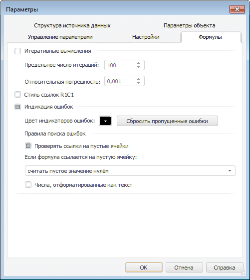

# Настройка формул отчёта: Регламентный отчёт, настольное приложение

Настройка формул отчёта: Регламентный отчёт, настольное приложение
-

# Настройка формул отчёта

Для определения параметров расчета [формул](../organizational_management/Function/UiReport_Function.htm)
 с циклическими ссылками и стиля ссылок перейдите на вкладку «Формулы»
 окна «[Параметры](UiReport_Reports_Param.htm)».

[Для открытия
 окна](javascript:TextPopup(this))

	Выполните команду главного меню «Сервис
	 > Параметры».

Определите на вкладке следующие параметры:

[Итеративные
 вычисления](javascript:TextPopup(this))

	При установленном флажке «Итеративные
	 вычисления» появляется возможность вычислять содержимое ячеек,
	 содержащих формулы с циклическими ссылками.

	Примечание.
	 Данная настройка задаётся для всего отчёта, но разрешение циклических
	 ссылок ведется в рамках одного листа. Например, если в ячейках указаны
	 циклические формулы, ссылающиеся на значения ячеек других листов,
	 то даже при включении итеративного режима будет отображена ошибка
	 «Обнаружены циклические ссылки».

	По умолчанию флажок снят и данные ячеек, содержащих циклические
	 ссылки, не вычисляются, в таких ячейках будет отображена ошибка. При
	 установке флажка происходит автоматическое перевычисление формул.
	 При смене параметров итеративного расчета автоматического перевычисления
	 формул не происходит.

	Если при добавлении формулы в ячейку появляется цикл и включено
	 итеративное вычисление циклических ссылок, то начальное значение этой
	 ячейки считается равным нулю. При включенном режиме при каждом вычислении
	 отчёта будет производиться выполнение цикла с заданными параметрами.
	 Цикл заканчивается при достижении предельного числа итераций или когда
	 изменение значения величины каждой ячейки становится меньше относительной
	 погрешности.

	После установки флажка «Итеративные
	 вычисления» задайте параметры:

		- Предельное число итераций.
		 Задайте количество итераций, после которых прекратится расчет
		 ячеек с циклическими ссылками. По умолчанию установлено значение
		 в 100 итераций;

		- Относительная погрешность.
		 Задайте величину, с которой будет сравниваться разница значений
		 каждой ячейки с циклическими ссылками в текущей и предыдущей итерациях.
		 Если изменение значения величины каждой ячейки становится меньше
		 относительной погрешности, то на данной итерации расчет ячеек
		 с циклическими ссылками прекращается. По умолчанию в качестве
		 значения относительной погрешности задано «0,001».

	Примечание.
	 Значения параметров «Предельное число
	 итераций» и «Относительная
	 погрешность» должны быть неотрицательными числами.

## Особенности настройки итеративного вычисления

	С помощью языка [Fore](TabSheet.chm::/Interface/ITabOptions/ITabOptions.IterativeCalculation.htm)
	 для каждого листа могут быть заданы разные настройки итеративного
	 вычисления, поэтому необходимо учитывать их особенности.

	При открытии окна:

		- если хотя бы у одного листа итеративные
		 вычисления включены, то флажок «Итеративные
		 вычисления» будет установлен;

		- если все листы имеют одинаковые
		 параметры итеративных вычислений (итерации, погрешность), то эти
		 настройки отображаются на вкладке «Формулы»
		 в окне «Параметры»;

		- если параметры хотя бы одного
		 листа отличны от других, то в окне будут отображены параметры
		 по умолчанию (100 итераций, погрешность 0.001).

	При добавлении нового листа:

		- если хотя бы у одного листа итеративные вычисления включены,
		 то на новом листе они также будут включены;

		- если все листы имеют одинаковые параметры итеративных вычислений
		 (число итераций и погрешность), то новый лист будет создан с этими
		 же настройками;

		- если параметры хотя бы одного листа отличны от других, то
		 новый лист создается с параметрами по умолчанию (100 итераций,
		 погрешность 0.001).

[Стиль
 ссылок R1C1](javascript:TextPopup(this))

	В регламентных отчётах доступно использование двух стилей ссылок:

		- А1. При использовании
		 стиля A1 столбцы обозначаются
		 буквами, а строки - цифрами;

		- R1C1. При использовании
		 стиля R1C1 строки (row)
		 и столбцы (column) обозначаются цифрами и ссылки на ячейки в формулах
		 задаются при помощи смещения от текущей ячейки. Например, ссылка
		 R[-1]C[2] ссылается на ячейку, которая находится на одну строку
		 выше и на два столбца правее текущей ячейки.

	По умолчанию флажок «Стиль ссылок
	 R1C1» снят, при этом используется стиль ссылок А1.
	 При установленном флажке для формирования новых ссылок будет использоваться
	 стиль R1C1, при этом заголовки
	 колонок в листе будут иметь цифровое обозначение.

[Индикация
 ошибок](javascript:TextPopup(this))

	При установленном флажке «Индикация
	 ошибок» появляется возможность индикации ячеек, содержащих
	 ошибки.

	После установки флажка задайте настройки действия и подсветки при
	 возникновении ошибок:

		- Цвет индикаторов ошибок.
		 В раскрывающейся палитре выберите цвет для подсветки ячеек;

		- Сбросить пропущенные ошибки.
		 Нажмите кнопку для возврата индикации тем ячейкам, которые содержали
		 ошибки в формулах, но были пропущены пользователем при помощи
		 команды «Пропустить ошибку».

	Для задания дополнительных правил поиска и проверки ошибок определите
	 параметры в группе «Правила поиска
	 ошибок»:

		- Проверять ссылки на пустые
		 ячейки. При установленном флажке будет осуществлена проверка
		 ссылок на пустые ячейки;

	Примечание.
	 При работе с пустыми ячейками учитывайте особенности вычисления некоторых
	 функций: [Average](../organizational_management/Function/Math/UiReport_Func_Math_Average.htm),
	 [Max](../organizational_management/Function/Math/UiReport_Func_Math_Max.htm)
	 и [Min](../organizational_management/Function/Math/UiReport_Func_Math_Min.htm).

		- Если формула ссылается
		 на пустую ячейку. В раскрывающемся списке выберите одно
		 из действий для проверки формул, ссылающихся на пустые ячейки:

			- Показать индикатор
			 ошибки. По умолчанию пустые ячейки, которые используются
			 в формуле, заменяются нулями. В ячейке будет отображаться
			 результат расчёта формулы, индикатор ошибки и контекстная
			 кнопка для [управления
			 ошибкой](../organizational_management/Function/UiReport_Function.htm#cell_indication) в формуле при нажатии на ячейку:

				- Преобразовать в
				 число. Команда выполняет преобразование значения,
				 содержащегося в ячейке, в числовой формат данных. Команда
				 доступна для диапазона ячеек, содержащих подобные данные;

	Примечание.
	 Данная команда доступна только для ячеек с числами, сохранёнными в
	 текстовом формате.

				- Пропустить ошибку.
				 Команда закрывает контекстное меню, снимает индикатор
				 ошибки с ячейки и скрывает кнопку ошибки;

				- Изменить в строке
				 формул. Команда переводит ячейку в режим редактирования
				 формулы. Фокус ввода при этом смещается в строку формул.
				 Если строка формул выключена, она появляется и на вкладке
				 «Вид» ленты инструментов
				 устанавливается соответствующий флажок;

				- Параметры проверки
				 ошибок. Команда открывает диалог «Параметры»
				 на вкладке «Формулы»;

	Примечание.
	 Для диапазона ячеек доступна только команда «Пропустить
	 ошибку».

			- Не вычислять формулу.
			 В ячейке будет выводиться сообщение об ошибке «#ССЫЛКА!»
			 без отображения индикатора;

			- Считать пустое значение
			 нулём. Пустое значение будет заменено нулём. Используется
			 по умолчанию.

	Для индикации ячеек с числами, сохраненными в текстовом формате,
	 установите флажок «Числа, отформатированные
	 как текст». При установленном флажке в соответствующих ячейках
	 будет отображаться индикатор ошибки и контекстная кнопка для [управления
	 ошибкой](../organizational_management/Function/UiReport_Function.htm#cell_indication).

См. также:

[Начало
 работы с инструментом «Отчёты» в веб-приложении](../../Web/organizational_management/Starting.htm) | [Использование
 формул](../organizational_management/Function/UiReport_Function.htm) | [Настройка
 параметров отчёта](UiReport_Reports_Param.htm) | [Построение
 отчёта](../CreateReport.htm) | [Работа
 с готовым отчётом](OperationReport/Work_witn_report.htm)

		Справочная
		 система на версию 10.9
		 от 18/08/2025,
		 © ООО «ФОРСАЙТ»,
