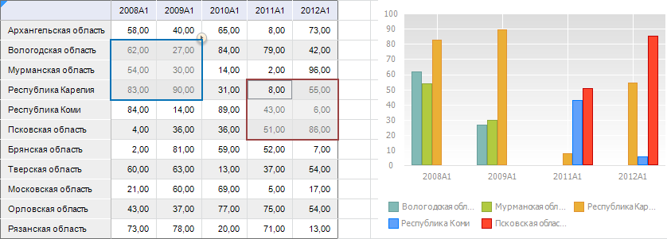

# Визуализация данных на листе отчёта

Визуализация данных на листе отчёта
-

# Визуализация данных на листе отчёта

Для отображения данных в отчёте поместите на табличный лист визуализаторы:

	- [таблицы](../AreaData/Table_Types.htm);

	- [диаграммы](../Diagrams/UiReport_Diagrams_appointment.htm);

	- [карты](../Maps/svgmap.htm).

Для изменения набора данных, представляемых визуализаторами, используйте
 [отметку](Selection.htm).

Для дополнительной визуализации данных и расширения функциональности
 регламентного отчёта в веб-приложении и [конструкторе
 бизнес-приложений](Constructor.chm::/Intro/Designer_business_applications.htm) подключите [плагины](DataAnalysis.chm::/Plugins/Plugins.htm).
 Плагины подключаются на отдельных [листах](../Sheets/UiReport_Sheets.htm)
 отчёта.

## Агрегация фиксированных измерений

Агрегация позволяет производить множественную отметку элементов фиксированных
 измерений с применением выбранного метода агрегации.

Примечание.
 Агрегация фиксированных измерений недоступна при работе с [глобальным кешем](UiNav.chm::/02_Navigator/Cache_In_Blob.htm).

Для [агрегации
 фиксированных измерений](UiNavObj.chm::/Cube/Agregation.htm) в срезе:

	- Выберите визуализатор:

		- если это таблица, установите курсор в ячейку [табличного
		 визуализатора](../AreaData/DataTable.htm);

		- если это диаграмма или карта, то щёлкните по ней левой кнопкой
		 мыши.

Примечание.
 Агрегация применяется для всех визуализаторов, построенных на одном источнике.

	- Перейдите на вкладку «Данные»
	 из группы «Данные» боковой
	 панели.

	- В раскрывающемся списке «Агрегировать
	 фиксированные измерения» выберите необходимый вариант агрегации:

		- Нет. Агрегация данных
		 не производится;

		- Сумма. По выбранным
		 элементам в фиксированных измерениях будет произведено суммирование;

		- Максимум. Из выбранных
		 элементов в фиксированных измерениях будет отображено максимальное
		 значение;

		- Минимум. Из
		 выбранных элементов в фиксированных измерениях будет отображено
		 минимальное значение;

		- Из измерений источника.
		 В фиксированных измерениях будет использоваться агрегация в соответствии
		 с установленными методами агрегации [измерений
		 источника](UiNavObj.chm::/Cube/CreateCube/Master_Standart/UiMd_Cube_CreateCube_Master_Standart_7.htm). При работе с кубами ADOMD используется
		 агрегация, настроенная в соответствующих источниках ADOMD;

		- Из фактов источника.
		 В фиксированных измерениях будет использоваться агрегация в соответствии
		 с установленными методами [агрегации
		 фактов источника](UiNavObj.chm::/Cube/CreateCube/Master_Standart/UiMd_Cube_CreateCube_Master_Standart_2.htm#agregation);

		- Среднее. По выбранным
		 элементам в фиксированных измерениях будет отображено среднее
		 значение.

Примечание.
 При выборе любого пункта списка, кроме «Нет»,
 становится активной кнопка «Отметить
 все фиксированные», при нажатии на которую будут отмечены все элементы
 в фиксированных измерениях.

## Выбор данных для построения визуализаторов

В инструменте «Отчеты» при
 выделении диапазона ячеек в [табличном
 визуализаторе](../AreaData/DataTable.htm) доступно перестроение визуализаторов, построенных на
 том же срезе, что и таблица. Визуализаторами являются [диаграммы](../Diagrams/UiReport_Diagrams_appointment.htm)
 и [карты](../Maps/svgmap.htm).

Для выбора области таблицы, по которой будут строиться визуализаторы:

	- В рабочей области [выделите
	 табличный визуализатор](../AreaData/Table_Types.htm).

	- Перейдите на вкладку «Конструктор»
	 на ленте инструментов.

	- Нажмите кнопку  «Данные
	 визуализаторов» и выберите вариант построения визуализаторов:

		- Вся таблица. Визуализаторы
		 строятся по всей таблице;

		- Выделенная область.
		 Визуализаторы строятся по данным, выделенным в таблице.

После настройки визуализаторы будут перестраиваться согласно заданным
 параметрам. Перестроение будет выполняться, как в режиме просмотра, так
 и в режиме редактирования регламентного отчета.

## Особенности построения визуализаторов по выделенной области таблицы

	- Если выделены данные в двух или более таблицах, то визуализаторы
	 не перестраиваются.

	- Если выделенные данные включают ячейки рабочей области, которые
	 не относятся к таблице, то визуализаторы не перестраиваются.

	- Если в таблице области данных выделена одна ячейка или уголок,
	 то визуализаторы будут построены по всей таблице данных.

	- Если в таблице области данных с помощью клавиши CTRL выделено
	 несколько диапазонов ячеек, то в визуализаторы будет передаваться
	 объединенная по строкам и столбцам отметка по всем выделенным диапазонам.
	 Например:

См. также:

[Начало
 работы с инструментом «Отчёты» в веб-приложении](../../Web/organizational_management/Starting.htm) | [Построение
 отчёта](../CreateReport.htm)

		Справочная
		 система на версию 10.9
		 от 18/08/2025,
		 © ООО «ФОРСАЙТ»,
